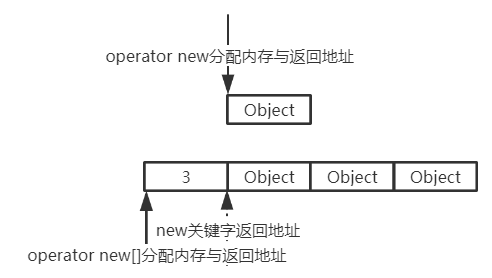
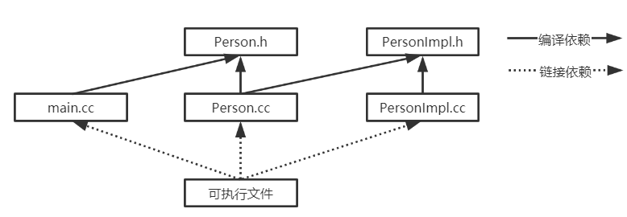
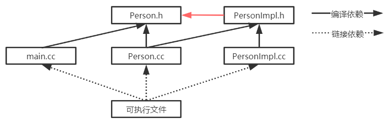

# Effective C++（第三版）

[TOC]

## 1 让自己习惯C++

### 条款01 视C++为一个语言联邦

**请记住**

+ C++高效编程守则视状况而变化，取决于你使用C++的哪一部分。

1. C++次语言
   1. C：许多时候C++对问题的解法其实不过就是较高级的C解法（***例如条款02、13***），但当你以C次语言工作时，高效编程守则映照出C语言的局限：没有模板（templates），没有异常（exceptions），没有重载（overloading）……
   2. Object-Oriented C++：封装（encapsulation）、继承（inheritance）、多态（polymorphism）。
   3. Template C++：泛型编程（generic programming）、模板元编程（TMP：template metaprogramming）
   4. STL：容器（containers）、迭代器（iterators）、泛型算法（algorithms）以及函数对象（function objects）。
2. 例如对内置类型而言，pass-by-value通常比pass-by-reference高效，但当你从C part of C++移往Object-Oriented C++，由于用户自定义（user-defined）构造函数和析构函数的存在，pass-by-reference-to-const往往更好。运用Template C++时尤其如此，因为彼时你甚至不知道所处理的对象的的类型。然而一旦跨入STL你就会了解，迭代器和函数对象都是在C指针之上塑造出来的，所以对STL的迭代器和函数对象而言，旧式的C pass-by-value守则再次适用（***细节见条款20***）。

### 条款02 尽量以consts、enums、inlines替换#defines

**请记住**

+ 对于单纯常量，最好以const对象或enums替换#defines。
+ 对于形似函数的宏(macros)，最好改用inline函数替换#defines。

1. #define带来的问题？

   + 对于常量宏定义#define PI    3.14：PI不会出现在符号表，因此当你运用PI但获得一个编译错误时，可能会带来困惑，因为错误信息也许会提到3.14而不是PI，你将因为追踪它而浪费时间。

   + 对于函数宏定义#define MAX(a, b)     ((a) > (b) ? (a) : (b))：无论何时当你写出这种宏，你必须记住为宏中的所有实参加上小括号，否则某些人在表达式中调用这个宏时可能会遭遇麻烦。但纵使你为所有实参加上小括号，也可能出问题。

     + ```c++
       int a = 2, b = 1;
       MAX(++a, b);//a被累加两次
       MAX(++a, b+10)//a被累加一次
       ```

### 条款03 尽可能使用const

**请记住**

+ 将某些东西声明为const可帮助编译器侦测出错误用法。const可被施加于任何作用域内的对象、函数参数、函数返回类型、成员函数本体。
+ 编译器强制实施bitwise constness（禁止浅拷贝，但并不禁止深拷贝），但你编写程序时应该使用*概念上的常量性（conceptual constness）*（搭配关键字mutable）。
+ 当const和non-const成员函数有着实质等价的实现时，令non-const版本调用const版本可避免代码重复。

1. const语法虽然变化多端，但并不高深莫测。如果关键字const出现在星号左边，表示被指物是常量；如果出现在星号右边，表示指针自身是常量。

   + > const int * ptr1与int const * ptr2都是指向常量的指针

2. STL迭代器系以指针为根据模塑出来，所以迭代器的作用就像个T\*指针。声明迭代器为const就像声明指针为const一样（即声明一个T\* const指针）；如果你希望获得一个const T\*指针，你需要的是const_iterator。（常见误区）

3. 解决const成员函数与non-const成员函数的代码重复问题？

   + ```c++
     class TextBlock{
     public:
         const char& operator[](std::size_t pos) const{
             ...
             return text[position];
         }
         char& operator[](std::size_t pos){
             return const_cast<char&>(
                 static_cast<const TextBlock&>(*this)[position]
             );
         }
     private:
         std::string text;
     };
     ```

   + 注意：首先，必须使用static_cast将\*this指针从其原始类型TextBlock&转型为const TextBlock&，否则这里会递归调用non-const版本的成员函数；其次，不能令const版本调用non-const版本，这会违背const成员函数常量性的约定。

### 条款04 确定对象使用前已先被初始化

**请记住**

+ 为内置型对象进行手工初始化，因为C++不保证初始化它们。
+ 构造函数最好使用成员初值列（member initialization list），而不要在构造函数本体内使用赋值操作（assignment）。初值列列出的成员变量，其排列次序应该和它们在class中的声明次序相同。
+ 为免除“跨编译单元之初始化次序”问题，请以local static对象替换non-local static对象。

1. array（来自C part of C++)不保证其内容被初始化，而vector(来自STL part of C++)却有此保证。内置类型（array）与用户自定义类型（vector）的区别。

   + ```c++
     int array[3];
     vector<int> v(3);
     for(int i = 0; i < 3; i++)
         cout<<array[i]<<" ";
     for(auto i : v)
         cout<<i<<" ";
     //32760 4209224 0 0 0 0
     ```

2. c++规定，对象的成员变量的初始化动作发生在进入构造函数本体之前。构造函数的一个较佳写法为，使用所谓的member initialization list（成员初始化列）替换赋值动作。

3. C++有着十分固定的成员初始化次序：base classes更早于其derived classes被初始化（***见条款12***），而class的成员变量总是以其声明次序被初始化。

4. C++对定义于不同编译单元内的non-local static对象的初始化次序并无明确定义。
   + Singleton手法：将每个non-local static对象搬到自己的专属函数内（该对象在此函数内被声明为static）。这些函数返回一个reference指向它所包含的对象。然后用户调用这些函数，而不直接指涉这些对象。
   + C++保证，函数内的local static对象会在该函数被调用期间，首次遇上该对象之定义式时被初始化。更棒的是，如果你从未调用non-local static对象的“仿真函数”，就绝不会引发构造和析构成本。

## 2 构造函数、析构函数以及赋值运算符

### 条款05 了解C++默默编写并调用哪些函数

**请记住**

+ 编译器可以暗自为class创建default构造函数、copy构造函数、copy assignment运算符、以及析构函数。

1. 什么时候empty class（空类）不再是个empty class呢？当C++处理过它之后。是的，如果你自己没有声明，编译器就会为它声明（编译器版本的）一个copy构造函数、一个copy assignment运算符和一个析构函数。此外如果你没有声明任何构造函数，编译器也会为你声明一个default构造函数。所有这些函数都是public且inline的。这些函数当被需要（被调用）时才会由编译器创建出来，且只执行编译器需要的操作。

### 条款06 若不想使用编译器自动生成的函数，就该明确拒绝

**请记住**

+ 为驳回编译器自动（暗自）提供的机能，可将相应的成员函数声明为private并且不予实现。使用像Uncopyable这样的base class也是一种做法。（对于C++11，可将成员函数声明为delete）

1. 如何禁止拷贝构造与拷贝赋值？
   1. 声明拷贝成员函数为private且不予实现。
   2. 声明基类的拷贝成员函数为private且不予实现，然后private继承基类。（Boost提供的noncopyable）
   3. C++11，显式声明拷贝成员函数为delete。

### 条款07 为多态基类声明virtual析构函数

**请记住**

+ polymorphic（带多态性质的）base classes应该声明一个virtual析构函数。如果class带有任何virtual函数，它就应该拥有一个virtual析构函数。
+ classes的设计目的如果不是作为base classes使用，或不是为了具备多态性（polymorphically），就不该声明virtual析构函数。（例如：标准string、STL容器、noncopyable）

1. C++明白指出，当derived class对象经由一个base class对象指针被删除，而该base class带着一个non-virtual析构函数，其结果未有定义。通常造成对象的derived成分没被销毁。

### 条款08 别让异常逃离析构函数

**请记住**

+ 析构函数绝对不要吐出异常。如果一个被析构函数调用的函数可能抛出异常，析构函数应该捕捉任何异常，然后吞下它们（不传播）或结束程序。
+ 如果客户需要对某个操作函数运行期间抛出的异常作出反应，那么class应该提供一个普通成员函数（而非在析构函数中）执行该操作。

1. 例如负责数据库连接的DBConnection，使用RAII手法，通过DBConn管理DBConnection对象的生命期。

   + ```c++
     class DBConnection{
     public:
         ...
         static DBConnection create();
         void close();
     };
     class DBConn{
     public:
         ...
         ~DBConn(){ db.close(); }
     private:
         DBConnection db;
     };
     //客户代码
     {
         DBConn dbc(DBConnection::create());
     }
     ```

   + 如果close()可能抛出异常，两种解决办法：如果close抛出异常就结束程序，通常通过调用abort完成；吞下因调用close而发生的异常。这两种办法的问题是客户无法对导致close抛出异常的情况做出反应。

   + 因此较佳策略是重新设计DBConn接口，例如DBConn可以自己提供一个close函数，因而赋予客户一个机会得以处理因该操作而发生的异常。客户在需要处理异常时自己主动调用DBConn::close()关闭数据库连接，否则DBConn对象追踪DBConnection对象生命期并在析构函数中关闭数据库连接。

   + ```c++
     class DBConn{
     public:
         ...
         void close(){
             db.close();
             closed = true;
         }
         ~DBConn(){
             if(!closed){
                 try{
                     db.close();
                 }catch(...){
                     //记录日志
                 }
             }
         }
     private:
         DBConnection db;
         bool closed;
     };
     ```

### 条款10 令operator=返回一个reference to *this

**请记住**

+ 令赋值（assignment）运算符返回一个reference to *this。

1. 为什么令赋值运算符返回一个reference to *this？
   + 为了实现连锁赋值。
   + 如果仅仅为了实现连锁赋值，那返回*this也是可以的，但这样势必生成一个临时对象来满足值语义。增加了不必要的构造、析构开销。

### 条款11 在operator=中处理*自我赋值*

**请记住**

+ 确保当对象自我赋值时operator=有良好行为。其中技术包括比较*来源对象*和*目标对象*的地址、精心周到的语句顺序、以及copy-and-swap。
+ 确定任何函数如果操作一个以上的对象，而其中多个对象是同一个对象时，其行为仍然正确。

1. 在operator=中处理*自我赋值*的三种技术

   + ```c++
     class Bitmap{};
     class Widget{
     private:
         Bitmap* pb;
     }
     ```

   + 一：比较*来源对象*和*目标对象*的地址：缺点是不具备*异常安全性*，若new Bitmap导致异常，pb指针指向被删除的Bitmap。

   + ```c++
     Widget& Widget::operator=(const Widget& rhs){
         if(this == &rhs) return *this;
         delete pb;
         pb = new Bitmap(*rhs.pb);
         return *this;
     }
     ```

   + 二：精心周到的语句顺序：不仅具备*自我赋值安全性*，也具备*异常安全性*。

   + ```c++
     Widget& Widget::operator=(const Widget& rhs){
         Bitmap* pOrig = pb;
         pb = new Bitmap(*rhs.pb);
         delete pOrig;
         return *this;
     }
     ```

   + 三：copy-and-swap：与*异常安全性*有密切关系，（***详见条款29***）。

   + ```c++
     void Widget::swap(Widget& rhs);
     Widget& Widget::operator=(const Widget& rhs){
         Widget temp(rhs);
         swap(temp);
         return *this;
     }
     ```

### 条款12 拷贝对象勿忘其每一个成分

**请记住**

+ Copying函数应该确保拷贝*对象内的所有成员变量*及*所有base class成分*。
+ 不要尝试以某个copying函数实现另一个copying函数。应该将共同机能放进第三个函数中，并由两个copying函数共同调用。

1. 令拷贝赋值运算符调用拷贝构造函数与令拷贝构造函数调用拷贝赋值运算符都是不合理的，正确的做法是建立一个新的成员函数给两者调用。这样的函数往往是private而且常被命名为init。

### 条款09 绝不在构造和析构函数中调用virtual函数

**请记住**

+ 在构造和析构期间不要调用virtual函数，因为这类调用从不下降至derived class（比起当前执行构造函数和析构函数的那层）。

1. ```c++
   class Transaction{
   public:
       Transaction(){
           logTransaction();
       }
       virtual void logTransaction() const = 0;
   };
   class BuyTransaction : public Transaction{...};
   class SellTransaction : public Transaction{...};
   //如果在用户代码中执行这行代码，Transaction版本的logTransaction()会被调用，不能完成多态任务。
   BuyTransaction b;
   ```

2. 解决办法是将logTransaction()改为non-virtual，然后要求derived class构造函数传递必要信息给Transaction构造函数。换句话说由于你无法使用virtual函数从base class向下调用，在构造期间，你可以藉由*令derived classes将必要的构造信息向上传递至base class构造函数*替换之而加以弥补。

   + ```c++
     class Transaction{
     public:
         explicit Transaction(const std::string& logInfo){
             logTransaction(logInfo);
         }
         void logTransaction(const std::string& logInfo) const;
     };
     class BuyTransaction : public Transaction{
     public:
         BuyTransaction(parameters) : Transaction(createLogString(parameters)){}
     private:
         static std::string createLogString(parameters);
     }
     ```

   + 注意：比起在成员初值列内给予base class所需数据，利用辅助函数创建一个值传给base class构造函数往往比较方便（也比较可读）。令此函数为static，也就不可能意外指向*初期未成熟之BuyTransaction对象内尚未初始化的成员变量*。

## 3 资源管理

### 条款13 以对象管理资源

**请记住**

+ 为防止资源泄露，请使用RAII（Resource Acquisition Is Initializaton）对象，它们在构造函数中获得资源并在析构函数中释放资源。
+ 两个常被使用的RAII classes分别是shared_ptr和auto_ptr。前者通常是较佳选择，因为其拷贝行为比较直观。若选择auto_ptr，拷贝动作会使它（被拷贝对象）指向null。（C++11已废弃auto_ptr，改为unique_ptr）

1. RAII对象能通过ctor-dtor保证资源的获取与释放成对出现，这能解决资源泄露问题。但还有一些问题需要考虑，例如RAII对象的拷贝行为（***详见条款14***）。

2. auto_ptr vs unique_ptr？

   1. auto_ptr与unique_ptr都以*移动资源*（***详见条款14***）方式实现拷贝行为，区别是auto_ptr实现的是拷贝构造与拷贝赋值；而unique_ptr实现的是移动构造与移动赋值，禁止了拷贝构造与拷贝赋值。

      + 上述叙述的区别是auto_ptr允许移动左值的资源，而这容易导致编程错误，因此auto_ptr不能置于标准容器中，这进一步限制了它的使用；而unique_ptr只允许移动右值的资源，右值通常为匿名临时对象，这限制了编程出错行为，因此unique_ptr可用于标准容器。

      + ```c++
        // auto_ptr使用示例
        auto_ptr<int> pInt1 = new int;
        auto_ptr<int> pInt2 = pInt1;// 隐式移动资源，此时pInt1.get()返回null。
        
        // unique_ptr使用示例
        unique_ptr<int> pInt1 = new int;
        unique_ptr<int> pInt2 = std::move(pInt1);// 显式移动资源
        ```
   
   2. 另一个关键是unique_ptr允许传入用户指定的资源释放函数，而不是默认的delete。某些资源的获取和释放并不意味着构造与析构，例如std::mutex。

### 条款14 在资源管理类中小心拷贝行为

**请记住**

+ 拷贝RAII对象必须一并拷贝它所管理的资源，所以资源的拷贝行为决定RAII对象的拷贝行为。
+ 普遍而常见的RAII拷贝行为是：抑制拷贝、施行引用计数法（reference counting）。不过其他行为也都可能被实现（拷贝资源、移动资源）。

### 条款15 在资源管理类中提供对原始资源的访问

**请记住**

+ APIs往往要求访问原始资源（raw resources），所以每一个RAII class应该提供一个*取得其所管理之资源*的办法。
+ 对原始资源的访问可能经由显式转换或隐式转换。一般而言显式转换比较安全，但隐式转换对客户比较方便。

1. 如何提供对原始资源的访问？

   + ```c++
     1.提供显式访问接口
         int *std::unique_ptr<int>::get() const noexcept
     2.重载解引用运算符
         int &std::unique_ptr<int>::operator*() const;
     2.转换运算符与转换构造函数
     	struct ConvertTo{
             ConvertTo(const ConvertFrom&);
         };
         struct ConvertFrom{
         	operator ConvertTo() const{ return ConvertTo(*this);};
         };
     ```

### 条款16 成对使用new和delete时要采取相同形式

**请记住**

+ 如果你在new表达式中使用[]，必须在相应的delete表达式中也使用[]。如果你在new表达式中不使用[]，一定不要在相应的delete表达式中使用[]。

1. `new关键字`、`operator new函数`、`placement new函数`，傻傻分不清楚？（***详见8 定制new和delete***）
   + 我们通过`new关键字`动态分配内存，它的执行步骤为：
     1. 调用适当的分配函数分配内存空间。若 *类型* 是非数组类型，则函数名是 `operator new`。若 *类型* 是数组类型，则函数名是 `operator new[]`。
     2. 调用构造函数在已分配的内存空间中构造对象。
   + 而`placement new函数`是函数名为`operator new`的一个重载，用于在已分配的内存空间中构造对象，即上述的步骤2。
   + `operator new`与`placement new`函数原型为`void* operator new(std::size_t, void*)`，`placement new`会忽略第一个参数，直接返回未更改的第二实参，这样就完成了对象的构造。

2.  `operator new`与`operator new[]`实现区别？
   + 在调用内存分配函数时，`new 关键字`将请求的字节数作为`std::size_t`类型的第一参数传递给它，该参数对于非数组 `T` 精确地为 sizeof(T)。
   + 数组的分配中可能带有一个未指明的开销（overhead），且两次调用 new 的这个开销可能不同。`new关键字`所返回的指针等于内存分配函数所返回的指针加上该值。许多实现使用数组开销存储数组中的对象数量，它为`delete[]关键字`所用，以进行正确数量的析构函数调用。另外，若 new 被用于分配 char、unsigned char 或 std::byte 的数组，则它可能从分配函数请求额外内存，以此保证所有不大于请求数组大小的类型的对象，当将其放入所分配的数组中时能够正确对齐。
   + 


### 条款17 以独立语句将newed对象置入智能指针

**请记住**

+ 以独立语句将newed对象存储入（置入）智能指针内。如果不这样做，一旦异常被抛出，有可能导致难以察觉的资源泄露。（常见于函数传参）

1. 对这样的函数调用`processWidget(std::shared_ptr<Widget>(new Widget), priority());`，由于C++编译器对参数求值顺序并无规定，由此可能产生如下操作序列：

   + ```c++
     1.调用operator new()
     2.调用priority()
     3.调用std::shared_ptr构造函数
     ```

   + 若priority()抛出异常，就会导致资源泄露。

## 4 设计与声明

### 条款18 让接口容易被正确使用，不易被误用

**请记住**

+ 好的接口很容易被正确使用，不容易被误用。你应该在你的所有接口中努力达成这些性质。
+ *促进正确使用*的办法包括接口的一致性，以及与内置类型的行为兼容。
+ *阻止误用*的办法包括建立新类型、限制类型上的操作、束缚对象值，以及消除客户的资源管理责任。
+ std::shared_ptr支持定制型删除器（custom deleter）。这可防范cross-DLL问题，可被用来自动解除互斥锁（std::mutex）（***详见条款14***）等等。

许多编程错误可以因为导入新类型而获得预防。真的，在防范*不值得拥有的代码*上，类型系统（type system）是你的主要同盟国。

一旦正确的类型就位，限制其值有时候是通情达理的。比较安全的解法是预先定义所有有效的值。

避免无端与内置类型不兼容，真正的理由是为了提供行为一致的接口。STL容器的接口十分一致（虽然不是完美的一致），这使它们非常容易被使用。

任何接口如果要求用户必须记得做某些事情，就是有着*不正确使用*的倾向，因为用户可能会忘记做那件事。

### 条款19 设计class犹如设计type

**请记住**

+ Class的设计就是type的设计。在定义一个新type之前，请确定你已经考虑过本条款覆盖的所有讨论主题。（重载（overloading）函数和操作符、控制内存的分配和归还、定义对象的初始化和终结……）

1. 几乎每一个class都要求你面对以下提问，而你的回答往往导致你的设计规范：
   1. 新type的对象应该如何被创建和销毁？构造函数、析构函数、内存分配函数、内存释放函数的设计。
   2. 对象的初始化和对象的赋值该有什么样的差别？构造函数、赋值运算符的设计。
   3. 新type的对象如果被passed by value，意味着什么？拷贝构造函数的设计。
   4. 什么是新type的*合法值*？成员函数必须进行的错误检查工作。
   5. 你的新type需要配合某个继承体系吗？析构函数是否为virtual等。
   6. 你的新type需要什么样的转换？类型转换运算符、转换构造函数、显式转换接口的设计。
   7. 什么样的运算符和函数对此新type而言是合理的？接口定义。
   8. 什么样的标准函数应该驳回？noncopyable等（delete方式、private方式）。
   9. 谁该取用新type的成员？访问控制符、友员类和友员函数。
   10. 什么是新type的*未声明接口*？
   11. 你的新type有多么一般化？使用class template替换class的设计。
   12. 你真的需要一个新type吗？如果只是定义新的derived class以便为既有的class添加机能，那么说不定单纯定义一或多个non-member函数或templates，更能够达到目标。

### 条款20 以pass-by-reference-to-const替换pass-by-value

**请记住**

+ 尽量以pass-by-reference-to-const替换pass-by-value。前者通常比较高效，并可避免切割问题（slicing problem）。
+ 以上规则并不适用于内置类型，以及STL的迭代器和函数对象。对它们而言，pass-by-value往往比较适当。

1. 缺省情况下C++以pass-by-value方式（一个继承自C的方式）传递对象至（或来自）函数，（实参->形参，临时对象->返回值）。这可能会导致如下两个问题：
   + 当对象含有成员对象或基对象时，递归执行拷贝构造函数和析构函数的代价可能较大。
   + 对象切割问题（slicing problem）。

2. STL的迭代器和函数对象习惯上都被设计为pass-by-value。（应该是指参数或返回值为迭代器和函数对象时，会发生值拷贝）

### 条款21 必须返回对象时，别妄想返回其reference

**请记住**

+ 绝不要返回pointer或reference指向一个local stack对象，或返回reference指向一个heap-allocated对象，或返回pointer或reference指向一个local static对象而有可能同时需要多个这样的对象。条款04已经为*在单线程环境中合理返回reference指向一个local static对象*提供了一份设计实例。

1. 返回heap对象的reference，可能导致资源泄露。例如重载*运算符，用户构造链乘表达式，导致临时对象资源泄露。

### 条款22 将成员变量声明为private

**请记住**

+ 切记将成员变量声明为private。这可赋予用户访问数据的一致性、可细微划分访问控制、允诺约束条件获得保证、并提供class作者以充分的实现弹性。
+ protected并不比public更具封装性。（但如果是抽象基类中的共有数据成员，protected好像也挺合理。）

### 条款23 宁以non-member non-friend替换member函数

**请记住**

+ 宁可拿non-member non-friend函数替换member函数。这样做可以增加封装性、包裹弹性（packaging flexibility）和机能扩充性。（因此剥离某些工具函数为non-member non-friend函数。）

1. 增加封装性

   + 对象内的数据成员，愈少代码可以访问它，封装性就愈高。

2. 增加包裹弹性（packaging flexibility）

   + 一个像WebBrowser这样的class可能拥有大量工具函数，某些与书签有关、某些与打印有关、还有一些与cookie的管理有关……为了降低编译依存关系（***详见条款31***），将不同类别的工具函数分别声明于不同头文件。这正是C++标准程序库的组织方式。

     + ```c++
       // 头文件"webbrower.h"——这个头文件针对class WebBrowser自身及核心机能
       namespace WebBrowserStuff{
       class WebBrowser{...};
           ... // 核心机能，例如几乎所有用户都需要的non-member函数。
       } // namespace WebBrowserStuff
       
       // 头文件"webbrowserbookmarks.h"
       namespace WebBrowserStuff{
           ... // 与书签相关的工具函数
       } // namespace WebBrowserStuff
       
       // 头文件"webbrowsercookies.h"
       namespace WebBrowserStuff{
           ... // 与cookie相关的工具函数
       } // namespace WebBrowserStuff
       ```

3. 增加机能扩充性

   + 将所有工具函数放在多个头文件内但隶属同一个命名空间，意味用户可以轻松扩展这一组工具函数。它们需要做的就是添加更多non-member non-friend函数到此命名空间内。

### 条款24 若所有参数皆需类型转换，请为此采用non-member函数

**请记住**

+ 如果你需要为某个函数的所有参数（包括被this指针所指的那个隐喻参数）进行类型转换，那么这个函数必须是个non-member。

1. 例如支持混合算术运算

   + ```c++
     class Rational{
     public:
         // 构造函数刻意不为explicit，允许int-to-Rational隐式转换。
         Rational(int numerator = 0, int denominator = 1);
         int numerator() const;
         int denominator() const;
     };
     
     1.将operator*实现为member函数
     const Rational Rational::operator*(const Rational& rhs) const;
     
     2.将operator*实现为non-member函数
     const Rational operator*(const Rational& lhs, const Rational& rhs) const;
     
     // 第1种实现支持如下隐式类型转换
     Rational()*2;
     // 但不支持如下隐式类型转换
     2*Rational();
     // 而第2种实现支持上述两种隐式类型转换
     ```

### 条款25 考虑写出一个不抛异常的swap函数

**请记住**

+ 当std::swap对你的类型效率不高时，提供一个swap成员函数，并确定这个函数不抛出异常。（***详见条款29***）
+ 如果你提供一个member swap，也该提供一个non-member swap用来调用前者。对于classes（而非templates），也请特化std::swap。
+ 调用swap时应针对std::swap使用using声明式，然后调用swap并且不带任何*命名空间修饰*。
+ 为*用户自定义类型*进行std templates全特化是好的，但千万不要尝试在std内加入某些对std而言全新的东西。

1. std::swap是个有趣的函数。原本它只是STL的一部分，而后成为异常安全性编程（exception-safe programming，***详见条款29***）的脊柱，以及用来处理自我赋值可能性（***详见条款11***）的一个常见机制。

2. 通常我们不能够（不被允许）改变std命名空间内的任何东西，但可以（被允许）为标准templates（如swap）制造特化版本，使它专属于我们自己的classes。

3. 如何实现类专属的swap函数？
   + 我们令class声明一个名为swap的public成员函数做真正的置换工作；然后提供一个non-member swap用来调用前者；同时将std::swap特化，也令它调用该成员函数。（注意：C++只允许对class templates偏特化（partially specialize），在function templates身上是行不通的。）
   + 用户使用时，先通过`using std::swap`令std::swap在用户空间可用，接着编译器会根据ADL规则首先查找类的专属swap，如果没有就使用std内的swap。
4. 实参依赖查找（argument-dependent lookup），又称ADL或Koenig查找：是一组对函数调用表达式（包括对重载运算符的隐式函数调用）中的无限定（即非std::swap()，而是swap()这样的函数调用）的函数名进行查找的规则。在通常无限定名字查找所考虑的作用域和命名空间之外，还在其各个实参的命名空间中查找这些函数。
5. 实现//TODO: 实现有些问题

## 5 实现

### 条款26 尽可能延后变量定义的出现时间

**请记住**

+ 尽可能延后变量定义式的出现。这样做可增加程序的清晰度并改善程序效率。

### 条款27 尽量少做转型动作

**请记住**

+ 如果可以，尽量避免转型，特别是在注重效率的代码中避免dynamic_casts。如果有个设计需要转型动作，试着发展无需转型的替代设计。
+ 如果转型是必要的，试着将它隐藏于某个函数背后。用户随后可以调用该函数，而不需将转型放进他们自己的代码内。
+ 宁可使用C++-style（新式）转型，不要使用旧式转型。前者很容易辨识出来，而且也有着分门别类的职责。

1. 转型的问题
   + 转型（casts）破坏了类型系统（type system）。
2. 旧式转型（C风格）与新式转型（C++风格）
   1. C风格：`(T)expression`
   2. C++风格：
      + const_cast：用来将对象的常量性移除，也是唯一有此能力的转型操作符。
      + dynamic_cast（动态类型转换）：用来执行安全向下转型（safe downcasting），也就是用来决定某对象是否归属继承体系中的某个类型。花费运行期开销。
      + reinterpret_cast：意图执行低级转型，实际动作（及结果）可能取决于编译器，这也就表示它不可移植。例如将一个`pointer to int`转型为一个`int`。这类转型在低级代码以外很少见。（***本书的使用详见条款50***）
      + static_cast（静态类型转换）
   3. 为什么不要使用C风格的类型转换？
      + C++风格的转换很容易在代码中被辨识出来，因而得以简化*找出类型系统在哪个地点被破坏*的过程。
      + C++风格的不同转换操作符的目标愈窄化，编译器愈可能诊断出错误的运用。

### 条款28 避免返回handles指向对象内部成分

**请记住**

+ 避免返回handles（包括references、指针、迭代器）指向对象内部。遵守这个条款可增加封装性，帮助const成员函数的行为像个const，并将发生*虚吊号码牌*（dangling handles）的可能性降至最低。

### 条款29 为*异常安全*而努力是值得的

**请记住**

+ 异常安全函数（Exception-safe functions）即使发生异常也不会泄露资源或允许任何数据结构败坏。这样的函数区分为三种可能的保证：基本型、强烈型、不抛异常型。
+ *强烈保证*往往能够以`copy-and-swap`实现出来，但*强烈保证*并非对所有函数都可实现或具备现实意义。
+ 函数提供的*异常安全保证*通常最高只等于其所调用之各个函数的*异常安全保证*中的最弱者。

1. 什么是异常？

   + 异常处理提供了一种方法，其可使程序从执行的某点，将控制流和信息转移到与执行先前经过的某点相关联的处理代码（换言之，异常处理将控制权沿调用栈向上转移）。
   + [throw 表达式](https://zh.cppreference.com/w/cpp/language/throw)、[dynamic_cast](https://zh.cppreference.com/w/cpp/language/dynamic_cast)、[typeid](https://zh.cppreference.com/w/cpp/language/typeid)、[new 表达式](https://zh.cppreference.com/w/cpp/language/new)、[分配函数](https://zh.cppreference.com/w/cpp/memory/new/operator_new)，以及专门用来抛出特定异常以指示特定错误状态的任何标准库函数（例如 [std::vector::at](https://zh.cppreference.com/w/cpp/container/vector/at)、[std::string::substr](https://zh.cppreference.com/w/cpp/string/basic_string/substr) 等），都可以抛出异常。
   + 为捕获异常，throw 表达式必须处于 [try 块](https://zh.cppreference.com/w/cpp/language/try_catch)之中，或处于 try 块中所调用的函数之中，而且必须有与异常对象的类型相匹配的 [catch 子句](https://zh.cppreference.com/w/cpp/language/try_catch)。
   + 在声明函数时，可以提供[异常说明](https://zh.cppreference.com/w/cpp/language/except_spec)和 [noexcept 说明符](https://zh.cppreference.com/w/cpp/language/noexcept_spec)，以限制函数能够抛出的异常类型。
   + 异常处理过程中发生的错误由 [std::terminate](https://zh.cppreference.com/w/cpp/error/terminate) 和 [std::unexpected](https://zh.cppreference.com/w/cpp/error/unexpected) (C++17 前) 处理。

2. 异常安全是指异常发生时：1）不会泄露资源；2）不会败坏数据结构。通常有三个异常安全级别：基本承诺、强烈保证、不抛异常（noexcept（C++11））保证。

   + 基本承诺：抛出异常后，程序内的任何事物仍然保持在有效状态下。
   + 强烈保证：如果异常被抛出，程序状态不改变。即程序只有两种状态：如预期般地到达函数成功执行后的状态，或回到函数被调用前的状态。与此成对比的是：调用基本承诺的函数出现异常，程序有可能处于任何状态——只要那是个合法状态。
   + 不抛掷（noexcept）保证：承诺绝不抛出异常，因为它们总是能够完成它们原先承诺的功能。

3. 强烈保证级别的异常安全实现

   + 技术一：`copy and swap`：为你打算修改的对象（原件）做出一份副本，然后在副本身上做一切必要修改。若有任何修改动作抛出异常，原对象保持未改变状态。待所有改变都成功后，再将修改过的那个副本和原对象在一个不抛出异常的操作中置换（swap函数）。通常搭配使用std::shared_ptr以保证线程安全。

   + 技术二：`pimpl idiom`：实现上通常是将所有*隶属对象的数据*从原对象放进另一个对象内，然后赋予原对象一个指针，指向那个所谓的实现对象。

   + ```c++
     // 技术二
     class PMImpl{
     public:
         shared_ptr<Image> bgImage;
         int imageChanges;
     };
     
     // 线程安全的可修改背景图案的GUI菜单类
     class PrettyMenu{
     private:
         mutex mutex_;
         shared_ptr<PMImpl> pImpl;
     };
     
     void PrettyMenu::changeBackground(std::istream& imgSrc){
         using std::swap;	// 详见条款25
         lock_guard<mutex> lock(mutex_);		// 详见条款13
         shared_ptr<PMImpl> pNew(new PMImpl(*pImpl));
         pNew->bgImage.reset(new Image(imgSrc));
         ++pNew->imageChanges;
         swap(pNew, pImpl);		// 技术一
     }
     ```

   + 问题：`copy and swap`是对对象状态做出*全有或全无*改变的一个很好办法，但一般而言它并不保证整个函数有强烈的异常安全性。因为如果在`PrettyMenu::changeBackground()`中调用了其他没有强烈的异常安全性的函数，那么整个函数的异常安全性也被拉低到同一水平。

4. 四十年前，满载goto的代码被视为一种美好实践，而今我们却致力写出结构化控制流（structured control flows）。二十年前，全局数据（globally accessible data）被视为一种美好实践，而今我们却致力于数据的封装。十年前，撰写*未将异常考虑在内*的函数被视为一种美好实践，而今我们却致力于写出*异常安全码*。

参考文献

[异常 - cppreference.com](https://zh.cppreference.com/w/cpp/language/exceptions)

### 条款30 透彻了解inlining的里里外外

**请记住**

+ 将大多数inlining限制在小型、被频繁调用的函数身上。这可使日后的调试过程和二进制升级（binary upgradability）更容易，也可使潜在的代码膨胀问题最小化，使程序的速度提升机会最大化。
+ 不要只因为function templates出现在头文件，就将它们声明为inline。

1. 记住，inline只是对编译器的一个申请，不是强制命令。这项申请可以隐式提出，也可以显式提出。隐式方式是将函数定义于class定义式内（包括成员函数，friend函数）；显式方式是关键字inline。
2. Inline函数通常一定被置于头文件内。因为大多数建置环境（build environments）在编译期进行inlining，而为了将一个函数调用替换为inline函数体，编译器必须知道那个函数长什么样子。同理，templates通常也被置于头文件内，因为它一旦被使用，编译器为了将它具现化，需要知道它长什么样子。
3. 对于需要取inline函数地址的情况，编译器也需要为此inline函数生成函数体；同时，编译器通常不对通过函数指针而进行的调用实施inlining。这意味着对inline函数的调用有可能被inlined，也可能不被inlined，取决于该调用的实施方式。幸运的是大多数编译器提供了一个诊断级别：如果它们无法将你要求的函数inline化，会给你一个警告信息（***见条款53***）。
4. 程序库的设计者必须评估将函数声明为inline的冲击：inline函数无法随着程序库的升级而升级。即inline函数的改变会导致所有用到该函数的用户程序都必须重新编译；对调试器来说，无法在inline函数内设置断点。

### 条款31 将文件间的编译依存关系降至最低

**请记住**

+ 支持*编译依存性最小化*的一般构想是：相依于声明式，不要相依于定义式。基于此构想的两个手段是Handle classes和Interface classes。
+ 程序库头文件应该以*完全且仅有声明式（full and declaration-only forms）*的形式存在。这种做法不论是否涉及templates都适用。

1. 编译依存关系

   + 一个类通常在.h文件声明接口（定义式），在.cc文件实现接口。但问题是C++并没有把*将接口从实现中分离*这事做的很好。类的定义式不只详细叙述了class接口，还包括十足的实现细目（数据成员、内联函数）。

   + 不幸的是，这么一来就在类的.h文件和引用它的文件之间形成了一种编译依存关系。如果类的.h文件或它引用的其他.h文件有任何改变，那么每一个引用类的.h文件的文件都得重新编译。这样的连串编译依存关系（cascading compilation dependencies）会对许多项目造成难以形容的灾难。

   + ```c++
     /*Person.h Person的定义式，声明接口*/
     #ifndef _PACKAGE_PERSON_H_
     #define _PACKAGE_PERSON_H_
     
     #include <string>
     #include "Date.h"
     #include "Address.h"
     
     class Person{
     public:
         Person(const std::string& name, const Date& birthday, const Address& addr);
         std::string name() const;
         std::string birthDate() const;
         std::string address() const;
         ...
     private:
         std::string theName;
         Date theBirthDate;
         Address theAddress;
     };
     
     #endif
     
     /*Person.cc 实现Person的接口*/
     //编译依存关系：如果Person.h或Date.h、Address.h改变，则必须重新编译main.cc
     #include "Person.h"
     ...
         
     /*main.cc*/
     //编译依存关系：如果Person.h或Date.h、Address.h改变，则必须重新编译main.cc
     #include "Person.h"
     ...
     ```

2. 如何减小编译依存关系

   + 问题1：头文件的递归依赖问题？依赖链上任何一个头文件的改变都会引起引用该头文件的编译单元重新编译。
     + 解决：前置声明
   + 问题2：如何彻底分离类的接口与实现？
     + 解决1：Handle classes：main class（Person）只内含一个指针成员（***通常使用std::shared_ptr，细节见条款13***），指向其实现类（PersonImpl），这般设计常被称为pimpl idiom（pointer to implementation idiom）。接着为声明式和定义式提供不同的头文件（Person.h、PersonImpl.h）。实现细节如下：
       + i Person所有函数直接调用PersonImpl对应函数，由PersonImpl负责具体实现。
       + ii Person通过std::shared_ptr持有PersonImpl对象。
     + 解决2：Interface classes：令Person成为抽象基类，称为Interface class。实现细节如下：
       + i Interface class的目的是详细一一描述derived classes的接口（***见条款34***），因此它通常不带成员变量，也没有构造函数，只有一个析构函数（***见条款07）以及一组pure virtual函数，用来叙述整个接口。
       + ii 客户程序必须有办法为这种class创建新对象，通常使用工厂模式（***见条款13***）

3. 使用前置声明与Handle classes减小编译依存关系

   + ```c++
     /*Person.h*/
     #ifndef _PACKAGE_PERSON_H_
     #define _PACKAGE_PERSON_H_
     //实现细节1：string并不是一个类，而是typedef（定义为basic_string<char>），标准库不应该也不需要前置声明。
     #include <memory>
     #include <string>
     //实现细节2：在头文件中PersonImpl类需要前置声明，避免#include "PersonImpl.h"
     class PersonImpl;
     
     class Person{
     public:
         Person();
         std::string name() const;
         std::string birthDate() const;
         std::string address() const;
         ...
     private:
         //实现细节3：Person通过std::shared_ptr持有PersonImpl对象。
         std::shared_ptr<PersonImpl> pImpl;
     };
     
     #endif
     
     /*Person.cc*/
     #include "Person.h"
     //实现细节4：在源文件中需要引入PersonImpl.h
     #include "PersonImpl.h"
     
     Person::Person() : pImpl(new PersonImpl){}
     //实现细节5：Person所有函数直接调用PersonImpl对应函数，由PersonImpl负责具体实现。
     std::string Person::name() const{
         return pImpl->name();
     }
     std::string Person::birthDate() const{
         return pImpl->birthDate();
     }
     std::string Person::address() const{
         return pImpl->address();
     }
     
     /*PersonImpl.h*/
     #ifndef _PACKAGE_PERSONIMPL_H_
     #define _PACKAGE_PERSONIMPL_H_
     
     #include <string>
     //实现细节6：在头文件前置声明依赖的用户自定义类
     class Date;
     class Address;
     
     class PersonImpl{
     public:
         PersonImpl(const std::string& name, const Date& birthday, const Address& addr);
         std::string name() const;
         std::string birthDate() const;
         std::string address() const;
         ...
     private:
         std::string theName;
         Date theBirthDate;
         Address theAddress;
     };
     #endif
     
     /*PersonImpl.cc*/
     #include "PersonImpl.h"
     //实现细节7：在源文件引入依赖的用户自定义类的头文件
     #include "Date.h"
     #include "Address.h"
     
     PersonImpl::PersonImpl(const std::string& name, const Date& birthday, const Address& addr) : theName(name), theBirthDate(birthday), theAddress(addr){}
     std::string PersonImpl::name() const{
         return theName;
     }
     std::string PersonImpl::birthDate() const{
         return theBirthDate;
     }
     std::string PersonImpl::address() const{
         return theAddress;
     }
     
     /*main.cc*/
     //实现细节8：客户程序只需要引入Person.h即可编译通过，再通过与Person.cc、PersonImpl.cc链接合并成可执行文件。这样当PersonImpl的实现改变时，main.cc和Person.cc不需要重新编译，只需要重新编译PersonImpl.cc，再重新链接。
     #include "Person.h"
     ...
     ```

   + 

4. 使用前置声明与Interface classes减小编译依存关系

   + ```c++
     /*Person.h*/
     #ifndef _PACKAGE_PERSON_H_
     #define _PACKAGE_PERSON_H_
     
     #include <memory>
     #include <string>
     
     class Person{
     public:
         //实现细节1：Interface class析构函数为虚函数
         virtual ~Person();
         
         virtual std::string name() const = 0;
         virtual std::string birthDate() const = 0;
         virtual std::string address() const = 0;
         //实现细节2：通过静态工厂函数返回真正的对象PersonImpl
         static std::shared_ptr<Person> create();
     };
     
     #endif
     
     /*Person.cc*/
     #include "Person.h"
     //实现细节3：在源文件中需要引入PersonImpl.h，以便实现静态工厂函数
     #include "PersonImpl.h"
     
     Person::~Person(){}
     std::shared_ptr<Person> create(){
         return std::shared_ptr<Person>(new PersonImpl);
     }
     
     /*PersonImpl.h*/
     #ifndef _PACKAGE_PERSONIMPL_H_
     #define _PACKAGE_PERSONIMPL_H_
     #include "Person.h"
     #include <string>
     //实现细节4：在头文件前置声明依赖的用户自定义类
     class Date;
     class Address;
     
     class PersonImpl : public Person{
     public:
         PersonImpl();
         PersonImpl(const std::string& name, const Date& birthday, const Address& addr);
         virtual ~PersonImpl();
         
         std::string name() const;
         std::string birthDate() const;
         std::string address() const;
         ...
     private:
         std::string theName;
         Date theBirthDate;
         Address theAddress;
     };
     #endif
     
     /*PersonImpl.cc*/
     #include "PersonImpl.h"
     //实现细节5：在源文件引入依赖的用户自定义类的头文件
     #include "Date.h"
     #include "Address.h"
     
     PersonImpl::PersonImpl(){}
     PersonImpl::PersonImpl(const std::string& name, const Date& birthday, const Address& addr) : theName(name), theBirthDate(birthday), theAddress(addr){}
     PersonImpl::~PersonImpl(){
         ...
     }
     std::string PersonImpl::name() const{
         return theName;
     }
     std::string PersonImpl::birthDate() const{
         return theBirthDate;
     }
     std::string PersonImpl::address() const{
         return theAddress;
     }
     
     /*main.cc*/
     //实现细节8：客户程序只需要引入Person.h即可编译通过，再通过与Person.cc、PersonImpl.cc链接合并成可执行文件。这样当PersonImpl的实现改变时，main.cc和Person.cc不需要重新编译，只需要重新编译PersonImpl.cc，再重新链接。
     #include "Person.h"
     ...
     std::shared_ptr<Person> pp(Person::create());
     ...
     ```

   + 

5. 前置声明的问题？

   + 知乎问题“如何看待C++前置声明？”讨论：Google Style Guide对前置声明的建议从鼓励态度变为了“Avoid using forward declarations where possible. Just #include the headers you need."

     + 前置声明的优点是当编写程序库时，能够减小编译依存关系，同时节省编译时间（效果存疑），解决循环引用问题（例如A.h和B.h同时引用对方）。

     + 缺点是如果一个类的实现者需要把这个类改个名字/换个命名空间，出于兼容性他原本可以在原命名空间里/用原名通过using来起一个别名指向新类。然而别名不能被前向声明，因此他必须修改所有用户代码调用处。

     + 更严重的问题是可能导致运行时错误：我觉得这个例子站不住啊，.cc文件当然要直接#include了，前置声明是用在.h文件来减小编译依存关系的。

       + ```c++
         //b.h
         struct B{};
         struct D : B{};
         //由于声明时不知道D是B的子类，test()中f(x)就会导致f(void*)被调用，而不是f(B*)
         //good_user.cc					//bad_user.cc
         #include "b.h"					class B; class D;
         void f(B*);						void f(B*);
         void f(void*);					void f(void*);
         //calls f(B*)					//calls f(void*)
         void test(D* x){ f(x); }		void test(D* x){ f(x); }
         ```

   + 注意：标准库是不能也不需要前置声明的，例如std::string不是一个类，而是牵扯到模板的typedef。

参考文献

[如何看待C++前置声明？](https://www.zhihu.com/question/63201378)

## 6 继承与面向对象设计

### 条款32 确定你的public继承模塑出is-a关系

**请记住**

+ *public继承*意味`is-a`。适用于base classes身上的每一件事情一定也适用于derived classes身上，因为每一个derived class对象也都是一个base class对象。（但反过来不成立）

1. 反直觉的public继承错误
   + 令`Penguin`继承`Bird`：`Bird`都能飞，但是`Penguin`不能飞。
   + 令`Square`继承`Rectangle`：如果我修改了矩形的长，但保持宽不变；但对于正方形来说，宽不能保持不变。
2. class关系
   1. `is-a`关系：public继承
   2. `has-a`关系：应用域的复合（composition）（***详见条款38***）
   3. `is-implemented-in-term-of`关系：实现域的复合（***详见条款38***）

### 条款33 避免遮掩继承而来的名称

**请记住**

+ derived classes内的名称会遮掩base classes内的名称。在public继承下从来没有人希望如此。
+ 为了让被遮掩的名称再见天日，可使用using声明式或转交函数（forwarding functions）。

### 条款34 区分接口继承和实现继承

**请记住**

+ 接口继承和实现继承不同。在public继承之下，derived class总是继承base class的接口。
+ pure virtual函数只具体指定接口继承。
+ impure virtual函数具体指定接口继承及缺省实现继承。
+ non-virtual函数具体指定接口继承以及强制性实现继承。

### 条款35 考虑virtual函数以外的其他选择

**请记住**

+ virtual函数的替代方案包括NVI手法及`Strategy`设计模式的多种形式。NVI手法自身是一个特殊形式的`Template Method`设计模式。
+ 将机能从成员函数移到class外部函数，带来的一个缺点是，非成员函数无法访问class的non-public成员。
+ std::function对象的行为就像一般函数指针。这样的对象可接纳*与给定之目标签名式（target signature）兼容*的所有可调用物（callable entities）。

//TODO override和overload


### 条款38 通过复合（composition）模塑出has-a或is-implemented-in-terms-of关系

**请记住**

+ 复合（composition）的意义和public继承完全不同。
+ 在应用域（application domain），复合意味着has-a（有一个）。在实现域（implementation domain），复合意味is-implemented-in-terms-of（根据某物实现出）。

1. has-a示例：`Person`有一个`Address`，也可以有一个`PhoneNumber`。

2. is-implemented-in-terms-of示例：`MySet`由`std::set`实现。

3. 优先使用复合而不是继承。

