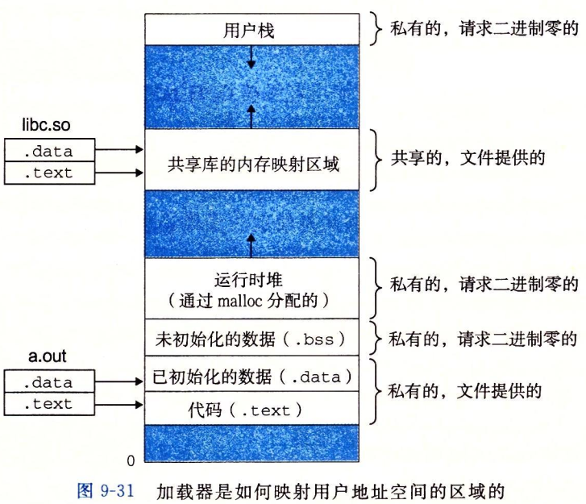

# Linux内核设计与实现（第三版）

[TOC]

## 前言

本书基于Linux内核2.6.34版。


## 第1章 Linux内核简介

1. 应用程序、内核和硬件的关系
   + 
   + 运行于用户空间，执行用户程序。
   + 运行于内核空间，处于进程上下文。分为代表某个特定的用户进程执行的内核线程和独立运行的内核线程。前者多是用户进程通过系统调用陷入内核，内核线程能映射用户空间的内存并访问；后者例如工作队列的工作者线程。
   + 运行于内核空间，处于中断上下文，处理某个特定的中断。
2. 单内核与微内核设计之比较及Linux内核设计
   + 单内核：内核服务处于统一的内核地址空间，通过函数调用相互通信。
   + 微内核：内核服务保持独立并运行在各自的地址空间（用户空间），通过IPC通信。
   + Linux内核设计：Linux是单内核设计，但汲取了微内核的精华。（模块化设计、抢占式内核、支持内核线程以及动态装载内核模块的能力）
3. Linux内核版本
   + 主版本号.从版本号.修订版本号.稳定版本号，例如：2.6.26.1
   + 从版本号表明内核处于稳定还是开发版，偶数为稳定版，奇数为开发版。

## 第2章 从内核出发

1. 安装新内核（与体系结构和启动引导工具（bootloader）息息相关）
   + 在使用grub的x86系统上，可能需要把编译后的arch/i386/boot/bzImage拷贝到/boot目录下，像vmlinuz-version这样命名它，并且编辑/etc/grub/grub.conf文件，为新内核建立一个新的启动项。
   + 模块的安装自动且独立于体系结构：以root身份运行%make modules_install就可以把所有已编译的模块安装到正确的/lib/modules下。
2. 内核代码常见C语言扩展
   + 内联(inline)函数：实践中一般在头文件定义内联函数，或定义在源文件开始的地方。
   + 内联汇编：通常使用asm()指令嵌入汇编代码。
   + 分支声明：likely()和unlikely()。

## 第3章 进程管理


1. 进程与线程的关系
   + 线程被视为一个与其它进程共享某些资源的进程，拥有自己的task_struct。
   + 线程独占资源包括程序计数器、线程栈、一组进程寄存器。
2. 内核如何存放和表示进程
   + 内核使用task_struct（即进程描述符）存放进程有关的全部信息，包括打开的文件、进程地址空间、挂起的信号，进程的状态等等。
   + Linux通过slab分配器分配task_struct结构，以达到对象复用与缓存着色（cache coloring）的目的。
   + 进程通过内核栈顶的thread_info结构快速访问task_struct。
3. 如何创建进程
   + 通过fork()，实际上最终是clone()
4. 如何把新的执行映像装入到地址空间
   + 通过exec()系统调用族
5. 如何表示进程的层次关系
   + Linux系统的进程都是init进程（pid=1）的后代，并存在一颗继承树。
6. 父进程如何收集其后代的信息
   + 通过wait()系统调用族，获取僵死进程的退出信息并释放剩余占用内存。
7. 进程最终如何消亡
   + 强制或自愿地调用exit()，C编译器会在main()函数返回点后面放置调用exit()的代码。exit()会释放进程的全部资源、退出所有等待队列、通知父进程并给子进程重新找养父，此时进程处于僵死状态，占有内存只剩下内核栈、thread_info结构和task_struct结构。

## 第4章 进程调度

1. 调度算法基本参数
   + 优先级：
     + nice优先级（-20 ~ +19）：越大的nice值意味着更低的优先级，Linux的nice值代表的是时间片的比例。
     + 实时优先级（0 ~ 99）：越高的数值意味着优先级越高，任何实时进程的优先级都高于普通进程。
   + 时间片：Linux的时间片代表处理器使用比例，并使用nice值作为权重调节。
2. Linux调度算法
   + 调度器类：Linux调度器以模块方式提供，允许不同类型的进程可以有针对性的选择调度算法，这种模块化结构被称为调度器类。sched_normal、sched_fifo、sched_rr、sched_idle。调度器实体结构作为一个名为se的成员变量嵌入在进程描述符struct task_struct中。
   + 基础调度器代码按照优先级顺序遍历调度类，拥有一个可执行进程的最高优先级的调度器类胜出，去选择下一个执行的进程。
   + sched_normal：CFS（Completely Fair Scheduler）完全公平调度算法，每个进程都按其权重在全部可运行进程中所占比例的”时间片“来运行，优先调度消耗”时间片“最少的进程。CFS使用红黑树来组织可运行进程队列，并通过vruntime变量记录进程的虚拟运行时间。
   + sched_fifo：实时调度算法，不基于时间片，进程一直执行直到阻塞或主动释放处理器为止，只有高优先级的sched_fifo或sched_rr进程才能抢占sched_fifo进程。
   + sched_rr：带有时间片的sched_fifo算法。
3. 抢占和上下文切换
   + 上下文切换：由定义在kernel/sched.c中的context_switch()函数负责处理。
     + 调用声明在<asm/mmu_context.h>中的switch_mm()，完成虚拟内存切换。
     + 调用声明在<asm/system.h>中的switch_to()，完成处理器状态切换。（保存、恢复栈信息和寄存器信息，还有一些与体系结构相关的状态信息）
   + 用户抢占
     + 从系统调用返回用户空间时
     + 从中断处理程序返回用户空间时
   + 内核抢占（持有锁的内核代码不能被抢占）
     + 中断处理程序正在执行，且返回内核空间之前
     + 内核代码再一次具有可抢占性的时候
     + 如果内核中的任务显式的调用schedule()
     + 如果内核中的任务阻塞（这同样也会导致调用schedule()）

## 第5章 系统调用

1. 系统调用与库函数及API的关系

   + 

   + C库提供了POSIX的绝大部分API，包括标准C库函数和系统调用接口。

2. 用户进程如何使用系统调用

   + X86系统上，用户进程通过128号软件中断引发一个异常促使系统切换到内核态去执行系统调用处理程序system_call()，system_call()执行相应的系统调用call* sys_call_table(,%rax,8)。
   + 系统调用号和返回值通过eax寄存器传递。
   + 在X86-32系统上，使用ebx、ecx、edx、esi和edi按照顺序存放前五个参数，多于五个参数的调用通过一个单独的寄存器存放指向所有参数的用户空间地址指针。
   + 

3. Linux如何实现系统调用

   + 首先，在系统调用表的最后加入一个表项。
   + 对于所支持的各种体系结构，系统调用号都必须定义于<asm/unistd.h>中。
   + 系统调用必须被编译进内核映像（不能被编译成模块）。

## 第6章 内核数据结构

1. Linux内核实现链表、红黑树方式与众不同，它不是将数据结构塞入链表、红黑树，而是将链表节点、红黑树节点塞入数据结构。内核以此实现了“容器”，并且定义了一组泛型函数。

   + ```c
     struct sched_entity {
     	...
     	struct rb_node			run_node;
     	struct list_head		group_node;
     	...
     };
     ```

2. 链表

   + ```c
     struct list_head {
     	struct list_head *next, *prev;
     };
     ```

   + ```c
     //使用container_of()我们可以方便的从链表指针找到父结构。这是因为在C语言中，给定结构的变量偏移在编译时地址就被ABI固定了下来。
     #define container_of(ptr, type, member) ({				\
     	void *__mptr = (void *)(ptr);					\
     	BUILD_BUG_ON_MSG(!__same_type(*(ptr), ((type *)0)->member) &&	\
     			 !__same_type(*(ptr), void),			\
     			 "pointer type mismatch in container_of()");	\
     	((type *)(__mptr - offsetof(type, member))); })
     //依靠list_entry()方法，内核提供了创建、操作以及其他链表管理的各种例程--所有这些方法都不需要知道list_head所嵌入对象的数据结构。
     #define list_entry(ptr, type, member) \
     	container_of(ptr, type, member)
     ```

3. 红黑树

   + ```c
     struct rb_node {
     	unsigned long  __rb_parent_color;
     	struct rb_node *rb_right;
     	struct rb_node *rb_left;
     } __attribute__((aligned(sizeof(long))));
     ```

## 第7章 中断和中断处理

1. 中断与异常
   + 硬中断：由硬件产生的异步中断。（键盘输入、NIC收包）
   + 软中断：下半部（bottom half）执行的一种机制。（NIC驱动程序->softirq->网络协议栈）
   + 异常：又称“软件中断”，由处理器产生的同步中断（除0，缺页，系统调用）。
2. 上半部（top half）与下半部区分（NIC收包）
   + 上半部：一个快速、异步、简单的机制负责对硬件做出迅速响应并完成那些时间要求很严格的操作。（处于中断上下文）
   + 下半部：推迟那些对时间要求相对宽松的任务到中断被激活以后再运行。（可能处于中断上下文，也可能处于进程上下文）
   + NIC通过中断处理程序通知内核收包事件，拷贝数据到内存，触发softirq引发下半部执行。网络协议层解析、处理数据包。
3. 中断上下文为什么不能睡眠
   + 中断上下文没有管理虚拟内存、处理器状态的类似于进程描述符一样的数据结构，因此不能重新调度。（可以切换，只需要保存处理器状态到中断栈即可）
   + 一般的中断处理程序执行时会禁止相同中断，而少数会禁止全部中断，这时睡眠会导致无法唤醒，因为内核不会接收任何中断。（包括时钟中断）
4. 中断处理机制的实现
   + 

5. 中断控制
   + 

## 第8章 下半部

1. 下半部实现机制对比

   + 

   + 内核定时器：将工作推后到某个确定的时间段之后执行。

2. 软中断（softirq）

   + ```c
     //软中断在编译期间静态分配，由softirq_action结构表示
     struct softirq_action
     {
     	void	(*action)(struct softirq_action *);
     };
     //kernel/softirq.c中定义了一个包含有32个该结构体的数组
     static struct softirq_action softirq_vec[NR_SOFTIRQS] __cacheline_aligned_in_smp;
     //do_softirq()遍历softirq_vec数组，调用待处理软中断的处理程序。
     //注册软中断处理程序
     open_softirq(NET_TX_SOFTIRQ, net_tx_action);
     //触发软中断，触发之前会禁止中断，触发后再恢复原来的状态。
     raise_softirq(NET_TX_SOFTIRQ);
     //中断已经被禁止时触发软中断
     raise_softirq_irqoff(NET_TX_SOFTIRQ);
     ```

   + 软中断在以下地方被检查和执行

     + 从一个硬件中断代码处返回时
     + 在ksoftirqd内核线程中
     + 在那些显示检查和执行待处理的软中断的代码中（网络子系统和SCSI）

3. tasklet

   + tasklet通过软中断实现，由两类软中断代表：HI_SOFTIRQ和TASKLET_SOFTIRQ.

   + tasklet与软中断最大的区别：同一时间在所有处理器上只允许运行一个相同tasklet，而同一时间可能在多个处理器上运行相同的softirq。

   + ```c
     struct tasklet_struct
     {
     	struct tasklet_struct *next;
     	unsigned long state;
     	atomic_t count;
     	void (*func)(unsigned long);
     	unsigned long data;
     };
     //tasklet由tasklet_schedule()和tasklet_hi_schedule()函数进行触发。
     //单处理器链表tasklet_vec和tasklet_hi_vec用于存放已触发的tasklet
     //do_softirq()执行TASKLET_SOFTIRQ和HI_SOFTIRQ相应的软中断处理程序，为当前处理器遍历tasklet_vec和tasklet_hi_vec链表，调用tasklet的处理程序。
     //静态创建tasklet
     DECLARE_TASKLET(name, func, data)
     DECLARE_TASKLET_DISABLED(name, func, data);
     //动态创建tasklet
     tasklet_init(t, tasklet_handler, dev);
     //触发tasklet
     tasklet_schedule(&my_tasklet);
     //禁止或激活tasklet
     tasklet_disable(&my_tasklet);
     tasklet_enable(&my_tasklet);
     ```

   + 

4. ksoftirqd

   + 每个处理器一个ksoftirqd/n内核线程，n为处理器编号。
   + 当大量软中断出现时（重复触发，例如：网络子系统连续收包），ksoftirqd用于推迟软中断的执行，避免饥饿用户进程。

5. 工作队列***(注意：目前版本的工作队列实现仿佛有较大变动)***

   + 工作队列子系统是一个用于创建内核线程的接口。

   + 工作者线程运行在进程上下文，允许被重新调度甚至是睡眠。

   + 缺省的工作者线程叫做events/n，n是处理器的编号。

   + ```c
     //工作队列
     struct workqueue_struct {
         struct cpu_workqueue_struct cpu_wq[NR_CPUS];
         struct list_head list;
         const char *name;
         int singlethread;
         int freezeable;
         int rt;
     }; 
     //每处理器工作队列
     //主要维护了工作链表，工作者线程需要睡眠的等待队列，以及进程描述符
     struct cpu_workqueue_struct {
         spinlock_t lock;/*因为工作者线程需要频繁的处理连接到其上的工作，所以需要加锁保护*/
         struct list_head worklist;/*工作列表*/
         wait_queue_head_t more_work;/*等待队列*/
         struct work_struct *current_work; /*当前的work*/
         struct workqueue_struct *wq;/*所属的workqueue*/
         struct task_struct *thread;/*工作者线程的进程描述符*/
     };
     //工作
     struct work_struct {
         atomic_long_t data;/*工作处理函数func的参数*/
         struct list_head entry;/*连接工作的指针*/
         work_func_t func;
     };
     ```

   + 

   + 

   + 工作者线程被创建之后，会先定义一个图中的wait节点，然后在一循环体中检查cwq中的worklist，如果该链表为空，那么就会把wait节点加入到cwq中的more_work中，然后休眠在该等待队列中。
   
   + 调用queue_work（struct workqueue_struct *wq, struct work_struct *work）向wq中加入工作节点。work会依次加在cwq->worklist所指向的链表中。queue_work向cwq->worklist中加入一个work节点，同时会调用wake_up来唤醒休眠在cwq->more_work上的worker_thread进程。wake_up会先调用wait节点上的autoremove_wake_function函数，然后将wait节点从cwq->more_work中移走。
   
   + worker_thread再次被调度，开始处理cwq->worklist中的所有work节点。当所有work节点处理完毕，worker_thread重新将wait节点加入到cwq->more_work，然后再次休眠在该等待队列中直到调用queue_work。
   
6. 上下文切换（用户态与内核态、进程上下文、中断上下文）

   + 用户态与内核态切换：用户进程通过系统调用进入内核线程执行，只需要切换处理器状态（保存在内核栈），内核线程可能映射用户进程的虚拟内存并访问。
   + 进程上下文切换：进程由内核管理和调度，线程是内核调度的基本单位，因此只能在内核态通过切换内核线程切换进程。进程上下文切换需要切换处理器状态和虚拟内存（分别保存在task_struct的thread变量中和?）。
   + 中断上下文切换：2.6版本后，中断既可以和被中断进程共享一个内核栈，也可以有自己独立的中断栈。中断上下文只包括内核态中断处理程序执行所必需的状态，包括 CPU 寄存器、内核栈、硬件中断参数等。
     + 从进程上下文切换到中断上下文：应该先是用户进程从用户态切换到内核态（切换处理器状态），接着切换到中断上下文（还是切换处理器状态，不需要切换虚拟内存）；
     + 中断抢占：切换处理器状态。（保存在被中断进程的内核栈或自己独立的中断栈中）

7. 在下半部之间加锁

   + 如果进程上下文和一个下半部共享数据：在访问数据之前需要禁止下半部的处理并得到锁的使用权，所做的这些也是为了本地和SMP的保护并防止死锁的出现。
   + 如果中断上下文和一个下半部共享数据：在访问数据之前需要禁止中断并得到锁的使用权，所做的这些也是为了本地和SMP的保护并防止死锁的出现。
   + 任何在工作队列中被共享的数据也需要使用锁机制。

8. 禁止下半部

   + 这些函数通过为每个进程维护一个引用计数器preempt_count，当当前进程计数器为0时，下半部才能处理。
   + 

参考文献

[https://blog.csdn.net/MyArrow/article/details/8090504](https://blog.csdn.net/MyArrow/article/details/8090504)

[https://zhuanlan.zhihu.com/p/52845869](https://zhuanlan.zhihu.com/p/52845869)

## 第10章 内核同步原语

1. 原子操作

   + 内核提供了两组原子操作接口：一组针对整数进行操作，另一组针对单独的位进行操作。大多数体系结构提供支持原子操作的简单算数指令，其他的也为单步执行提供了锁内存总线的指令。
   + 

   + 

2. 自旋锁
   + 自旋锁是一种不可睡眠锁。如果一个线程试图获得一个被已经持有的自旋锁，那么该线程就会一直进行忙循环->旋转->等待锁重新可用。
   + 门和锁的例子：自旋锁相当于坐在门外等待同伴从里面出来，并把钥匙交给你。如果你到了门口，发现里面没有人，就可以抓到钥匙进入房间。如果你到了门口发现里面正好有人，就必须在门外等待钥匙，不断的检查房间是否为空。当房间为空时，你就可以抓到钥匙进入。
   + 

3. 信号量
   + 信号量是一种睡眠锁。如果有一个任务试图获得一个不可用（已经被占用）的信号量时，信号量会将其推进一个等待队列，然后让其睡眠。当持有的信号量可用（被释放后），处于等待队列的那个任务被唤醒，并获得该信号量。
   + 门和锁的例子：当某个人到了门前，他抓取钥匙，然后进入房间。最大的差异在于当另一个人到了门前，但无法得到钥匙时会发生什么情况。在这种情况下，这家伙不是在徘徊等待，而是把自己的名字写在一个列表中，然后就去打盹了。当里面的人离开房间时，就在门口查看一下列表。如果列表上有名字，他就对第一个名字仔细检查，并在胸部给他一拳，叫醒他，让他进入房间。
   + 

4. 互斥量
   
+ 
  
5. 完成变量（条件变量）
   + 如果一个任务要执行一些工作时，另一个任务就会在完成变量上等待。当这个任务完成工作后，会使用完成变量去唤醒在等待的任务。
   + 

6. 顺序锁（seq锁）

   + 顺序锁提供了一种很简单的机制用于读写共享数据，实现方式主要依靠一个序列计数器：当有疑义的数据被写入时，会得到一个锁，并且序列值会增加。在读取数据之前和之后，序列号都被读取。如果读取的序列号值相同，说明在读操作进行的过程中没有被写操作打断过。此外，如果读取的值是偶数，那么就表明写操作没有发生。

   + ```c
     //定义一个写锁
     seqlock_t mr_seq_lock = DEFINE_SEQLOCK(mr_seq_lock);
     //使用写锁
     write_seqlock(&mr_seq_lock);
     /*写锁被获取...*/
     write_sequnlock(&mr_seq_lock);
     //使用读锁
     unsigned long seq;
     do{
         seq = read_seqbegin(&mr_seq_lock);
         /*读这里的数据...*/
     }while(read_seqretry(&mr_seq_lock, seq));
     ```

   + 应用：jiffies是一个64位的变量，记录了自系统启动以来的时钟节拍累加数。读取jiffies_64变量的get_jiffies_64()函数以及定时器中断更新jiffies都使用了seq锁。

7. 禁止抢占
   + 有时候同步并不需要使用自旋锁(单处理器独立变量），则这时可以通过禁止内核抢占来同步，禁止抢占维护一个抢占计数器，当计数为0，内核可以抢占。
   + 

8. 顺序和屏障

   + [更多内容参见](./../程序员的自我修养——链接、装载和库/程序员的自我修养——链接、装载与库.md)
+ 内存屏障：它使得CPU或编译器在对内存进行操作的时候，严格按照一定的顺序来执行，即屏障之前的指令和之后的指令不会由于系统优化等原因而导致乱序。语义上，内存屏障之前的所有写操作都要写入内存，之后的读操作都可以获得内存屏障之前的写操作的结果。
   + 

## 第11章 定时器和时间管理

1. 体系结构提供了两种设备进行计时

   + | 实时时钟（RTC）                                              | 系统定时器                                                   |
     | ------------------------------------------------------------ | ------------------------------------------------------------ |
     | 用来持久存放系统时间的设备。在PC体系结构中，RTC和CMOS集成在一起，RTC的运行与BIOS的保存设置都是通过同一个电池供电。 | 提供一种周期性触发中断机制。在X86体系结构中，主要采用可编程中断时钟（PIT）。内核在启动时对PIT进行变成初始化 |
     | RTC在系统启动时初始化墙上时间xtime                           | 内核在启动时对PIT进行编程初始化，使其能够以HZ/秒的频率产生时钟中断，更新系统运行时间jiffies和墙上时间xtime |

   + 节拍率（HZ）：X86体系结构中，默认节拍率HZ=100，即时钟中断每10ms触发一次。

2. 时钟中断处理程序

   + 分为两个部分，体系结构相关部分和体系结构无关部分，体系结构相关部分作为系统定时器的中断处理程序而注册到内核中。
   + 时钟中断处理程序的功能：
     + 获得xtime_lock锁，以便对访问jiffies_64和墙上时间xtime进行保护。
     + 需要时应答或重新设置系统时钟
     + 周期性使用墙上时间更新实时时钟（RTC）。
     + 调用体系结构无关的时钟例程：tick_periodic()。
   + tick_periodic()功能：
     + 给jiffies_64变量加1（这个操作即使在32位体系结构上也是安全的，因为前面已经获得了xtime_lock锁）。
     + 更新资源消耗的统计值，比如当前进程所消耗的系统时间和用户时间。
     + 执行已经到期的动态定时器。
     + 执行scheduler_tick()函数，负责减少当前运行进程的时间片计数值并且在需要时设置need_resched标志。在SMP机器上，还要负责平衡每个处理器上的运行队列。
     + 更新墙上时间xtime。

3. gettimeofday()

   + 从用户空间取得墙上时间的系统调用。

   + ```c
     struct timespec {
       time_t  tv_sec;	/* Seconds */
       long    tv_nsec;	/* Nanoseconds */
     };
     ```

4. 定时器

   + ```c
     struct timer_list {
     	struct hlist_node	entry;
     	unsigned long		expires;
     	void			(*function)(struct timer_list *);
     	u32			flags;
     	...
     };
     //使用
     struct timer_list my_timer;
     init_timer(&my_timer);
     my_timer.expires = jiffies+delay;
     my_timer.data = 0;
     my_timer.function = my_function;
     add_timer(&my_timer);
     del_timer(&my_timer);/*不等待，可能产生竞争条件*/
     del_timer_sync(&my_timer);/*等待在其他CPU上正在运行的定时器处理程序全部退出*/
     ```

5. 延迟执行（除了使用定时器和下半部机制）

   + 短延迟（比时钟中断节拍还短）

     + ```c
       //udelay通过执行若干次循环达到延迟效果。
       void udelay(unsigned long usecs)
       void ndelay(unsigned long nsecs)
       void mdelay(unsigned long msecs)
       ```

   + schedule_timeout()（大于时钟中断节拍的延迟）

     + 基于定时器实现，让需要延迟执行的任务睡眠到指定的延迟时间耗尽后再重新运行。

## 第12章 内存管理

1. 内核内存管理单位

   + 

   + 页：内核把**物理**页作为内存管理的基本单位。内存管理单元（MMU）负责管理内存并把虚拟地址转换为物理地址。

     + ```c
       //page结构与物理页相关，而并非与虚拟页相关。
       struct page{
           unsigned long			flags;/*存放页的状态（脏页、锁定）*/
           atomic_t				_count;/*引用计数*/
           atomic_t				_mapcount;
           unsigned long			private;
       //一个页可以由高速页缓存使用，此时，mapping指向关联的address_space对象
           struct address_space* 	mapping;
           pgoff_t					index;
           struct list_head		lru;
           void*					virtual;/*虚拟地址*/
       }
       ```

   + 区：Linux把系统的页划分为区，形成不同的内存池，根据用途进行分配。

     + 

2. 内存分配函数

   + 低级页分配函数

     + 

   + kmalloc()：分配内存确保页在物理地址上是连续的（虚拟地址自然也是连续的）。

     + ```c
       void* kmalloc(size_t size, gfp_t flags);
       void kfree(const void* ptr);
       ```

     + gfp_t：分配器标志，分为三类：行为修饰符、区修饰符及类型。类型标志组合了行为修饰符和区修饰符。

     + 

   + vmalloc()：只确保页在虚拟地址空间内连续，而物理地址则无须连续。

     + vmalloc()函数为了把物理上不连续的页转换为虚拟地址空间上连续的页，必须专门建立页表项。更糟的是，这些页必须一个一个的进行映射，导致TLB抖动。

     + ```c
       void* vmalloc(unsigned long size);
       void vfree(const void* addr);
       ```

3. slab分配器：为了便于数据的频繁分配和回收，针对内核频繁使用的对象创建对象高速缓存组（链表）

   + 进程描述符（task_struct_cachep）、索引节点（inode_cachep）、mptcp协议栈（mptcp_sock_cache、mptcp_cb_cache、mptcp_tw_cache）

   + 

   + ```c
     //创建一个新的对象高速缓存
     struct kmem_cache* kmem_cache_create(const char* name,
                                          size_t size,
                                          size_t align,
                                          unsigned long flags,
                                          void(*ctor)(void*));
     //撤销一个对象高速缓存
     int kmem_cache_destroy(struct kmem_cache* cachep);
     //从缓存分配对象
     void* kmem_cache_alloc(struct kmem_cache* cachep, gfp_t flags);
     //释放对象
     void kmem_cache_free(struct kmem_cache* cachep, void* objp);
     ```

4. MMU如何管理虚拟地址与物理地址的映射（MMU位于CPU内）
   
   + 进程的虚拟地址与物理地址的映射由进程描述符持有的内存描述符持有的页表与物理页的映射描述。
   + 用户进程运行时读写某一地址，如果此时页表并没有关联具体的物理页，CPU中的MMU会产生缺页异常，用户进程陷入内核态，然后MMU将相应的物理页关联到进程持有的页表，并从磁盘读入数据。

## 第13章 虚拟文件系统（VFS）

1. VFS抽象
   + VFS之所以能衔接各种各样的文件系统，是因为它定义了所有文件系统都支持的、基本的、概念上的接口和数据结构。同时实际文件系统也将自身的诸如“如何打开文件”，“目录是什么”等概念在形式上与VFS的定义保持一致。
   + 
   + VFS采用面向对象的设计思路，通过一组数据结构来代表通用文件对象，同时结构体通过一组函数指针操作文件对象。
     + 超级块对象(struct super)：代表一个具体的已安装文件系统。
     + 索引节点对象(struct inode)：代表一个具体文件。
     + 目录项对象(struct dentry)：代表一个目录项，是路径的一个组成部分。注意，目录项对象不代表目录，在Unix中，目录是一个特殊的文件对象。
       + 引入目录项是为了加速路径名查找：解析一个路径并遍历其分量是一个耗时的、常规的字符串比较过程，执行耗时、代码繁琐。
     + 文件对象(struct file)：代表由进程打开的文件。
2. 进程与关联文件及文件系统的结构示意
   
   + 
3. 进程与打开文件的结构示意
   + 文件对象是已打开的文件在内存中的表示，多个进程可以同时打开和操作同一个文件，所以同一个文件也可能存在多个对应的文件对象。
   + 文件对象仅仅在进程观点上代表已打开文件，它反过来指向目录项对象（反过来指向索引节点），其实只有目录项对象才表示已打开的实际文件。虽然一个文件对应的文件对象不是惟一的，但对应的索引节点和目录项对象无疑是唯一的。
   + 

4. Linux文件系统层次结构

   + | /       | 第一层次的根、整个文件系统层次结构的根目录                   |
     | ------- | ------------------------------------------------------------ |
     | /bin/   | 需要在单用户模式可用的必要命令；面向所有用户，例如：cat、ls、cp |
     | /boot/  | 引导程序文件，例如：kernel、initrd；时常是一个单独的分区     |
     | /dev/   | 必要设备，例如：/dev/null                                    |
     | /etc/   | 特定主机、系统范围内的配置文件。（Editable Text Configuration） |
     | /home/  | 用户的家目录，包含保存的文件、个人设置等，一般为单独的分区   |
     | /lib/   | /bin/和/sbin/中二进制文件必要的库文件                        |
     | /media/ | 可移除媒体（如CD-ROM）的挂载点                               |
     | /mnt/   | 临时挂载的文件系统                                           |
     | /opt/   | 可选应用软件包                                               |
     | /proc/  | 虚拟文件系统，将内核与进程状态归档为文本文件。例如：uptime、network。在Linux中，对应Procfs格式挂载 |
     | /root/  | 超级用户的家目录                                             |
     | /sbin/  | 必要的系统二进制文件，例如：init、ip、mount                  |
     | /tmp/   | 临时文件（参见/var/tmp），在系统重启时目录中文件不会被保留   |
     | /usr/   | 用于存储只读用户数据的第二层次：包含绝大多数的多用户工具和应用程序，（Unix Software Resource）<br />    /usr/bin/：非必要可执行文件（在单用户模式中不需要）；面向所有用户<br />    /usr/sbin/：非必要的系统二进制文件，例如：大量网络服务的守护进程<br />    /usr/include/：标准头文件<br />    /usr/lib/：/usr/bin和/usr/sbin/中二进制文件的库<br />    /usr/share/：体系结构无关（共享数据）数据<br />    /usr/src/：源代码，例如：内核源代码<br />    /usr/local/：本地数据的第三层次，具体到本台主机。通常而言有进一步的子目录，例如：bin/、lib/、share/ |
     | /var/   | 变量文件——如日志，有时是一个单独的分区<br />    /var/log/：日志文件，包含大量日志文件，为了防止日志占满根分区，生产环境中一般是单独分区。<br />    /var/tmp/：在系统重启过程中可以保留的临时文件 |
     | /run/   | 自最后一次启动以来运行中的系统的信息，例如：当前登录的用户和运行中的守护进程、一些守护进程的pid文件、socket文件。 |

参考文献

[https://blog.csdn.net/sealyao/article/details/4626875](https://blog.csdn.net/sealyao/article/details/4626875)

## 第14章 块I/O层

1. 扇区与块的区别
   + 扇区是块设备的最小可寻址单元，块是文件系统的最小操作单元
2. 块I/O操作相关的数据结构
   + struct buffer_head：缓冲区描述符，描述磁盘块和物理内存缓冲区（位于页高速缓存）之间的映射关系。
   + struct bio：块I/O操作的基本容器，代表正在现场执行的I/O操作。
     + 总而言之，每一个块I/O请求都通过一个bio结构体表示。每个请求包含一个或多个块，这些块存储在bio_vec结构体数组中。这些结构体描述了每个片段在物理页中的实际位置，并且像向量一样被组织在一起。
     + 
   + struct request：块设备的块I/O请求在请求队列中的表示，每个请求可以由多个bio结构体组成。
3. I/O调度程序：管理块设备的请求队列。它决定队列中的请求排列顺序以及在什么时候派发请求到块设备。（合并与排序）
   + Linus电梯
   + 最终期限I/O调度：Linus电梯+请求过期时间
   + 预测I/O调度：最终期限I/O调度+预测
   + 完全公正的排队I/O调度：每个进程一个磁盘请求队列+时间片轮询
   + 空操作I/O调度：只合并而不排序。专为随机访问设备设计。（SSD）

## 第15章 进程地址空间

1. 进程地址空间结构

   + 

2. 内存描述符：内核使用内存描述符结构体表示进程的地址空间。

   + 内核同时使用红黑树和链表两种数据结构组织内存描述符。链表利于简单、高效的遍历所有元素，红黑树便于搜索指定元素。
   + 所有的mm_struct结构体都通过自身的mmlist域连接到一个双向链表，该链表的首元素是init_mm内存描述符，它代表init进程的地址空间。
   + 分配内存描述符
     + fork()函数利用copy_mm()函数复制父进程的内存描述符，也就是current->mm域给其子进程，而子进程中的mm_struct结构体实际是通过allocate_mm()宏从mm_cachep slab缓存中分配得到的。
     + 对于线程，在fork()调用clone()时，设置CLONE_VM标志，内核就不再调用allocate_mm()宏，而是直接在copy_mm()函数中将mm域指向其父进程的内存描述符就可以了。
   + 撤销内存描述符：进程退出时，内核调用exit_mm()->mmput()减少内存描述符中的mm_users用户计数，降为0则接着调用mmdrop()减少mm_count使用计数，如果使用计数也降为0，最后调用free_mm()宏通过kmem_cache_free()函数将mm_struct结构体归还到mm_cachep slab缓存中。

3. 虚拟内存区域（VMA）

   + vm_area_struct结构体描述了指定地址空间内连续区间上的一个独立内存范围。内核将每个内存区域作为一个单独的内存对象管理，每个内存区域都拥有一致的属性，比如访问权限等，另外，相应的操作也都一致。

   + 

   + BSS段存放未初始化的全局变量与静态变量。在可执行文件中长度为0，当加载到内存中时才映射到零页（页上全为0），完成初始化。这样做避免了在目标文件中显式初始化，减少了空间浪费。

   + 操作内存区域

     + ```c
       //在指定的地址空间中搜索第一个vm_end大于addr的内存区域。
       struct vm_area_struct* find_vma(struct mm_struct* mm, unsigned long addr);
       //返回第一个vm_end小于addr的VMA
       struct vm_area_struct* find_vma_prev(struct mm_struct* mm, unsigned long addr, struct vm_area_struct** pprev);
       //返回第一个和指定地址区间相交的VMA。
       static inline struct vm_area_struct* find_vma_intersection(struct mm_struct* mm, unsigned long start_addr, unsigned long end_addr);
       ```

4. mmap()->do_mmap()以及mummap()->do_mummap()

   + 系统调用mmap()使用内核函数do_mmap()在虚拟内存中分配一个合适的新内存区域。如果可能的话，将新区域与邻近区域进行合并，否则内核从vm_area_cachep缓存中分配一个vm_area_struct结构体，并且使用vma_link()函数将新分配的内存区域添加到地址空间的内存区域链表和红黑树中，随后还要更新内存描述符中的total_vm域，然后返回新分配的地址区间的初始地址。
   + 系统调用mummap()使用内核函数do_mummap()从特定的进程地址空间中删除指定地址区间。

5. 页表：Linux使用三级页表完成地址转换

   + 
   + 内核管理物理页struct page，进程持有虚拟地址空间strcut mm_struct。每个进程可以拥有相同的虚拟地址空间，内核负责将其映射到不同的物理页。

## 第16章 页高速缓存

页高速缓存（cache）是Linux内核实现磁盘缓存，主要用来减少对磁盘的I/O操作。

1. LRU算法（最近最少使用缓存回收算法）
   + lru算法常见实现（读操作、写操作）
     + 数组+时间戳：跟踪每个数据的访问踪迹，回收最老时间戳的数据。
       + 读操作：遍历数组，如果数据在数组中，置时间戳为0并访问数据，否则，调用写操作并返回新数据。O(n)
       + 写操作：插入新数据，并置时间戳为0，同时将其余数据时间戳加1。如果数组空间溢出，遍历数组删除时间戳最大的数据。O(n)
     + 链表模拟队列：先进先出。
       + 读操作：遍历链表，如果数据在链表中，访问数据并移动到链尾，否则，调用写操作并返回新数据。O(n)
       + 写操作：将新数据插入链尾。O(1)
     + 链表+哈希表：减少读操作的遍历时间
       + 读操作：查找哈希表，若数据存在则访问链表中的数据并移动到链尾，否则，调用写操作。O(1)
       + 写操作：将新数据插入链尾和哈希表。O(1)
       + 问题：如何哈希？通过数据对象地址
   + lru/n算法（应对缓存污染）：linux实现为lru/2：Linux 引入了两个页面标志符 PG_active 和 PG_referenced 用于标识页面的活跃程度，从而决定如何在两个链表之间移动页面。PG_active 用于表示页面当前是否是活跃的，如果该位被置位，则表示该页面是活跃的。PG_referenced 用于表示页面最近是否被访问过，每次页面被访问，该位都会被置位。Linux 必须同时使用这两个标志符来判断页面的活跃程度，假如只是用一个标志符，在页面被访问时，置位该标志符，之后该页面一直处于活跃状态，如果操作系统不清除该标志位，那么即使之后很长一段时间内该页面都没有或很少被访问过，该页面也还是处于活跃状态。为了能够有效清除该标志位，需要有定时器的支持以便于在超时时间之后该标志位可以自动被清除。然而，很多 Linux 支持的体系结构并不能提供这样的硬件支持，所以 Linux 中使用两个标志符来判断页面的活跃程度。
     + 如果页面被认为是活跃的，则将该页的 PG_active 置位；否则，不置位。
     + 当页面被访问时，检查该页的 PG_referenced 位，若未被置位，则置位之；若发现该页的 PG_referenced 已经被置位了，则意味着该页经常被访问，这时，若该页在 inactive 链表上，则置位其 PG_active 位，将其移动到 active 链表上去，并清除其 PG_referenced 位的设置；如果页面的 PG_referenced 位被置位了一段时间后，该页面没有被再次访问，那么 Linux 操作系统会清除该页面的 PG_referenced 位，因为这意味着这个页面最近这段时间都没有被访问。
     + PG_referenced 位同样也可以用于页面从 active 链表移动到 inactive 链表。对于某个在 active 链表上的页面来说，其 PG_active 位被置位，如果 PG_referenced 位未被置位，给定一段时间之后，该页面如果还是没有被访问，那么该页面会被清除其 PG_active 位，挪到 inactive 链表上去。
2. 内存中并非所有物理页面都是可以进行回收的，总的来说，以下这些种物理页面可以被 Linux 操作系统回收：
   - 文件读写操作过程中用于缓冲数据的页面
   - 用户地址空间中用于文件内存映射的页面
   - 匿名页面：进程用户模式下的堆栈或者是使用 mmap 匿名映射的内存区
   - 特殊的用于 slab 分配器的缓存，比如用于缓存文件目录结构 dentry 的 cache，以及用于缓存索引节点 inode 的 cache
3. address_space：管理页高速缓存项和页I/O操作，是vm_area_struct的物理地址对等体。一个文件可以被多个vm_area_struct标识，但只能被一个address_space标识。
4. flusher线程：每磁盘一个flusher内核线程，定期刷写缓存回磁盘。

***关于缓存的管理与组织过于复杂，由于精力限制，不深入分析。***

参考文献

[https://blog.csdn.net/elricboa/article/details/78847305](https://blog.csdn.net/elricboa/article/details/78847305)

[https://www.ibm.com/developerworks/cn/linux/l-cn-pagerecycle/index.html](https://www.ibm.com/developerworks/cn/linux/l-cn-pagerecycle/index.html)

## 第17章 设备与模块

1. 模块

   + > 对于原理性知识，阅读并笔记是正确的；而对于实操性知识，只有实操才有用。

   + Linux是单内核，整个内核运行在单独的保护域中，但是允许在运行时动态的向其中插入或从中删除代码。这些代码（包括相关的子例程、数据、函数入口和函数出口）被一并组合在一个单独的二进制镜像中，即所谓的可装载内核模块中，或简称为模块。

2. 设备模型（kobject、ktype、kset）

   + 统一设备模型（device model）：提供了一个独立的机制专门来表示设备，并描述其在系统中的拓扑结构（sysfs），从而使系统具有以下优点：
     + 代码重复最小化
     + 提供诸如引用计数这样的统一机制
     + 可以列举系统中所有的设备，观察它们的状态，并且查看它们连接的总线
     + 可以将系统中的全部设备结构以树的形式完整、有效的展现出来--包括所有的总线和内部连接
     + 可以将设备和其对应的驱动联系起来，反之亦然。
     + 可以将设备按照类型加以归类，比如分类为输入设备，而无需理解物理设备的拓扑结构。
     + 可以沿设备树的叶子向其根的方向依次遍历，以保证能以正确顺序关闭各设备的电源。
   + 
     + ktype与kset区别：一个kobject对象只能有一个抽象类型，但是可以根据不同属性被关联到不同的kset集合。
     + sd与attrs关系：kobject通过sd被映射为抽象设备树文件系统sysfs的一个目录项，而attrs导出为该目录项具体文件，反映设备属性。

3. sysfs（抽象设备数文件系统）

   + | block    | 每一个子目录对应系统中的一个已注册的块设备                   |
     | -------- | ------------------------------------------------------------ |
     | bus      | 提供了一个系统总线视图                                       |
     | class    | 包含了以高层功能逻辑组织起来的系统设备视图                   |
     | dev      | 已注册设备节点的视图                                         |
     | devices  | 系统中设备拓扑结构视图，直接映射出内核中设备结构体的组织层次 |
     | firmware | 包含了一些诸如ACPI、EDD、EFI等低层子系统的特殊树             |
     | fs       | 已注册文件系统的视图                                         |
     | kernel   | 包含内核配置项和状态信息                                     |
     | module   | 包含系统已加载模块的信息                                     |
     | power    | 包含系统范围的电源管理数据                                   |

   + 其中最重要的目录是devices，该目录将设备模型导出到用户空间，目录结构就是系统中实际的设备拓扑。其他目录中的很多数据都是将devices目录下的数据加以转换加工而得。比如，/sys/class/net/目录是以注册网络接口这一高层概念来组织设备关系的，在这个目录中可能会有目录eth0，它里面包含的devices文件其实就是一个指回到devices下实际设备目录的符号链接。

4. 内核引用计数系统（kref）

   + ```c
     struct kref {
     	refcount_t refcount;
     };
     ```

   + 为什么采用结构体而不是直接使用原子变量？这是为了便于进行类型检测。

5. 内核事件层：实现内核到用户的消息通知系统

   + 

参考文献

[https://www.cnblogs.com/sky-heaven/p/6394267.html](https://www.cnblogs.com/sky-heaven/p/6394267.html)

## 第20章 补丁、开发和社区

1. Linux编码风格
   + 缩进：制表位（Tab）每次缩进8个字符长度（Linus认为如果代码复杂到需要多级缩进则需要重构
   + switch语句：case标记缩进到和switch声明对齐，当执行逻辑需要有意的从一个case声明尾部进入另一个case声明时，对其进行评注无疑是一个良好且普遍的实践经验。
   + 空格：空格放在关键字周围；函数名和圆括号之间无空格；对于大多数二元或三元操作符，在操作符两边加上空格；解引用运算符应紧靠标识符而不是C++风格的紧靠类型。
   + 花括号：左括号紧跟在语句的最后，与语句在相同的一行，而右括号要新起一行。不需要一定使用括号的语句可以忽略括号。
   + 每行代码的长度：尽可能保证不超过80个字符。
   + 命名规范：名称中不允许使用骆驼拼写法（CamelCase）、Studly Caps或其他混合的大小写字符。局部变量应尽可能简单，如idx或i；而全部变量应包含描述性内容，必要时加上下划线区分单词，如get_active_tty()。
   + 函数：根据经验，函数的代码长度不应该超过两屏，局部变量不应超过10个。
   + 注释：略
   + ……