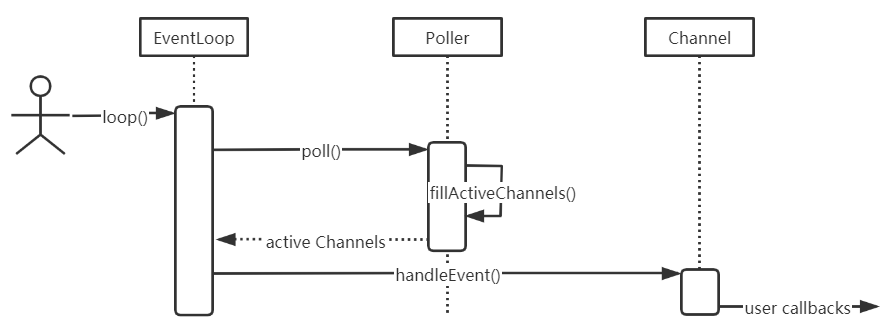
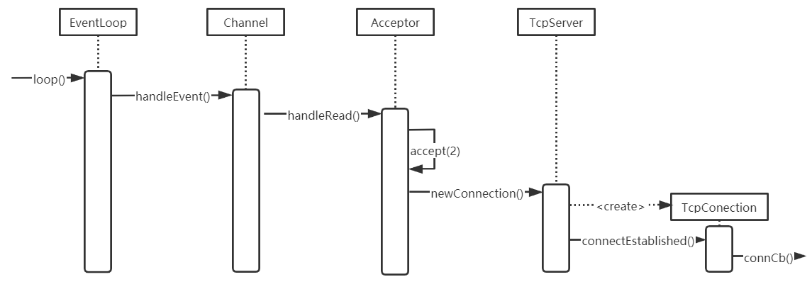
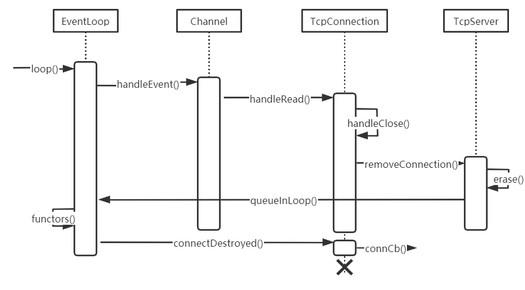
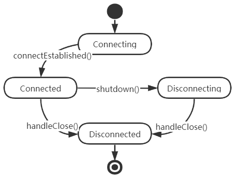

# Linux多线程服务端编程

[TOC]

## 第一部分 C++多线程系统编程

### 第1章 线程安全的对象生命期管理

1. 线程安全与可重入的定义与区别。

2. mutex与lock_guard搭配使用。
   + mutex封锁临界区，lock_guard封装临界区的进入与退出；二者都使用RAII手法，不允许拷贝构造与拷贝赋值。
3. 线程安全的构造函数，不要在构造期间泄露this指针。
   + 不要在构造函数中注册回调；
   + 不要在构造函数中把this指针传给跨线程的对象；
   + 即使在构造函数的最后一行也不行。
4. Observer模式与代码示例。

5. shared_ptr与weak_ptr搭配使用。
   + 二者可拷贝构造与拷贝赋值；
   + shared_ptr与bind使用可能意外延长对象生命期。
6. C++内存问题。
   + 缓冲区溢出；
   + 空悬指针/野指针；
   + 重复释放；
   + 内存泄漏；
   + 不配对的new[]/delete；
   + 内存碎片。
7. 代码示例，对象池实现。

### 第2章 线程同步精要

1. 线程同步的四项原则。
   + 首要原则是尽量最低限度的共享对象，减少需要同步的场合，一个对象能不暴露给别的线程就不要暴露。如果要暴露，优先考虑immutable对象，实在不行才暴露可修改的对象，并用同步措施来充分保护它；
   + 其次是使用高级的并发编程构件，如TaskQueue、Producer-Comsumer Queue、CountDownLatch等等；
   + 最后不得已必须使用底层同步原语时，只用非递归的互斥器与条件变量，慎用读写锁，不要用信号量；
   + 除了使用atomic整数之外，不自己编写lock-free代码，也不要用“内核级”同步原语。不凭空猜测“哪种做法性能会更好”，比如spin lock vs mutex。
2. 遍历时修改vector的两种做法。
   + 一是把修改延后，记住循环中试图添加或删除哪些元素，等循环结束了再依记录修改；
   + 二是用copy-on-write。
3. extract method重构手法解决可能出现的重复加锁错误。
4. condition_variable用法。
   + wait端：必须与mutex一起使用，该布尔表达式的读写需受此mutex保护；在mutex已上锁时才能调用wait()；把判断布尔条件和wait()放到while循环中，避免spurious wakeup问题。C++11支持template< class Predicate > void wait( std::unique_lock\<std::mutex\>& lock, Predicate pred );
   + signal/broadcast端：不一定要在mutex已上锁的情况下调用signal（理论上）；在signal之前一般要修改布尔表达式；修改布尔表达式通常要用mutex保护（至少用作full memory barrier）；注意区分signal与broadcast：“broadcast通常用于表明状态变化，signal通常用于表示资源可用。
5. 一般使用条件变量实现的高层同步措施，如BlockingQueue\<T\>或CountDownLatch。
   + 倒计时是一种常用且易用的同步手段。主要有两种用途：
     + 主线程发起多个子线程，等这些子线程各自都完成一定的任务之后，主线程才继续执行。通常用于主线程等待多个子线程完成初始化；
     + 主线程发起多个子线程，子线程等待主线程，主线程完成其他一些任务之后通知所有子线程开始执行。通常用于多个子线程等待主线程发出“起跑”指令。
6. 代码示例，封装MutexLock、MutexLockGuard、Condition。
7. Singleton模式与代码示例（线程安全的Singleton实现）
8. DCL（double check lock）
   + 实现Singleton的惰性初始化由于乱序执行的影响不可靠，可用pthread_once代替。考虑下面的事件队列：
     1. 线程A发现变量没有被初始化，然后它获取锁并开始变量的初始化。由于某些编程语言的语义，编译器生成的代码允许在线程A执行完变量的初始化之前，更新变量并将其指向部分初始化的对象。
     2. 线程B发现共享变量已经被初始化，并返回变量。由于线程B确信变量已被初始化，它没有获取锁。如果在线程A完成初始化之前共享变量对线程B可见。这是由于A没有完成初始化或者因为一些初始化的值还没有覆盖B使用的内存（缓存一致性），程序很可能会崩溃。
9. sleep不是同步原语。
   + 生产代码中线程的等待可分为两种：
     1. 一种是等待资源可用：要么等在poll/epoll_wait上，要么等在条件变量上；
     2. 一种是等着进入临界区：等在mutex上以便读写数据。后一种等待通常极短，否则程序性能和伸缩性就会有问题。
10. 代码示例，借shared_ptr实现copy-on-write。
    1. 对于read端：在读之前把引用计数加1，读完之后减1，这样保证在读的期间其引用计数大于1，可以阻止并发写。加锁只在拷贝shared_ptr时。
    2. 对于write端：如果发现引用计数为1，这时可以安全的修改共享对象，不必担心有人正在读它；如果发现引用计数大于1，则拷贝副本，修改副本并替换共享变量。全程加锁。

### 第3章 多线程服务器的适用场合与常用编程模型

1. Reactor与Proactor定义与区别。non-blocking IO + IO multiplexing vs aio

2. select/poll/epoll实现与区别。

3. 服务器程序设计范式，
   1. UNP：
      1. TCP并发服务器（每个客户一个子进程）；
      2. TCP预先派生子进程服务器（accept无上锁保护）；
      3. TCP预先派生子进程服务器（accept使用文件上锁保护）；
      4. TCP预先派生子进程服务器（accept使用线程上锁保护）；
      5. TCP预先派生子进程服务器（传递描述符）；
      6. TCP并发服务器（每个客户一个线程）；
      7. TCP预先创建线程服务器（每个线程各自accept）；
      8. TCP预先创建线程服务器（主线程统一accept）。
   2. 工业界：
      1. 单线程的单进程；
      2. 多线程的单进程；
      3. 单线程的多进程；
      4. 多线程的多进程。

4. C++多线程服务器编程模式：one eventloop per thread + thread pool。
   1. IO线程：event loop用作IO multiplexing，配合non-blocking IO和定时器；
   2. 计算线程：thread pool用来做计算，具体可以是任务队列或生产者消费者队列。

5. 线程分类。
   1. IO线程：这类线程的主循环是IO multiplexing，阻塞的等在select/poll/epoll_wait系统调用上。这类线程也处理定时事件。当然它的功能不止IO，有些简单计算也可以放入其中，比如消息的编码或解码；
   2. 计算线程：这类线程的主循环是blocking queue，阻塞地等在condition_variable上。这类线程一般位于thread pool中。这类线程通常不涉及IO，一般要避免任何阻塞操作；
   3. 第三方库的线程：比如logging，database connection。

6. 多线程服务器的适用场景。
   1. 必须使用单线程的场合：程序可能会fork或限制程序的CPU占用率；
   2. 适用多线程的场景：提高响应速度，让IO和计算相互重叠，降低latency。

7. IO类型分类。同步与异步

### 第4章 C++多线程系统编程精要

1. pthread最基本的函数。
   1. 线程的创建与等待结束（join）。封装为muduo::Thread；
   2. mutex的创建、销毁、加锁、解锁。封装为muduo::MutexLock；
   3. 条件变量的创建、销毁、等待、通知、广播。封装为muduo::Condition。
2. 多线程系统编程的难点不在于学习线程原语（primitives），而在于理解多线程与现有的C/C++库函数和系统调用的交互关系，以进一步学习如何设计并实现线程安全且高效的程序。
3. 对于标准而言，关键的不是定义线程库，而是规定内存模型（memory model）。特别是规定一个线程对某个共享变量的修改何时能被其他线程看到，这称为内存序（memory ordering）或内存能见度（memory visibility）。
4. 编写线程安全程序的一个难点在于线程安全是不可组合的（composable）。
   + 例如fseek()和fread()都是线程安全函数，但同时使用而不加锁则不安全，可通过flockfile(FILE\*)和funlockfile(FILE\*)函数显式加锁。
5. C++标准库的绝大多数泛型算法都是线程安全的，因为这些都是无状态纯函数。（std::random_shuffle()可能是个例外，它用到了随机数发生器。）只要输入区间是线程安全的，那么泛型函数就是线程安全的。
6. pthread库线程标识pthread_t带来的问题：
   1. 无法打印输出pthread_t，因为不知道其确切类型。也就没法在日志中用它表示当前线程的id；
   2. 无法比较pthread_t的大小或计算其hash值，因此无法用作关联容器的key；
   3. 无法定义一个非法的pthread_t值，用来表示绝对不可能存在的线程id，因此MutexLock class没法有效判断当前线程是否已经持有本锁；
   4. pthread_t值只在进程内有意义，与操作系统的任务调度之间无法建立有效关联。比方说在/proc文件系统中找不到pthread_t对应的task。
   5. 另外，glibc的pthread实现实际上把pthread_t用作一个结构体指针（它的类型是unsigned long），指向一块动态分配的内存，而且这块内存是反复使用的。因此pthread只保证同一进程之内，同一时刻的各个线程的id不同；不能保证同一进程先后多个线程具有不同的id，更不要说一台机器上多个进程之间的id唯一性了。在我的机器上：win10 v1903 && mingw-w64(x86_64-8.1.0-posix-sjlj-rt_v6-rev0)上，msvcrt的pthread_t实现在进程生命期内的线程标识从1开始递增（从主线程开始）。
7. 封装gettid()系统调用的返回值作为线程id。muduo::CurrentThread::tid()使用__thread变量来缓存gettid()的返回值，减少系统调用开销。
8. 线程创建与销毁的守则。
   1. 程序库不应该在未提前告知的情况下创建自己的“背景线程”；
   2. 尽量用相同的方式创建线程，例如muduo::Thread；
   3. 在进入main()函数之前不应该启动线程。因为这会影响全局对象的安全构造：C++保证在进入main()之前完成全局对象的构造，同时，各个编译单元之间的对象构造顺序是不确定的；
   4. 程序中线程的创建最好能在初始化阶段全部完成。）
9. __thread关键字是GCC内置的线程局部存储设置（thread local storage）。
10. fork()一般不能在多线程程序中调用，因为Linux的fork()只克隆当前线程的thread of control，不克隆其他线程。

### 第5章 高效的多线程日志

1. 生产环境应做到“Log Everything All The Time”。
   + 对于关键进程，日志通常要记录：
     1. 收到的每条内部消息的id（还可以包括关键字段、长度、hash等）；
     2. 收到的每条外部消息的全文；
     3. 发出的每条消息的全文，每条消息都有全局唯一的id；
     4. 关键内部状态的变更，等等。
   + 每条日志都需要时间戳，在分布式系统中完整追踪一个事件的来龙去脉，例如跟踪一个请求从负载均衡器、web服务器、数据库服务器、缓存服务器、文件服务器以及中间的一些路由器和交换机上的发送的所有事件。
2. 日志库大体可分为前端（frontend）和后端（backend）两部分：前端是供应用程序使用的接口（API），并生成日志消息；后端负责把消息写到目的地。这两部分接口可能简单到只有一个回调函数。
3. C++日志库的前端大体上有两种API风格：
   1. C/Java的printf(fmt, ...)风格；
   2. C++的stream<<风格。C++ stream风格不必费心保持格式字符串与参数类型的一致性，可以随用随写，而且是类型安全的。
4. 一个典型的日志文件的文件名。`logfile_test.20120603-144022.hostname.3605.log`。分别为`进程名.GMT时区的创建时间.主机名.进程id.log`。
5. 日志文件的归档（archive）。
   1. 日志文件的滚动（rolling）：文件大小达到阈值或时间过期；
   2. 通过symlink使日志库后端始终指向最新日志文件；
   3. 日志文件压缩与归档不应该由日志库实现，而是交给专门的脚本去做。
6. muduo日志格式：`日期 时间 微秒 线程 级别 正文 - 源文件名:行号`。例如：`20120603 08:02:46.125770Z 23261 INFO Hello - test.cc:51`。

7. muduo日志库性能优化。
   1. 时间戳字符串中的日期和时间两部分是缓存的；
   2. 日志消息的前4个字段是定长的，因此可以避免运行期求字符串长度。编译器会将定长的内存复制memcpy()在编译期inline展开；
   3. 线程id预先格式化为字符串；
   4. 源文件名采用编译期计算来获得basename，避免运行期strrchr开销。
8. muduo日志库采用双缓冲（double buffering）技术。前端多条日志聚合，避免多次唤醒后端开销。
9. 改进：进一步增加buffer数目p119，通过hash分桶（bucket）减少线程锁争用p121。

## 第二部分 muduo网络库

### 第8章 muduo网络库设计与实现

1. Reactor的关键结构
   + `EventLoop`：负责调用IO multiplexing，并分发事件。包括三类事件：socketfd事件、timerfd事件、eventfd事件。它并不持有socketfd事件的fd和Channel，但是它持有eventfd事件和timerfd事件，其中后者通过unique_ptr\<TimerQueue\>间接持有。因为socketfd事件由用户直接处理；timerfd事件通过TimerId class暴露给用户使用，TimerQueue class本身对用户透明；eventfd事件对用户透明。
   + `Poller`：是IO multiplexing的封装，抽象基类。Poller通过ChannelMap（从fd到Channel*的映射）持有所有注册事件，但不负责管理事件生命期，而且不负责分发事件。
   + `PollPoller`：poll(2)的封装，通过PollFdList缓存struct pollfd数组，与ChannelMap一一对应，Channel会缓存自己在数组中的下标，方便快速定位。在updateChannel()和removeChannel()中更新上述两个数据结构。
   + `EPollPoller`：epoll(2)的封装，并不需要缓存struct epoll_event数组，但是需要为epoll_wait(2)返回活跃事件保留空间。返回活跃事件的epoll_event.data.ptr指向ChannelMap中对应Channel的地址。
   + `Channel`： 只属于某个EventLoop，只负责一个fd的IO事件分发。Channel会把不同的IO事件分发为不同的回调，ReadCallback()、WriteCallback()、ErrorCallback()、CloseCallback()，而且回调用函数对象表示，用户无需继承Channel，Channel不是基类。muduo用户一般不直接使用Channel，而会使用更上层的封装，如TcpConnection。Channel的生命期由其owner class负责管理，它一般是其他class的直接或间接成员。
   + 
2. 定时器
   + `TimerQueue`：持有唯一的timerfd，并使用红黑树组织Timer。由于用户可在其他线程向TimerQueue添加Timer，因此需要考虑线程安全性。
   + `Timer`：定时器的内部实现，持有回调函数。若为重复事件，可重新设定过期时间后继续使用。
   + `TimerId`：网络库暴露给用户的定时器handle，用户可由此取消对应定时器事件。
   + 时序图.png)
3. TCP网络库
   + `TcpServer`：抽象出的服务器实体，管理Accetpor接受的新连接TcpConnection。一方面，通过向Acceptor注册newConnection()回调，创建TcpConnection并分发到EventLoopThreadPool中；另一方面，为TcpConnection注册用户提供的ConnectionCallback、MessageCallback、WriteCompleteCallback、CloseCallback，完成上层业务逻辑。
   + `Acceptor`：用于accept(2)或accept4(2)接受新连接，并通过回调NewConnectionCallback()通知用户。由TcpServer使用，生命期受后者控制。持有Socket、Channel等。
   + `EventLoopThread`：EventLoop+Thread，线程池的实现基础。
   + `EventLoopThreadPool`：EventLoop线程池，实现one loop per thread多线程服务器编程模式。
   + `TcpConnection`
   + `InetAddress`：对`struct sockaddr`的简单封装，能自动转换字节序。值语义，可以拷贝。
   + `Socket`：RAII handle，封装了socket fd的生命期。
   + 
   + 
   + 
   + 
4. 技巧总结