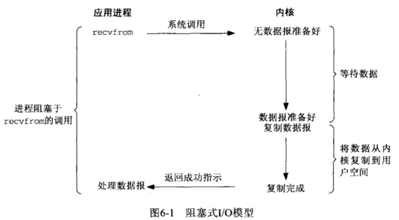
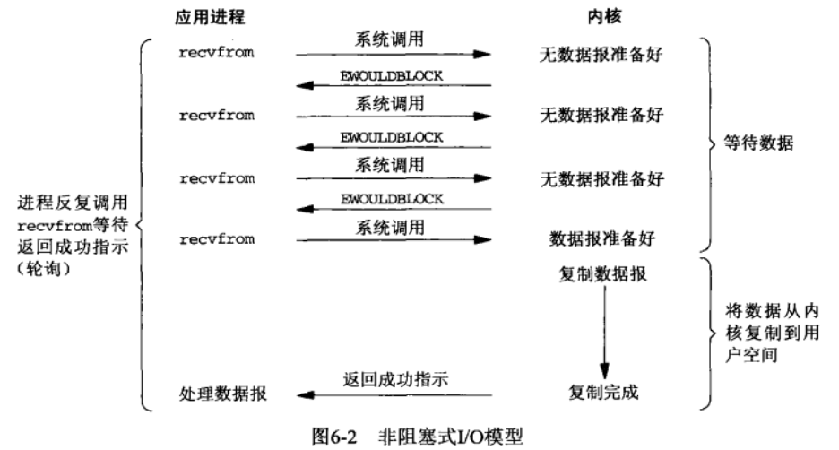
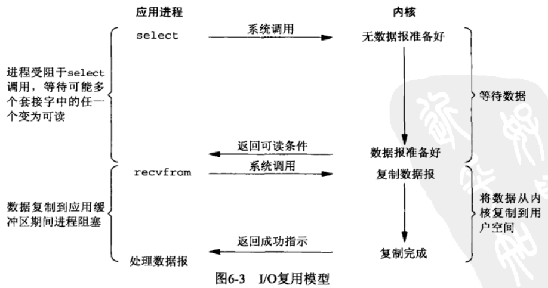
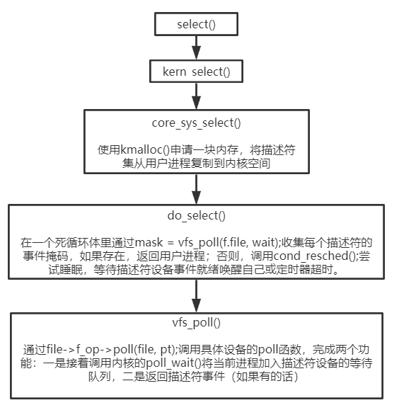
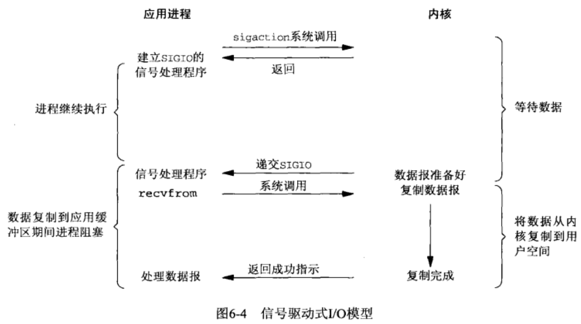
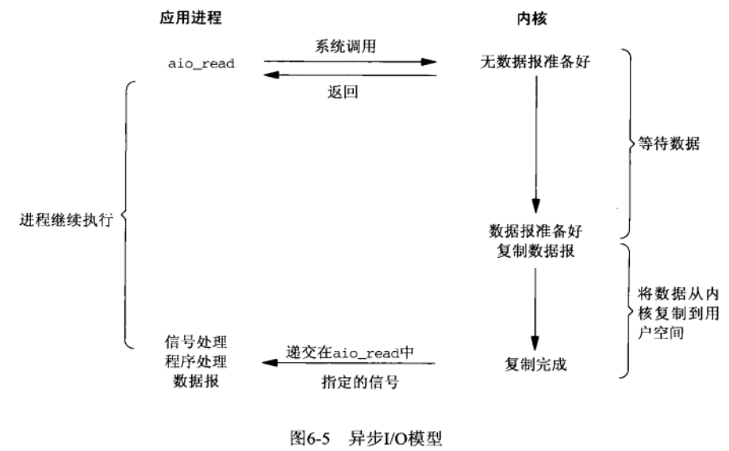
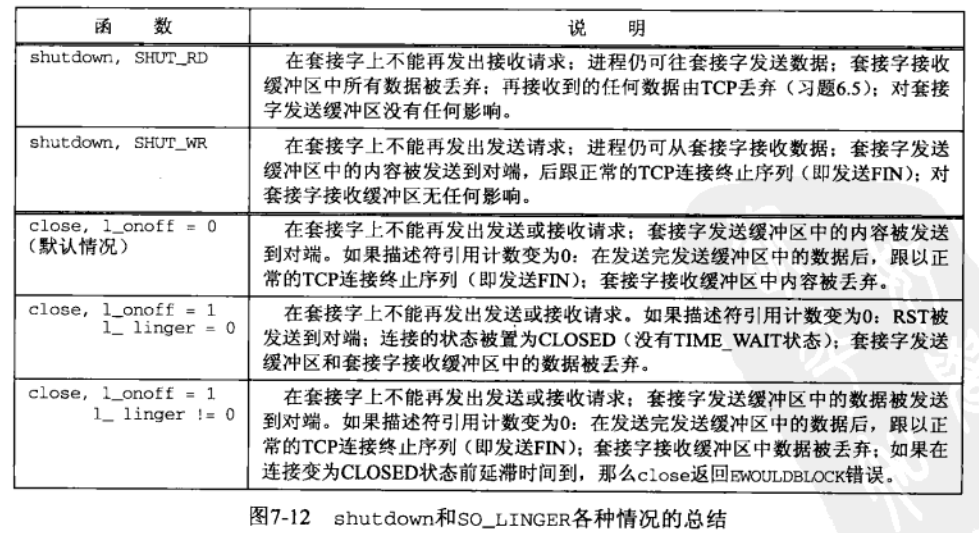

# UNIX网络编程 卷一：套接字联网API（第三版）

[TOC]

## 第3章 套接字编程简介

1. IPv4套接字地址结构`sockaddr_in`、IPv6套接字地址结构`sockaddr_in6`、通用套接字地址结构`sockaddr`如下（注意，这是Linux实现，与POSIX规范并不完全一致）

   + ```c
     struct sockaddr_in{
         sa_family_t		sin_family; /* address family: AF_INET */
         in_port_t		sin_port;	/* port in network byte order */
         struct in_addr	sin_addr;	/* internet address */
     };
     /* Internet address */
     struct in_addr{
         uint32_t		s_addr;		/* address in network byte order */
     };
     ```

   + ```c
     struct sockaddr_in6{
         sa_family_t		sin6_family;	/* AF_INET6 */
         in_port_t		sin6_port;		/* port number */
         uint32_t		sin6_flowinfo; 	/* IPv6 flow information */
         struct in6_addr	sin6_addr;		/* IPv6 address */
         uint32_t		sin6_scope_id;	/* Scope ID (new in 2.4) */
     };
     struct in6_addr{
         unsigned char	s6_addr[16];	/* IPv6 address */
     };
     ```

   + ```c
     struct sockaddr{
         sa_family_t		sa_family;
         char			sa_data[14];
     };
     ```

   + IP地址和端口号在套接字地址结构中总是以网络字节序来存储。

   + 按照惯例，我们总是在填充地址结构前将整个结构置为0。

2. 套接字地址结构操作函数包括字节序转换函数族、IP地址的ASCII字符串与网络字节序的二进制值转换函数族。

   + 字节序转换函数族

     + ```c
       uint16_t htons(uint16_t host16bitvalue);
       uint32_t htonl(uint32_t host32bitvalue);
       uint16_t ntohs(uint16_t net16bitvalue);
       uint32_t ntohl(uint32_t net32bitvalue);
       ```

   + IP地址转换函数族（旧的函数族存在各种各样的问题，这里只记录新的函数族，函数名中p和n分别代表表达（presentation）和数值（numeric））

     + ```c
       int 		inet_pton(int family, const char* strptr, void* addrptr);
       	// 返回：若成功则为1，若输入不是有效的表达式则为0，若出错则为-1
       const char* inet_ntop(int family, const void* addrptr, char* strptr, size_t len);
       	// 返回：若成功则为指向结果的指针，若出错则为NULL
       ```
     
     + ```c
       // inet_ntop使用示例1:IPv4
       struct sockaddr_in addr;
       inet_ntop(AF_INET, &addr.sin_addr, str, sizeof(str));
       // 使用示例2:IPv6
       struct sockaddr_in6 addr6;
       inet_ntop(AF_INET6, &addr.sin6_addr, str, sizeof(str));
       ```
     
     + `inet_ntop`进行相反的转换。len参数是目标存储单元的大小，以免该函数溢出其调用者的缓冲区。为有助于指定这个大小，在`<netinet/in.h>`头文件有如下定义
     
     + ```c
       #define		INET_ADDRSTRLEN		16	/* for IPv4 dotted-decimal */
       #define		INET6_ADDRSTRLEN	46	/* for IPv6 hex string */
       ```

## 第4章 基本TCP套接字编程

1. `int socket(int family, int type, int protocol)`：若成功返回非负描述符，若出错则为-1.

   + > family: AF_INET or AF_INET6
     >
     > type: SOCK_STREAM
     >
     > protocol: IPPROTO_TCP

   + 此时新创建的socket对象处于CLOSED状态。

2. `int connect(int sockfd, const struct sockaddr* servaddr, socklen_t addrlen)`：若成功返回0，若出错则为-1.

   + 客户端在调用`connect`前不必非得调用`bind`，因为如果需要的话，内核会确定源IP地址，并选择一个临时端口作为源端口。
   + 如果是TCP套接字，调用`connect`将激发三次握手过程，而且仅在连接建立成功或出错时才返回。
   + 出错返回可能有以下几种情况：
     1. 没有收到syn-ack，返回ETIMEDOUT错误。返回错误前客户端会尝试退避重传syn直到超时。
     2. 服务端返回rst，这是一种硬错误（hard error），客户端立即返回ECONNREFUSED错误。错误原因是目的端口没有正在监听的服务器。
     3. ICMP目的地不可达错误，这是一个软错误（soft error），客户端返回EHOSTUNREACH或ENETUNREACH（2020/04/11的Linux man connect(2)已不包含EHOSTUNREACH错误）。返回错误前客户端也会尝试退避重传syn直到超时。
   + `connect()`函数导致当前socket从CLOSED状态转移到SYN_SENT状态，若成功再转移到ESTABLISHED状态。若`connect()`失败，则该socket不再可用，必须关闭。当重复调用`connect()`建立连接时，每次`connect()`失败都必须`close()`当前的sockfd并重新调用`socket()`。
   
3. `int bind(int sockfd, const struct sockaddr* myaddr, socklen_t addrlen)`：若成功返回0，否则返回-1.

   + 对于TCP，调用bind函数可以指定一个端口号，或指定一个IP地址，也可以两者都指定，还可以两者都不指定。若用户进程不显式绑定相应的IP或端口，内核会隐式完成绑定工作。

   + 通常客户端进程不需要显式绑定IP和端口，而服务端进程通常绑定地址通配符（INADDR_ANY和in6addr_any）和特定端口。

     + ```c
       //使用示例
       struct sockaddr_in servaddr;
       servaddr.sin_addr.s_addr = htonl(INADDR_ANY);
       
       struct sockaddr_in6 serv;
       serv.sin6_addr = in6addr_any;
       ```

   + 无论是网络字节序还是主机字节序，INADDR_ANY的值（为0.0.0.0）都一样，因此使用`htonl()`并非必须。不过既然头文件`<netinet/in.h>`中定义的所有INADDR_常值都是按照主机字节序定义的，我们应该对任何这些常值都使用`htonl()`。

   + 为了得到内核所绑定的IP和端口，必须调用函数`getsockname()`来返回协议地址。

   + 从`bind()`函数返回的一个常见错误是EADDRINUSE。

   + `/proc/sys/net/ipv4/ip_local_port_range`限制了内核能分配的临时端口号。注意这个限制为每一个四元组中的客户端端口的限制，不同四元组并不共享这个限制值。

4. `int listen(int sockfd, int backlog)`：若成功返回0，否则返回-1.

   + 内核为任何一个给定的监听套接字维护两个队列。
     1. 未完成连接队列：这些请求套接字处于SYN_RCVD状态。
     2. 已完成连接队列：这些请求套接字处于ESTABLISHED状态但还未被应用进程接受。当应用进程调用`accept()`时，已完成连接队列的队首项将返回给进程，或者如果该队列为空，那么进程将阻塞直到TCP/IP协议栈在该队列中放入一项。
   + 关于backlog含义有两种实现，一是未完成连接队列+已完成连接队列长度和；二是已完成连列队列长度。Linux man指出Linux2.2以后的backlog含义为第二种实现。关于这两个队列长度可查看`/proc/sys/net/ipv4/tcp_max_syn_backlog`和`/proc/sys/net/core/somaxconn`。
   + 如果新请求到达时已完成连接队列已满，则服务端可能返回rst或静默，前者导致客户端返回ECONNREFUSED，后者等待客户端超时重传SYN。

5. `int accept(int sockfd, struct sockaddr* cliaddr, socklen_t* addrlen)`：若成功返回非负sockfd，否则返回-1.

   + 返回已完成连接队列的队首项给进程，或者如果该队列为空，那么进程将阻塞直到TCP/IP协议栈在该队列中放入一项。
   + Linux有一个非标准的`accept4(2)`系统调用，比`accept(2)`多一个`int flags`参数，可设置为SOCK_NONBLOCK和SOCK_CLOEXEC。这样可以消除多线程环境下先调用`accept(2)`后调用`fcntl(2)`引入的竞争条件。

6. `int close(int sockfd)`

   + TCP将尝试发送发送队列中的所有数据（但不管对方是否全部成功接收），发送完毕后发生的是正常的TCP连接四次挥手。
   + 当SO_LINGER选项置位，`close(2)`和`shutdown(2)`阻塞进程直到发送队列中的所有数据成功发送或linger超时。如果sockfd的关闭作为`exit(2)`的一部分，总是在后台执行linger行为。

7. `int shutdown(int sockfd, int howto)`：若成功返回0，否则返回-1.

   + 终止连接的通常方式是调用`close(2)`函数，不过它有两个限制，一是`close(2)`把sockfd的引用计数减一，仅在该计数变为0时才关闭套接字。使用`shutdown(2)`可以不管引用计数就激发TCP的正常连接终止序列；二是`close(2)`终止读和写两个方向的数据传送。

   + > SHUT_RD：关闭连接的读一半——套接字中不再有数据可接收，而且接收缓冲区中的现有数据都被丢弃。
     >
     > SHUT_WR：关闭连接的写一半——对于TCP套接字，这称为半关闭（half-close）。当前留在发送缓冲区中的数据将被发送，后跟TCP的正常连接终止序列。

8. `int getsockname(int sockfd, struct sockaddr* localaddr, socklen_t* addrlen)`与`int getpeername(int sockfd, struct sockaddr* peeraddr, socklen_t* addrlen)`：若成功返回0，否则返回-1.

参考文献

[mariolu：socket接口api的深度探究](https://cloud.tencent.com/developer/article/1479738)

[杨博东：深入探索 Linux listen() 函数 backlog 的含义](https://blog.csdn.net/yangbodong22011/article/details/60399728)

[net.ipv4.ip_local_port_range 的值究竟影响了啥](https://mozillazg.com/2019/05/linux-what-net.ipv4.ip_local_port_range-effect-or-mean.html)

## 第6章 I/O复用：select和poll函数

1. 阻塞式I/O
   
+ 
  
2. 非阻塞式I/O
   
+ 
  
3. I/O复用
   
+ 
  
4. select

   + 该函数允许进程指示内核等待多个事件中的任何一个发生，并只有在一个或多个事件发生或经历一段指定的时间后才唤醒它。

   + ```c
     /*
      * maxfdp1: 指定待测试的描述符个数，值为待测试的最大描述符加1.内核通过这个参数避免在用户进程与内核空间之间复制描述符集中不必要的部分，减少需要测试的描述符数量来提高效率。
      * readset、writeset和exceptset: 描述符集
      * timeout: 指定超时时间
      * 返回值表示跨所有描述符集的已就绪的总位数
      */
     int select(int maxfdp1, fd_set* readset, fd_set* writeset, fd_set* exceptset, const struct timeval* timeout);
     ```

   + select返回某个套接字就绪的条件。

   + | 条件                                                         | 可读               | 可写       | 异常 |
     | ------------------------------------------------------------ | ------------------ | ---------- | ---- |
     | 有数据可读<br />关闭连接的读一半<br />给监听套接字准备好新连接 | ok<br />ok<br />ok |            |      |
     | 有可用于写的空间<br />关闭连接的写一半                       |                    | ok<br />ok |      |
     | 待处理错误                                                   | ok                 | ok         |      |
     | TCP带外数据                                                  |                    |            | ok   |

   + select可使用的最大描述符数由FD_SETSIZE限制，因此增大描述符集的唯一方法是增大FD_SETSIZE的值，再重新编译内核。
   + 

5. epoll

   + epoll把监听注册从实际监听中分离出来，从而解决了select和poll监听时遍历全部描述符集的缺陷。

   + ```c
     //创建一个epoll实例（文件对象）
     /*
      * size：需要监听的描述符数量
      * 返回epoll实例的文件描述符
      
     int epoll_create(int size);
     //向指定的epoll实例添加或删除描述符
     /*
      * epfd：epoll实例
      * op：添加、删除、修改fd指定的文件描述符
      * event：描述epoll更具体的行为，通常置event.data.fd为fd，这样epoll_wait()返回时就可以知道哪个文件描述符触发了事件。
      */
     int epoll_ctl(int epfd, int op, int fd, struct epoll_event* event);
     //等待给定epoll实例关联的描述符上的事件
     /*
      * events：内核用来向用户空间复制发生的事件。
      */
     int epoll_wait(int epfd, struct epoll_event* events, int maxevents, int timeout);
     ```

6. select与epoll区别
   
   + select，poll实现需要自己不断轮询所有fd集合，直到设备就绪，期间可能要睡眠和唤醒多次交替。而epoll其实也需要调用`epoll_wait`不断轮询就绪链表，期间也可能多次睡眠和唤醒交替，但是它是设备就绪时，调用回调函数，把就绪fd放入就绪链表中，并唤醒在epoll_wait中进入睡眠的进程。虽然都要睡眠和交替，但是select和poll在“醒着”的时候要遍历整个fd集合，而epoll在“醒着”的时候只要判断一下就绪链表是否为空就行了，这节省了大量的CPU时间。
7. LT模式与ET模式
   + LT模式：只要某个描述符处于readable/writable状态，每次epoll_wait()都会返回该描述符。
   + ET模式：只有某个描述符状态发生了改变，epoll_wait()才会返回该描述符。如从unreadable->readable，从unwritable->writable。
   + LT与ET实现区别：内核代码中LT与ET的处理逻辑几乎完全相同，差别仅在于LT在描述符发生事件时不会将其从epoll实例的就绪链表中移除。
   + I/O复用模型Socket编程注意事项：（sockfd：监听socket、connfd：accept()返回的socket）
     + 对于监听的sockfd，最好使用水平触发模式，边缘触发模式可能导致高并发情况下，有的客户端会连接不上。如果非要使用边缘触发，解决办法是通过while循环accept()调用，直到TCP就绪队列连接处理完。
     + 对于读写的connfd，水平触发模式下，阻塞和非阻塞效果都一样，不过为了防止特殊情况，还是建议设置非阻塞；边缘触发模式下，必须使用非阻塞IO，并要一次性全部读写完数据。
     + 陈硕的《Linux多线程服务端编程》建议non-blocking IO + IO multiplexing 搭配使用。
   + LT与ET性能辨析
     + 由于两种模式处理逻辑差异极小，性能测试结果表明常规应用场景中二者性能差异不大。一般声称ET能降低epoll相关系统调用开销，但同时为了解决饿死问题，用户进程需要增加read/write循环调用开销。
     + 使用ET的用户代码逻辑较为复杂，出错概率更高。

8. 信号驱动式I/O
   + 需要开启socket的信号驱动式I/O功能。
   + 

9. 异步I/O
   + 由POSIX规范定义：通知内核启动某个操作，并让内核在整个操作（包括将数据从内核复制到用户进程的缓冲区）完成后通知我们。
   + 这一模型与信号驱动式I/O模型的主要区别在于：信号驱动式I/O模型是由内核通知我们何时可以启动一个I/O操作，而异步模型是由内核通知我们I/O操作何时完成。
   + 

10. 总结

    + Input操作通常包括两个不同的阶段：

      + 等待网卡收到数据包，并复制到内核缓冲区。
      + 从内核向用户进程复制数据。

    + | 同步I/O：真正的I/O操作将阻塞进程               | 异步I/O |
      | ---------------------------------------------- | ------- |
      | 阻塞式I/O、非阻塞式I/O、I/O复用、信号驱动式I/O | 异步I/O |

参考文献

[https://www.cnblogs.com/200911/p/7016843.html](https://www.cnblogs.com/200911/p/7016843.html)

[https://yq.aliyun.com/articles/495890](https://yq.aliyun.com/articles/495890)

## 第7章 套接字选项

1. `int getsockopt(int sockfd, int level, int optname, void* optval, socklen_t* optlen)`与`int setsockopt(int sockfd, int level, int optname, const void* optval, socklen_t optlen)`。

   + level指定系统中解释选项的代码或为SOCKET层（SOL_SOCKET）、或为TCP层(IPPROTO_TCP)、或为IP层(IPPROTO_IP)。

   + | level       | optname      | get  | set  | 说明                     | 标志？ | 数据类型      |
     | ----------- | ------------ | :--: | :--: | ------------------------ | :----: | ------------- |
     | SOL_SOCKET  | SO_DEBUG     |  *   |  *   | 开启调试                 |   *    | int           |
     |             | SO_ERROR     |  *   |      | 获取待处理错误并清除     |        | int           |
     |             | SO_KEEPALIVE |  *   |  *   | 周期性测试连接是否仍存活 |   *    | int           |
     |             | SO_LINGER    |  *   |  *   | 若有数据待发送则延迟关闭 |        | struct linger |
     |             | SO_REUSEADDR |  *   |  *   | 允许重用本地地址         |   *    | int           |
     |             | SO_REUSEPORT |  *   |  *   | 允许重用本地端口         |   *    | int           |
     | IPPROTO_TCP | TCP_NODELAY  |  *   |  *   | 禁止Nagle算法            |   *    | int           |

2. `SO_DEBUG`
   
   + 本选项仅由TCP支持，本选项开启时内核将在环形缓冲区中为TCP在该套接字发送和接收的所有分组保留详细跟踪信息。
   
3. `SO_ERROR`
   
   + 当一个套接字上发生错误时，源自Berkeley的内核中的协议模块将该套接字的名为so_error的变量设为标准的Unix Exxx值中的一个，我们称它为该套接字的待处理错误。内核能够以下面两种方式之一立即通知进程这个错误：
     1. 如果进程阻塞在对该套接字的`select(2)`调用上，那么无论是检查可读条件还是可写条件，`select(2)`均返回并设置其中一个或所有两个条件。
     2. 如果进程使用信号驱动式I/O模型，那就给进程或进程组产生一个SIGIO信号。
   
4. `SO_KEEPALIVE`
   
   + 给一个TCP套接字设置此选项后，如果2小时内该套接字的任一方向都没有数据交换，TCP就自动给对端发送一个保活探测包（keep-alive probe）。它会导致以下三种情况之一：
     1. 对端返回ACK。
     2. 对端返回RST，告知本端TCP：对端已崩溃且已重启。该套接字的待处理错误被置为ECONNRESET，套接字本身则被关闭。
     3. 超时，源自Berkeley的TCP将另外发送8个保活探测包，两两相隔75s。若全部超时，该套接字的待处理错误被置为ETIMEOUT，套接字本身则被关闭；或收到ICMP错误，返回相应的错误，套接字本身也被关闭。
   
5. `SO_LINGER`
   
   + 本选项指定`close(2)`函数对面向连接的协议（例如TCP，但不是UDP）如何操作。默认操作是`close(2)`立即返回，但是如果有数据残留在套接字发送缓冲区中，系统将试着把这些数据发送给对端。
   + 
   
6. `SO_REUSEADDR`和`SO_REUSEPORT`：由于对多播与广播不太了解，这里忽略相关内容。

   + 通常我们调用`bind(2)`显式绑定服务器的套接字地址（ip和port），而客户端则在调用`connect(2)`前由内核隐式绑定。
   + 对于`bind(2)`：ip和port都可以绑定通配符，若port指定为0，则内核将从`/proc/sys/net/ipv4/ip_local_port_range`指定的范围中为套接字选择一个临时端口；若ipv4指定为INADDR_ANY（0.0.0.0），对服务器的listen_socket，表示占用全部本地ip；而对于conn_socket（包括客户端`socket(2)`返回的与服务器`accept(2)`返回的），则内核根据目标地址和路由表的内容，选择适当的源地址。
   + 对于BSD的SO_REUSEADDR选项，有两个作用：
     1. 允许不同套接字分别绑定ip通配符与具体的本地ip。（在port相同的情况下）
     2. 允许重用处于TIME_WAIT状态的套接字地址（ip和port）。（注意：这使TIME_WAIT状态本来的作用不能发挥，可能造成“串话”，但听说实践中不常见。）
   + 众所周知，现在所有系统的socket实现都源于BSD，然后自己演进。因此Linux的SO_REUSEADDR选项与BSD有一点不同。
     + 当listen_socket绑定了ip通配符时，不能再绑定具体的ip地址；而先绑定具体的ip地址，然后再绑定ip通配符是允许的。（在port相同的情况下）
   + 对于BSD的SO_REUSEPORT选项，作用非常直接。
     + 如果想要绑定同一套接字地址的每个套接字都设置了SO_REUSEPORT，那么重复绑定是允许且不限的。（注意：这可能导致`connect(2)`调用返回EADDRINUSE错误，因为本地ip和端口可能被重复绑定）
   + Linux对SO_REUSEPORT选项也有自己的限制与好处
     + 为了防止端口劫持，所有的重复绑定的套接字所属的进程必须有相同的UID。
     + 对于TCP套接字，此选项允许通过为每个线程使用一个指定的listen_socket来改进多线程服务器中的`accept(2)`负载均衡。与传统的技术相比，这提供了更好的性能，比如使用单个`accept(2)`线程来分配连接，或者使用多个线程从同一个套接字竞争`accept(2)`（但Linux解决了竞争`accept(2)`的惊群问题）。
   + 在所有的TCP服务器中，在调用`bind(2)`之前应设置SO_REUSEADDR选项。

参考文献

[stackoverflow：How do SO_REUSEADDR and SO_REUSEPORT differ?](https://stackoverflow.com/questions/14388706/how-do-so-reuseaddr-and-so-reuseport-differ)

[socket(7) - Linux manual page](http://man7.org/linux/man-pages/man7/socket.7.html)