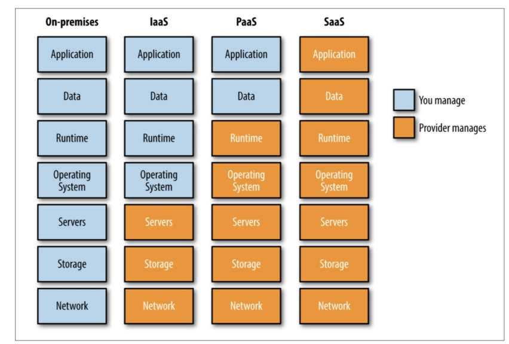
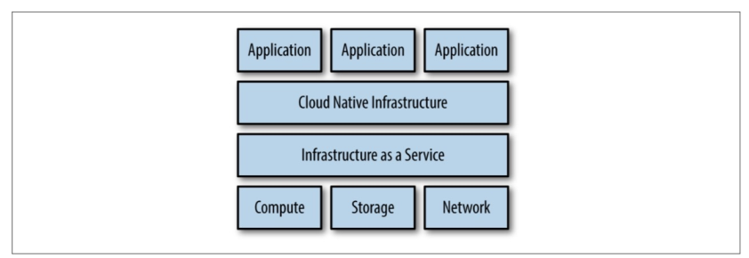
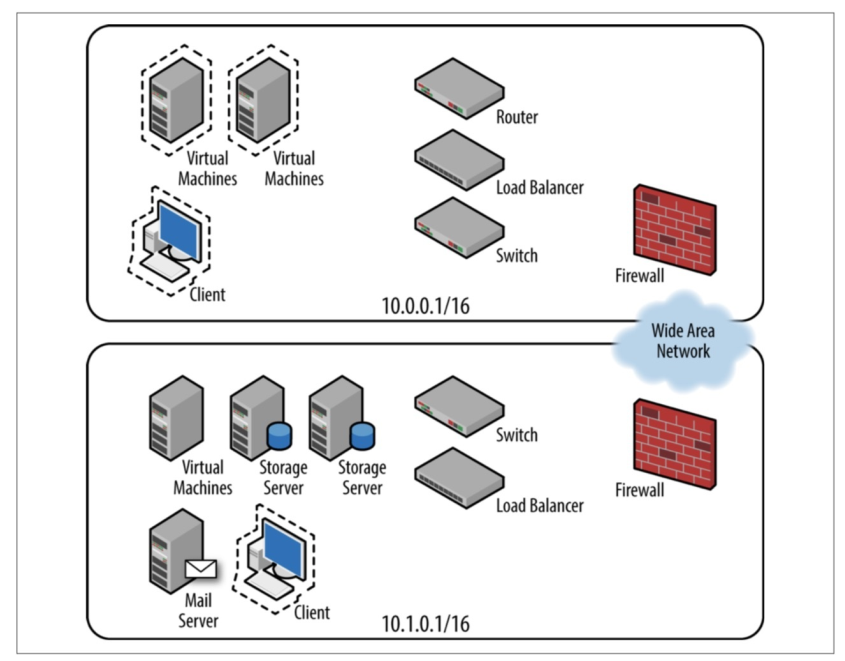

# 云原生基础架构

[TOC]

云原生：云原生技术有利于各组织在公有云、私有云和混合云等新型动态环境中，构建和运行可弹性扩展的应用。云原生的代表技术包括容器、服务网格、微服务、不可变基础设施和声明式API。这些技术能够构建容错性好、易于管理和便于观察的松耦合系统。结合可靠的自动化手段，云原生技术使工程师能够轻松地对系统作出频繁和可预测的重大变更。

参考文献

[CNCF Cloud Native Definition v1.0]([https://github.com/cncf/toc/blob/master/DEFINITION.md#%E4%B8%AD%E6%96%87%E7%89%88%E6%9C%AC](https://github.com/cncf/toc/blob/master/DEFINITION.md#中文版本))

## 第1章 什么是云原生基础架构

**基础架构**

支持应用程序的所有软件和硬件，包括数据中心、操作系统、部署流水线、配置管理以及支持应用程序生命周期所需的任何系统或软件。

***

 

**IaaS**

在云中运行基础架构不会使你的基础架构成为云原生。IaaS仍然需要基础架构管理。在购买和管理物理资源之外，你可以认为IaaS与过去购买服务器在自己的数据中心架设的传统基础架构一摸一样。

***

 

**PaaS**

就像IaaS对VM消费者隐藏了物理服务器一样，PaaS也对应用程序隐藏了操作系统。但是，许多PaaS平台不足以满足业务需求。他们通常会限制平台运行的语言、库和功能以实现从应用程序中抽离基础架构的承诺。

***



***

**云原生基础架构**

抽象基础IaaS产品以提供自己的抽象。新层负责控制它下面的IaaS，并将自己的API暴露给消费者控制。

***由软件管理的基础架构***是云中的一个关键区别点。软件控制的基础架构使基础架构能够扩展，并且在弹性、供应和可维护性方面也发挥着重要作用。软件需要了解基础架构的抽象概念，并知道如何获取抽象资源并相应地在可消费的IaaS组件中实现它。

***

**什么不是云原生基础架构**

+ 云原生不等于在公有云上运行基础架构。
+ 云原生不等于在容器中运行应用程序。
+ 也不是说只要你运行了容器编排器（例如k8s）就是云原生。
+ 云原生不等于微服务或基础架构即代码。

编排器：负责集群中的所有资源使用（CPU、存储和网络），该术语通常用于描述执行许多任务的产品，如健康检查和云自动化。

调度器：编排平台的一个子集，仅负责为进程和服务选择所运行的服务器。

***

**云原生应用程序**

云原生应用程序被设计为在平台上运行，具有弹性、敏捷性、可操作性和可观察性。弹性能够容忍故障而不是试图阻止故障，利用了在平台运行的动态特性；敏捷性允许快速部署和快速迭代；可操作性从应用程序内部控制应用程序生命周期，而不是依赖外部进程和监视器；可观察性提供信息来回答有关应用程序状态的问题。

以下是实现云原生应用程序所需特性的常用方法：

+ 微服务
+ 健康报告
  + 为了提高云原生应用程序的可操作性，应用程序应该暴露健康检查，开发人员可以以命令或过程信号的方式实现，以便应用程序在执行自我检查后相应。或者更常见的是：通过应用程序提供Web服务，返回HTTP状态码来检查健康状态。（k8s的存活探针）
  + 应用程序不仅仅有健康或不健康的状态。它们将经历一个启动和关闭的过程，在这个过程中它们应该通过健康检查，报告它们的状态。（k8s的就绪探针）
+ 遥测数据
  + 健康报告汇报应用程序的生命周期状态，而遥测数据汇报应用程序的业务指标。
  + 遥测数据应该用于告警而不是健康监测。在能够动态自我修复的环境中，我们不关注应用程序单个实例的生命周期，更关注的是应用程序的整体SLO。
+ 弹性
  + 面向故障设计：应用程序的最佳状态是健康状态，第二好的是故障状态。其他一切都是非二元的，难以监控和排除故障。
  + 优雅降级：重点是允许应用程序始终返回请求的响应。
+ 声明式，而不是命令式。

## 第2章 采纳云原生基础架构的时机

**什么情况下不需要云原生基础架构**

1. 没有云原生应用程序：如果你的应用程序需要人工干预，无论是调度、重启还是搜索日志，云原生都没有多大好处。
2. 如果你的应用程序在k8s上运行，但是仍然需要人工设置监控、日志收集与负载均衡，则它不是云原生。



## 第3章 云原生部署的演变

**表述基础架构**

使用人类能看懂的方式表述基础架构，然后由人手动实现。



***

**基础架构即脚本**

使用脚本来表示基础架构的一个缺陷是运行相同的脚本可能获得两个不同的结果，这是由于初始状态的不同以及可能存在的执行失败；另一个缺陷是缺少声明状态，脚本的运行时不理解结束状态，因为它只提供了执行步骤，人类需要从步骤中解释理想的结果，以了解如何进行改变。

***

**基础架构即代码**

配置管理曾经是代表基础架构的主要角色。我们可以将配置管理视为抽象脚本，自动考虑初始状态以执行正确的过程。最重要的是，配置管理允许作者声明节点的期望状态，而不是实现它所需的每一步。

***

**基础架构即软件**

IaaS将原始组件作为临时API端点呈现，平台呈现更容易被应用程序使用的资源的API。其中一些资源可能提供IaaS组件（例如：负载均衡器和磁盘卷），但其中许多资源将由平台管理（例如：计算资源）。

***

**幂等性**

软件应该是幂等的，着意味着持续输入相同的输入，必须并始终获得相同的输出。$f(x) = f(f(x))$

***

**最终一致性**

最终的一致性意味着企图随着时间的推移调和一个系统。较大的系统和较小的组件都可以遵循这种随时间推移重试失败过程的理念。

最终一致系统的好处之一是运维人员可以确信它最终会达到预期状态，缺点是不知道什么时候能到达。

***

**原子性**

如果失败，直接恢复所做的更改并宣告失败。

## 第4章 设计基础架构应用程序

**自举问题**

编译器的自举：无一例外，使用X语言生成Y语言的编译器，然后再使用Y语言编译器自举新的Y语言编译器，以完成自举过程。

云原生基础设施的自举：

1. 手动创建云计算与基础架构应用程序中的第一个基础架构，并在部署更合适的基础架构后销毁初始引导基础架构。缺点是难以重复且容易出现人为错误。
2. 利用本地机器自动在云中创建基础架构，基础架构就位后，你的本地部署工具可以将其自身部署到新创建的基础架构并持续运行。
3. 在初始基础架构引导问题解决后，我们可以使用***基础架构管理程序***来引导新的基础架构。此时我们完全运行在云端。

***

**API**

传统上，基础架构即代码是用户将要管理的基础架构的直接表示，而API是对要管理的具体底层资源之上抽象。

***

**调节器模式**

调节器模式（reconciler pattern）是一种软件模式，可用于管理云原生基础架构。该模式强化了基础架构中的两种表现形式——实际状态与预期状态。

调节器模式将迫使工程师以两个独立的途径忘记这些表示，以及实现一个解决方案，以协调实际状态达到预期状态。

四种哲学规则：

1. 所有的输入和输出都使用数据结构；
2. 确保数据结构是不可变的；
3. 保持资源映射简单；
4. 使实际状态符合预期状态。

***基础架构管理程序***的组件是将表示映射到一组资源的能力。

调节器接口：

```go
// 下面的reconciler接口是调节器模式示例，每当用户打算根据可能随时间变化的状态来更改基础结构时，都应该使用它。
type Reconciler interface {
    // GetActual不接受输⼊参数。数据结构应包含基础架构的完整表示。有时称为审核。应该使⽤此⽅法来实时表示现有的基础架构。
    GetActual()(Api, error)
    // GetExpected不接受输⼊参数，并返回⼀个填充的数据结构，该数据结构表示运维⼈员已声明存在的基础结构以及可能的错误。有时将其称为预期或预期状态。应该使⽤此⽅法来实时表示运维⼈员打算使⽤的基础结构。
    GetExpected()(Api, error)
    // Reconcile有两个参数。actualApi是从GetActual⽅法返回的填充数据结构。ExpectedApi是从GetExpected⽅法返回的填充数据结构。Reconcile将返回填充的数据结构，该数据结构表示新的“实际”状态以及可能的错误。根据定义，此处返回的数据结构应与从GetExpected⽅法返回的数据结构匹配。此⽅法负责对基础结构进⾏更改。
    Reconciler(actualApi, expectedApi Api)(Api, error)
    // Destroy有⼀个参数。actualApi是从GetActual⽅法返回的填充数据结构。Destroy将返回填充的数据结构，该数据结构表示新的“实际”状态以及可能的错误。根据定义，此处返回的数据结构应与从GetExpected⽅法返回的数据结构匹配。
    Destroy(actualApi Api)(Api, error)
}
```

***

**在控制器中使用调节器模式**

编排管理工具（如k8s）为我们提供了一个可以方便地运行应用程序的平台。控制器是为预期状态提供控制回路，k8s建立在这个基础之上。调节器模式可以很容易地审计与协调由k8s控制的对象。

## 第5章 开发基础架构应用程序

**基础架构变化**

使用operator消费和生产API。

Operator：k8s控制器，实现了软件取代人类参与管理特定应用的需求，通过协调预期状态与实际状态来实现。

Operator是工程师应该创建的用于管理其基础架构的云原生应用程序类型的完美示例。

## 第6章 测试云原生基础架构

监控规则应声明为代码，方便版本管理。

## 第7章 管理云原生应用程序

**实施云原生模式**

诸如弹性伸缩、服务发现、配置、日志、健康检查和相关监控指标等功能都可以以不同方式在应用程序中实现。

1. 方式1：通过导入实现相关功能的标准语言库。
2. 方式2：sidecar模式，应用程序本身与实现管理功能的应用程序绑定在一起，通常作为单独的容器来实现，但也可以通过在虚拟机上运行另一个守护进程来实现。

***

**对运行于基础架构上的应用的要求**

云原生应用程序对基础架构的期望不只是执行二进制文件，它们还需要抽象、隔离与保证应用程序运行和管理。

对于应用程序来说，需要提供hook和API以允许基础架构管理它们。而应用程序对基础架构更多的期望包括：

1. 运行与隔离；
2. 资源分配和调度；
3. 环境隔离；
4. 服务发现；
5. 状态管理；
6. 监控和记录；
7. 监控指标聚合；
8. 调试和跟踪。

***

**状态管理**

k8s通过事件、探针和hook实现应用程序状态管理。

+ 当应用程序被提交、调度和扩缩容时，会触发k8s事件；
+ 探针用于检查应用程序何时准备好提供流量（就绪）并确保应用程序健康（存活）。
+ hook用于在进程启动之前或之后需要发生的事件。

## 第8章 保护应用程序

策略应该声明为代码，方便版本控制。

## 第9章 实施云原生架构