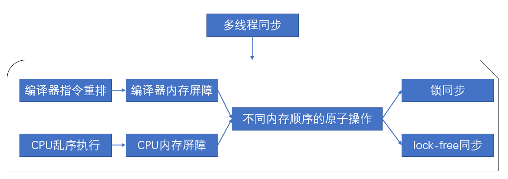

# C++：内存排序

[TOC]

## 1 前言

+ 
+ 内存排序是指CPU访问主存时的排序。可以是编译器在编译时产生，也可以是CPU在运行时产生。反映了内存操作重排序，乱序执行，从而充分利用不同内存的总线带宽。因此需要内存屏障以确保多线程的同步。
+ 内存排序是指对同一变量的原子操作（如store()和load()）之间进行同步的排序。
+ 因此我们使用各种同步措施来进行同步
  + 第一种是锁：如互斥锁（例如 [mutex](https://zh.cppreference.com/w/cpp/thread/mutex) 或[原子自旋锁](https://zh.cppreference.com/w/cpp/atomic/atomic_flag)），它们是通过获取-释放（acquire-release）内存排序的原子操作实现的。
  + 第二种是自己通过获取-释放（acquire-release）内存排序的原子操作实现lock-free机制
+ C++内存排序是C++语言层面的内存屏障、具体硬件实现是通过CPU内存屏障指令完成的。
  + 

## 2 同步关系

- synchronized-with关系：不同线程间，对于同一个原子操作，需要同步关系，store()操作一定要先于 load()，也就是说对于一个原子变量x，先写x，然后读x是一个同步的操作。
- happens-before关系：指明了哪些指令将看到哪些指令的结果，对于单线程而言，即代码序；对于多线程，若两个线程对某个原子操作有synchronized-with关系，则线程A store()操作前的指令结果一定能被线程B load()操作后的指令看到。

## 3 C++内存排序

内存一致性模型是多线程并发或并行执行时对内存的访问控制，本质上限制了load()操作的返回值。

+ 对于排序一致模型：直观上，读操作应该返回“最后”一次写入的值。
  + 在单处理器系统中，“最后”由程序排序定义。
  + 在多处理器系统中，则需要排序连贯（Sequential Consistency）：通俗地说，SC要求所有内存操作表现为逐个执行（任一次的执行结果都像是所有处理器的操作都以某种次序执行），每个处理器中的操作都以其程序指定的次序执行。
    + 在每个处理器内，维护每个处理器的程序次序
    + 在所有处理器间，维护单一的表征所有操作的次序。对于写操作W1，W2，不能出现从处理器 P1 看来，执行次序为 W1->W2；从处理器 P2 看来，执行次序却为 W2->W1 这种情况。

| 内存一致性模型                                 | C++内存排序                                                  |
| ---------------------------------------------- | ------------------------------------------------------------ |
| Sequential consistency model排序一致           | memory_order_seq_cst                                         |
| Acquire-release consistency model获取-释放一致 | memory_order_release memory_order_acquire memory_order_consume memory_order_acq_rel |
| Relaxed consistency model松弛一致              | memory_order_relaxed                                         |

1. 排序一致模型与memory_order_seq_cst
   + C++默认的内存排序
   + 从同步的角度来看，一个排序一致的 store ()操作synchronized-with一个排序一致的需要读取相同变量的 load()操作；除此以外，排序一致模型还保证了在 load 之后执行的排序一致原子操作都得表现得在 store 之后完成。
2. 获取-释放一致模型
   + 同步是成对出现的，它出现在一个进行store()操作和一个进行 load() 操作的线程间， 一个 store()操作synchronized-with一个想要读取刚才被写的值的load()操作。
     + release对应store()操作，acquire、consume对应load()操作，而acq_rel则同时包含两种操作的同步。
     + release-acquire：store()之前的所有指令的结果对load()之后的所有指令可见，即具有happens-before关系。
     + release-consume：只有那些在store之前且与此store()操作有依赖性的指令的结果，对在load()之后且与此load()操作有依赖性的指令可见。
   + 互斥锁（例如 [mutex](https://zh.cppreference.com/w/cpp/thread/mutex) 或[原子自旋锁](https://zh.cppreference.com/w/cpp/atomic/atomic_flag)）是获取-释放（acquire-release）同步的例子：线程 A 释放锁而线程 B 获得它时，发生于线程 A 环境的临界区（释放之前）中的所有事件，必须对于执行同一临界区的线程 B （获得之后）可见。
   + x86体系结构实现了Acquire-release consistency model获取-释放一致内存模型。
     + store-load 可以被重排，而store-store、load-load、load-store不能被重排。
     + aquire语义：load之后的读写操作无法被重排至load之前。即load-load，load-store不能被重排。
     + release语义：store之前的读写操作无法被重排至store之后。即load-store，store-store不能被重排。
3. 松弛一致模型
   + 在同一线程内对同一变量的原子操作仍保持happens-before关系，即对同一变量的原子操作store()和load()不可以被重排；在多线程中则没有任何关系。

参考文献

[https://www.zhihu.com/question/24301047](https://www.zhihu.com/question/24301047)

[https://zh.wikipedia.org/wiki/%E5%86%85%E5%AD%98%E6%8E%92%E5%BA%8F](https://zh.wikipedia.org/wiki/内存排序)