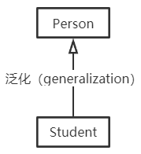

# C++：类关系

类关系：耦合度依次递增。

+ 依赖（dependency）：类A依赖类B，体现为类A的某个成员函数的返回值、形参、局部变量或静态方法的调用引用了类B。

  + 

+ 关联（association）：类A关联类B，体现为类B作为类A的数据成员。

  + 

+ 聚合（aggregation）：类A关联类B，体现为类B作为类A的数据成员。聚合用来表示集体和个体之间的关联关系。

  + 

+ 复合（composition）：类A关联类B，体现为类B作为类A的数据成员。复合用来表示个体与组成部分之间的关联关系。

  + 

+ 泛化（generalization）：继承关系

  + 

+ 依赖和关联的区别？

  + 发生依赖关系的两个类都不会增加属性。其中的一个类作为另一个类的方法的参数或者返回值，或者是某个方法的变量而已。发生关联关系的两个类，类A成为类B的属性，而属性是一种更为紧密的耦合，更为长久的持有关系。
  + 从关系的生命周期来看，依赖关系是仅当类的方法被调用时而产生，伴随着方法的结束而结束。关联关系当类实例化的时候产生，当类对象销毁的时候关系结束。相比依赖，关联关系的生存期更长。

+ 聚合和复合的区别？

  + 聚合关系没有复合紧密：学生不会因为班级的解散而无法存在，聚合关系的类具有不同的生命周期；而学生如果没有心脏将无法存活，复合关系的类具有相同的生命周期。

  + 信息的封装性不同：在聚合关系中，客户端可以同时了解Class类和Student类，因为他们是独立的。

    在复合关系中，客户端只认识Student类，根本不知道Heart类的存在，因为Heart类被严密地封装在Student类中。

参考文献

[CSDN - Dablelv](https://blog.csdn.net/K346K346/article/details/59582926)