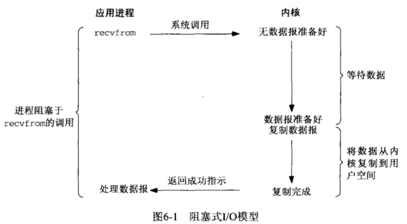
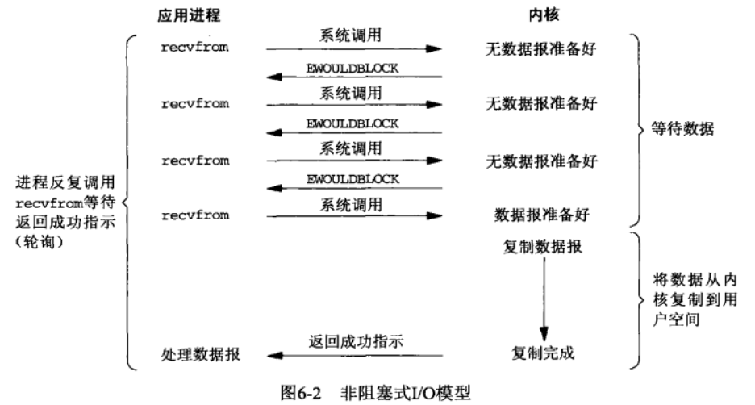
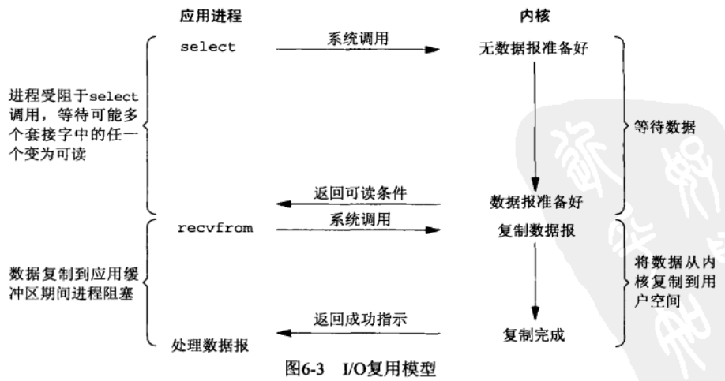
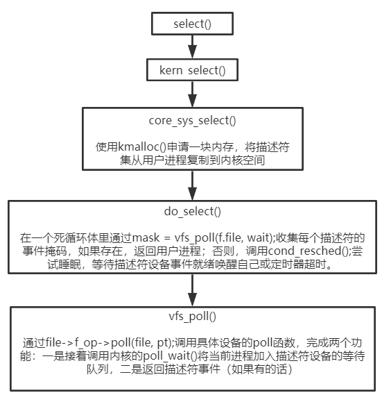
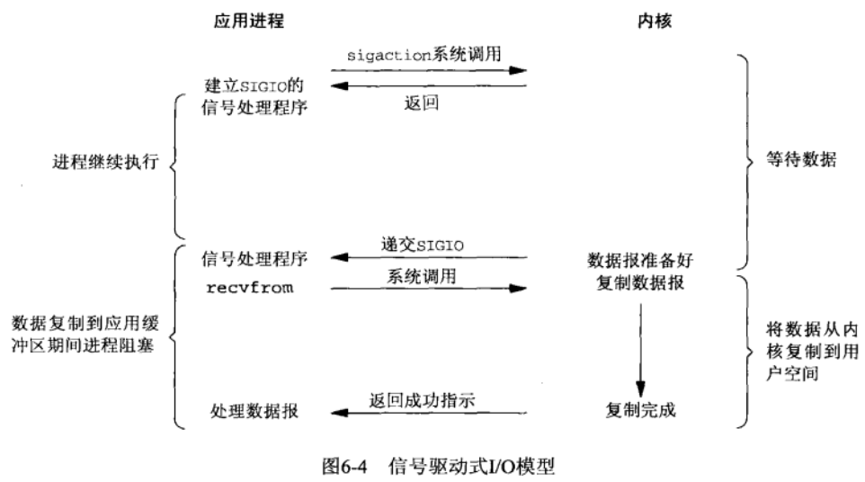
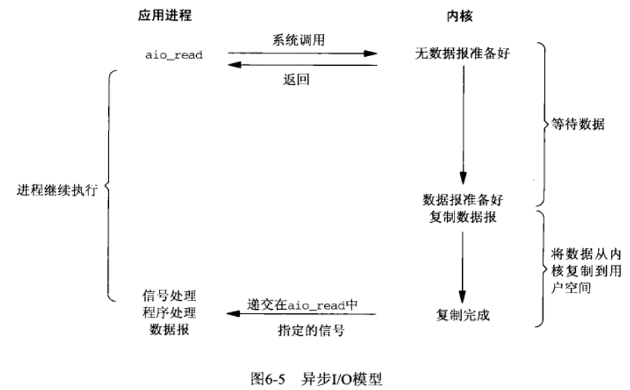

# Linux：I/O模型与select、epoll实现

[TOC]

## 1 阻塞式I/O



## 2 非阻塞式I/O



## 3 I/O复用



### 3.1 select

​		该函数允许进程指示内核等待多个事件中的任何一个发生，并只有在一个或多个事件发生或经历一段指定的时间后才唤醒它。

```c
/*
 * maxfdp1: 指定待测试的描述符个数，值为待测试的最大描述符加1.内核通过这个参数避免在用户进程与内核空间之间复制描述符集中不必要的部分，减少需要测试的描述符数量来提高效率。
 * readset、writeset和exceptset: 描述符集
 * timeout: 指定超时时间
 * 返回值表示跨所有描述符集的已就绪的总位数
 */
int select(int maxfdp1, fd_set* readset, fd_set* writeset, fd_set* exceptset, const struct timeval* timeout);
```

​		select返回某个套接字就绪的条件。

| 条件                                                         | 可读               | 可写       | 异常 |
| ------------------------------------------------------------ | ------------------ | ---------- | ---- |
| 有数据可读<br />关闭连接的读一半<br />给监听套接字准备好新连接 | ok<br />ok<br />ok |            |      |
| 有可用于写的空间<br />关闭连接的写一半                       |                    | ok<br />ok |      |
| 待处理错误                                                   | ok                 | ok         |      |
| TCP带外数据                                                  |                    |            | ok   |

​		select可使用的最大描述符数由FD_SETSIZE限制，因此增大描述符集的唯一方法是增大FD_SETSIZE的值，再重新编译内核。



### 3.2 epoll

​		epoll把监听注册从实际监听中分离出来，从而解决了select和poll监听时遍历全部描述符集的缺陷。

```c
//创建一个epoll实例（文件对象）
/*
 * size：需要监听的描述符数量
 * 返回epoll实例的文件描述符
 */
int epoll_create(int size);
//向指定的epoll实例添加或删除描述符
/*
 * epfd：epoll实例
 * op：添加、删除、修改fd指定的文件描述符
 * event：描述epoll更具体的行为，通常置event.data.fd为fd，这样epoll_wait()返回时就可以知道哪个文件描述符触发了事件。
 */
int epoll_ctl(int epfd, int op, int fd, struct epoll_event* event);
//等待给定epoll实例关联的描述符上的事件
/*
 * events：内核用来向用户空间复制发生的事件。
 */
int epoll_wait(int epfd, struct epoll_event* events, int maxevents, int timeout);
```

### 3.3 select与epoll区别

​		select，poll实现需要自己不断轮询所有fd集合，直到设备就绪，期间可能要睡眠和唤醒多次交替。而epoll其实也需要调用`epoll_wait`不断轮询就绪链表，期间也可能多次睡眠和唤醒交替，但是它是设备就绪时，调用回调函数，把就绪fd放入就绪链表中，并唤醒在epoll_wait中进入睡眠的进程。虽然都要睡眠和交替，但是select和poll在“醒着”的时候要遍历整个fd集合，而epoll在“醒着”的时候只要判断一下就绪链表是否为空就行了，这节省了大量的CPU时间。

### 3.4 LT模式与ET模式

​		LT模式：只要某个描述符处于readable/writable状态，每次epoll_wait()都会返回该描述符。

​		ET模式：只有某个描述符状态发生了改变，epoll_wait()才会返回该描述符。如从unreadable->readable，从unwritable->writable。

​		LT与ET实现区别：内核代码中LT与ET的处理逻辑几乎完全相同，差别仅在于LT在描述符发生事件时不会将其从epoll实例的就绪链表中移除。

I/O复用模型Socket编程注意事项：（sockfd：监听socket、connfd：accept()返回的socket）

+ 对于监听的sockfd，最好使用水平触发模式，边缘触发模式可能导致高并发情况下，有的客户端会连接不上。如果非要使用边缘触发，解决办法是通过while循环accept()调用，直到TCP就绪队列连接处理完。

+ 对于读写的connfd，水平触发模式下，阻塞和非阻塞效果都一样，不过为了防止特殊情况，还是建议设置非阻塞；边缘触发模式下，必须使用非阻塞IO，并要一次性全部读写完数据。
+ 陈硕的《Linux多线程服务端编程》建议non-blocking IO + IO multiplexing 搭配使用。

LT与ET性能辨析

+ 由于两种模式处理逻辑差异极小，性能测试结果表明常规应用场景中二者性能差异不大。一般声称ET能降低epoll相关系统调用开销，但同时为了解决饿死问题，用户进程需要增加read/write循环调用开销。
+ 使用ET的用户代码逻辑较为复杂，出错概率更高。

## 4 信号驱动式I/O

​		需要开启socket的信号驱动式I/O功能。



## 5 异步I/O

​		由POSIX规范定义：通知内核启动某个操作，并让内核在整个操作（包括将数据从内核复制到用户进程的缓冲区）完成后通知我们。

​		这一模型与信号驱动式I/O模型的主要区别在于：信号驱动式I/O模型是由内核通知我们何时可以启动一个I/O操作，而异步模型是由内核通知我们I/O操作何时完成。



## 总结

​		Input操作通常包括两个不同的阶段：

+ 等待网卡收到数据包，并复制到内核缓冲区。
+ 从内核向用户进程复制数据。

| 同步I/O：真正的I/O操作将阻塞进程               | 异步I/O |
| ---------------------------------------------- | ------- |
| 阻塞式I/O、非阻塞式I/O、I/O复用、信号驱动式I/O | 异步I/O |

参考文献

《UNIX网络编程 卷一：套接字联网API》

[https://www.cnblogs.com/200911/p/7016843.html](https://www.cnblogs.com/200911/p/7016843.html)

[https://yq.aliyun.com/articles/495890](https://yq.aliyun.com/articles/495890)