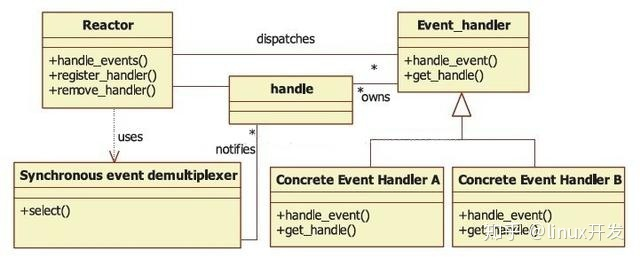

# 服务端编程：Reactor与Proacter

​		《Unix网络编程 卷一：套接字联网API》介绍了同步I/O模型与异步I/O模型，区别是谁负责执行真正的I/O操作以及是否需要阻塞进程直到I/O操作完成。基于这两种I/O模型出现了两种设计模式，Reactor和Proactor。

| Reactor                           | Proactor |
| --------------------------------- | -------- |
| non-blocking IO + IO multiplexing | aio      |

## Reactor

+ 将所有要处理的I/O事件注册到I/O多路复用器上，同时主线程/进程阻塞在多路复用器上，一旦有I/O事件到来或是准备就绪（文件描述符或socket可读、写），多路复用器返回并将事先注册的相应I/O事件分发到对应的处理程序中。
+ Reactor与Proactor都采用事件处理（event handling）机制，或者叫事件循环机制。
+ 模式参与者
  + 资源：可以为系统提供输入或使用系统输出的任何资源。包括各种描述符（文件、socket）、信号、定时器事件。
    + 信号与定时器事件如何抽象成可监听的描述符？
    + 并不是将信号与定时器事件抽象成描述符统一由I/O复用模型监听，而是为Reactor调度器封装新的信号与定时器监听模型，或者将I/O复用模型+信号与定时器监听模型封装成统一的同步事件多路分离器。
  + 同步事件多路分离器（synchronous event demultiplexer）：在事件循环中，使用select、poll、epoll等I/O复用模型等待监听的描述符事件到来。I/O框架库一般将各种I/O复用模型封装成统一的接口，称为同步事件多路分离器。
  + Reactor调度器（dispatcher）：使用同步事件分离器来等待事件的发生，接着调度对应的具体事件处理器完成真正的I/O操作；也负责具体事件处理器的注册与注销。
  + 事件处理器（event handler）：抽象的事件处理器，负责提供接口。
  + 具体的事件处理器：实现事件处理器接口，负责完成真正的I/O操作，然后完成上层业务逻辑。
  + 

## Proactor

+ Proactor可采用与Reactor相同的对象模型，唯一的区别是真正的I/O操作由OS自动完成，Proactor调度器等待的事件到来时，真正的I/O操作已经完成，事件处理器只需要完成上层业务逻辑。

## 辨析		

为什么使用Reactor？网络编程为什么要用反应堆？有了I/O复用，有了epoll已经可以使服务器并发几十万连接的同时，维持高TPS了，难道这还不够吗？

+ 技术层面足够了，但在软件工程层面却是不够的。反应器模式将特定于应用程序的代码与反应器实现完全分开，可用于编写I/O框架库。

C++多线程服务器编程模式：one eventloop per thread + thread pool。

+ IO线程：event loop用作IO multiplexing，配合non-blocking IO和定时器；
+ 计算线程：thread pool用来做计算，具体可以是任务队列或生产者消费者队列。

Reactor涉及哪些设计思想？

+ 好莱坞原则
+ 回调
+ 依赖注入
+ 控制反转

参考文献

[https://zhuanlan.zhihu.com/p/101419040](https://zhuanlan.zhihu.com/p/101419040)