# 深度探索C++对象模型（第三版）

[TOC]

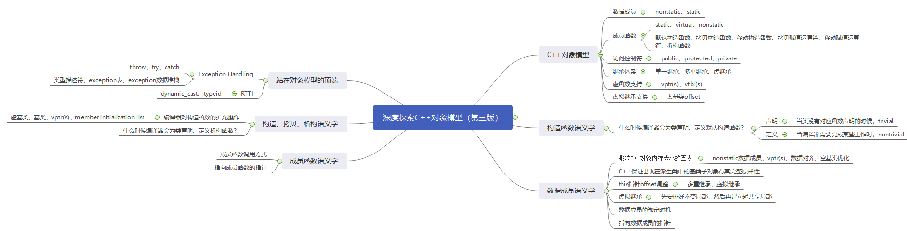

## 第1章 关于对象（Object Lessons）

1. C++对象模型

   + 在C++中，有两种类数据成员：static和nonstatic，以及三种类成员函数：static、nonstatic和virtual。对下面的class Point声明：

   + ```c++
     class Point {
     public:
         Point(float xval);
         virtual ~Point();
         
         float x() const;
         static int PointCount();
     protected:
         virtual ostream& print(ostream& os) const;
         float _x;
         static int _point_count;
     }
     ```

   + C++对象模型如下：
   
     + nonstatic数据成员放置于**每个对象**中，static数据成员放置于**所有对象**外。
     + static、nonstatic成员函数都放置于**所有对象**外。
     + virtual成员函数则通过两个机制支持：
       + **每一个类**拥有一个存放着指向所有虚函数的指针的表（vtbl），vtbl的第一个slot存放着**每一个类**所关联的type_info对象，用以支持RTTI。
       + **每一个对象**被编译器添加了一个指针（vptr），指向vtbl。vptr的初始化与重置都由**每一个类**的构造函数、析构函数和拷贝赋值运算符自动完成。
   
   + 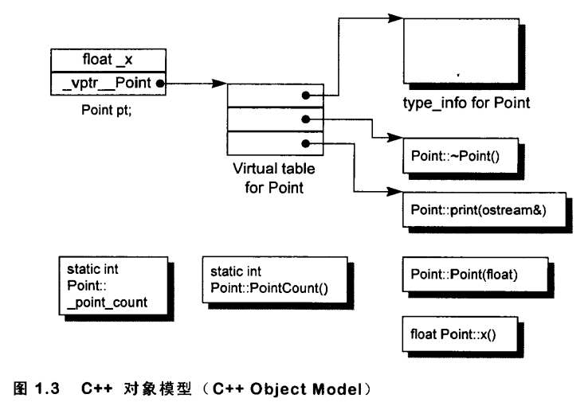
   
   + C++中凡处于同一个access section的数据，必定保证以其声明次序出现在内存布局中；然而被放置在多个access sections的数据，排列次序就不一定了。例如public与protected出现在内存布局的次序并无规定。
   
2. C++对象模型如何影响程序？

   + C++编译器对源代码做了如下修改：

     + NRVO命名返回值优化
     + 将new关键字扩展为new()与对象构造函数调用。
     + 将delete关键字扩展为对象析构函数调用与delete()。
     + 使用虚机制扩展多态函数调用。

   + ```cpp
     //class X定义了拷贝构造、虚析构以及虚函数foo()
     //源代码							  //编译器修改后的代码
     X foobar(){							void foobar(X& _result){
         X xx;								//构造_result用来取代局部变量xx
         									_result.X::X();
         X* px = new X;						//扩展X* px = new X;
         									px = _new(sizeof(X));
         									if(px != 0)
                                                 px->X::X();
         //foo()是一个虚函数					//扩展xx.foo()但不使用虚机制
         xx.foo();							foo(&_result);
         px->foo();							//使用虚机制扩展px->foo();
         									(*px->vtbl[2])(px);	
         delete px;							//扩展delete px;
         									if(px != 0){
                                                 (*px->vtbl[1])(px);
                                                 _delete(px);
                                             }
         return xx;							//RVO;
         									return;
     }
     ```

3. 需要多少内存才能够表现一个C++对象？一般而言要有：
   + 其nonstatic数据成员的总和大小。
   + 加上任何由于align的需求而padding（填补）上去的空间。
   + 加上为了支持virtual而由内部产生的任何额外负担。（vptr）
4. 继承体系中vptr如何放置？
   + 如图所示：单一继承下（多重继承和虚拟继承情况不同），派生对象Bear()与基对象ZooAnimal()共享基对象的vptr，这份vptr的内容在指针或引用发生类型转换时不需要修改，但是编译器如何为一个继承体系下的基对象与派生对象分别初始化vptr？
   + 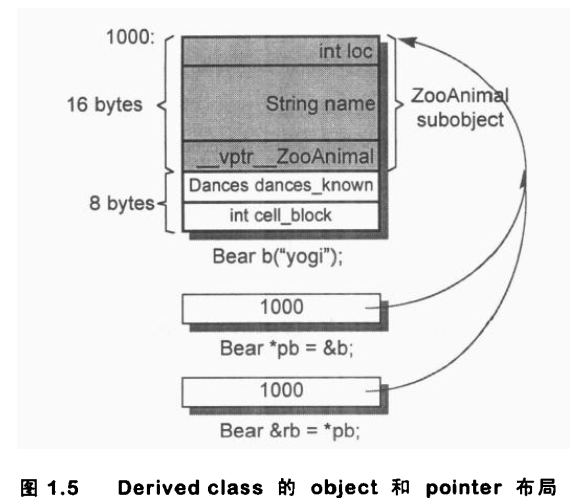
   + 指向不同类型之指针的差异，既不在其指针表示法不同，也不在其内容（代表一个地址）不同，而是在其所寻址出来的对象类型不同，指针的类型会教导编译器如何解释某个特定地址的内存内容与大小（对象切割slice）。

## 第2章 构造函数语义学（The Semantics of Constructor）

1. 编译器什么时候会为类声明、定义**默认构造函数**？

   + **声明（declare）**：如果用户程序没有声明任何**构造函数**，那么编译器会声明一个implicite**默认构造函数**，这样的声明是trivial（无用的）。

   + **定义（define）**：只有当编译器需要声明的implicite默认构造函数执行某些编译器所需的行动，这时编译器会在需要调用构造函数的地方开始**定义**默认构造函数。这样的定义是nontrivial（有用的）。

   + 注意：**定义**只发生在编译器需要它的时候，而不是用户程序需要的时候，而且被合成出来的默认构造函数只执行编译器所需的行动。

     + 对下面的类，用户程序可能需要一个默认构造函数来将pnext指针初始化，但是这不是编译器的责任，因此编译器在此处并不会**定义**默认构造函数；就算编译器**定义**了默认构造函数，也不会执行pnext的初始化。

     + ```c++
       class Foo {
       public:
           int val;
           Foo* pnext;
       }
       ```

2. 什么情况下编译器需要对象的**默认构造函数**完成某些必需的操作？

   1. 编译器需要在对象的**默认构造函数**中插入代码，完成对成员对象、继承对象的**默认构造函数**的调用。

      + 对象含有成员对象，且成员对象有定义**默认构造函数**；
      + 对象继承自基对象，基对象有定义**默认构造函数**；

   2. 编译器需要在对象的**默认构造函数**中插入代码，用来支持虚机制。

      + 对象有虚函数（声明或继承）：编译期间会产生两个扩张操作：i 编译器产生一个vtbl，存放类的虚函数地址和type_info对象地址；ii 类的每个对象会多出一个vptr指针指向vtbl。

      + 对象使用了虚继承：如何使虚基类在其每一个派生类对象内存模型中的位置，能够于运行期准备妥当。（虚基类在派生类中的类偏移）

        + ```c++
          class X {
          public:
              int i;
          };
          class A : public virtual X {};
          class B : public virtual X {};
          class C : public A, public B {};
          //由于pa的真正类型在运行时才确定，而虚基类对象在派生类对象中的偏移地址不确定。因此在编译期无法扩展pa->i为i在pa对象内存模型中的实际偏移地址。因此编译器需要在默认构造函数中插入这样的信息便于运行时确定。
          void foo(A* pa){
              pa->i = 1024;
          }
          ```

3. C++新手一般有两个常见的误解：

   + 任何类如果没有定义默认构造函数，就会被编译器定义出一个来。
   + 编译器定义出来的默认构造函数会明确设定类中每一个数据成员的初始化值。

4. 在C++各个不同的编译单元中，编译器如何避免**定义**出多个**默认构造函数**？
   
   + 解决办法是把**定义**的**默认构造函数**、**拷贝构造函数**、**析构函数**、**拷贝赋值运算符**都以inline方式完成。一个inline函数有静态链接期（static linkage），不会被编译单元以外者看到。如果函数太复杂，不适合做成inline，就会**定义**成一个explicit non-inline static实体？
   
5. 编译器什么时候会为类声明、定义**拷贝构造函数**？

   + **声明（declare）**：如果用户程序没有声明**拷贝构造函数**，那么编译器会声明一个implicite**拷贝构造函数**，这样的声明是trivial（无用的）。
   + **定义（define）**：只有当编译器需要声明的implicite拷贝构造函数执行某些编译器所需的行动，这时编译器会在需要调用拷贝构造函数的地方开始**定义**拷贝构造函数。这样的定义是nontrivial（有用的）。

6. 什么情况下编译器需要对象的**拷贝构造函数**完成某些必需的操作？：只有当对象具有memberwise copy semantics拷贝语义的时候，编译器会**定义**拷贝构造函数完成必要操作。

   + 拷贝语义：区分数据成员是内建基本数据类型还是对象。

     + memberwise copy semantics：按成员拷贝数据，对于成员对象，递归调用拷贝构造函数施行memberwise copy semantics。（对象）
     + bitwise copy semantics：按位拷贝数据（内建基本数据类型）

   + 编译器需要在对象的**拷贝构造函数**中插入代码，完成对成员对象、继承对象的**拷贝构造函数**的调用。

     + 对象含有成员对象，且成员对象有定义**拷贝构造函数**；
     + 对象继承自基对象，基对象有定义**拷贝构造函数**；

   + 编译器需要在对象的**拷贝构造函数**中插入代码，用来支持虚机制。

     + 对象有虚函数（声明或继承）：拷贝构造时，编译器可能（使用不同类的对象拷贝构造时）需要调整vptr指向地址。

       + ```c++
         class X {
         public:
             virtual void foo();
         };
         class Y : public X {};
         X* px = new Y;		Y y;
         X x = X* px;		X x = y;
         ```

     + 对象使用了虚继承：拷贝构造时，编译器可能（使用不同类的对象拷贝构造时）需要调整虚基类对象在派生类对象内存模型中的偏移地址信息。

       + ```c++
         class X {
         public:
             int i;
         };
         class A : public virtual X {};
         class B : public virtual X {};
         class C : public A, public B {};
         A a;				B b;
         X x = a;			X x = b;
         ```

7. 编译器会一一操作initialization list，以适当次序（成员在类中的声明顺序）在constructor之内安插初始化操作，并且在任何explicit use code之前。

## 第3章 Data语义学（The Semantics of Data）

1. 影响C++对象内存大小的因素

   + 所有的nonstatic数据成员；
   + 由编译器添加的数据成员，用以支持某些语言特性（主要是各种virtual特性：vptr、虚基类偏移）；
   + 对齐；
   + 编译器对于特殊情况所提供的可能的优化处理：（不同编译器对特殊情况的处理并不相同）
     + 空基类优化：对于一个空类，编译器需要插入一个字节的占位符；而对于空的基类，某些编译器可能优化掉派生类对象中基类的占位符。
   
2. 虚继承对象内存模型示例

   + ```c++
     class X {};
     class Y : public virtual X {};
     class Z : public virtual X {};
     class A : public Y, public Z {};
     ```

   + 如下图所示：（编译器：gcc version 8.1.0 (x86_64-posix-sjlj-rev0, Built by MinGW-W64 project）

     + X为空类，编译器插入一字节的占位符，用于为不同对象在内存中配置独一无二的地址；
     + Y，Z各持有一个指向虚基类子对象起始地址的指针，这里编译器优化掉了X子对象的占位符。
     + A含有Y和Z子对象，且X子对象的占位符也被编译器优化掉了。
   
   + 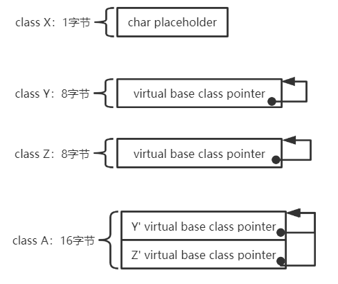
   
   + 别的编译器可能不会优化空基类的占位符，编译器之间的潜在差异正说明了C++对象模型的演化。这个模型为一般情况提供了解决之道。当特殊情况逐渐被挖掘出来时，种种启发（尝试错误）法于是被引入，提供优化的处理。如果成功，启发法于是就提升为普遍的策略，并跨越各种编译器而合并。它被视为标准（虽然它并不被规范为标准），久而久之也就成了语言的一部分。vtbl是一个好例子，另一个例子是NRVO。

3. 数据成员的绑定时机

   +  编译器对成员函数函数体的解析会直到整个类的声明完成了才会开始，因此在一个inline成员函数函数体内的数据成员绑定操作，会在整个类声明完成之后才发生。

   + 但是成员函数参数列表中的名称还是会在第一次出现时被决议（resolved）完成。因此需要将类中声明的typedef语句放在类的起始处，这样可以保证成员函数参数列表中的typedef被决议为类中声明而不是外部声明。

     + ```c++
       typedef int len;
       class X {
       public:
           //typedef long len;//放在这里可以避免val的类型被决议为int。
           //这里val的类型被决议为int，而_val的类型是long.
       	void foo(len val){
               _val = val;
           }
       private:
           typedef long len;
           len _val;
       }
       ```

4. 从对象存取数据成员与从对象指针或引用存取数据成员有什么差异？

   + 对于static数据成员：这两种方式没有任何区别，因为static数据成员作为全局静态变量统一存放在.data或.bss段，通过名称修饰机制解决访问控制与名称冲突问题。

   + 对于nonstatic数据成员：
     + 对于独立类、单一继承、多重继承：这两种存取方式没有区别，数据成员在类中的偏移在编译期即可获知。
     + 而对于虚继承：如果数据成员继承自虚基类，那么从对象指针或引用存取数据成员，由于不能确定具体对象，因此解析只能延迟到运行时，经由一个额外的间接引导，才能够解决。

5. 继承机制下的数据成员内存模型
   + 单一继承且不含虚函数：C++保证出现在派生类中的基类子对象有其完整原样性
     + 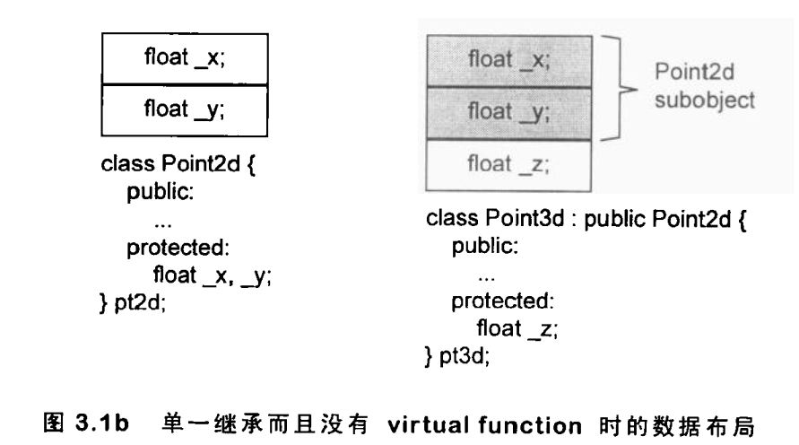
   + 单一继承且含虚函数：vptr可以在对象内存模型的开始处，也可以在对象内存模型的结束处。
     + 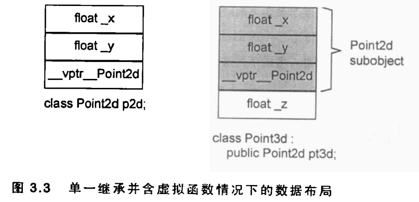
   + 多重继承：对一个多重派生对象，将其地址指定给最左端（也就是第一个）基类的指针，情况将和单一继承时相同，因为二者都指向相同的起始地址；至于第二个或后继的基类的地址指定操作，则需要将地址修改。
     + 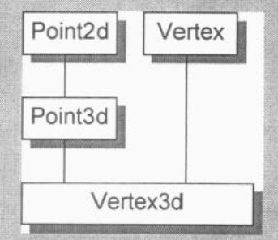
     + 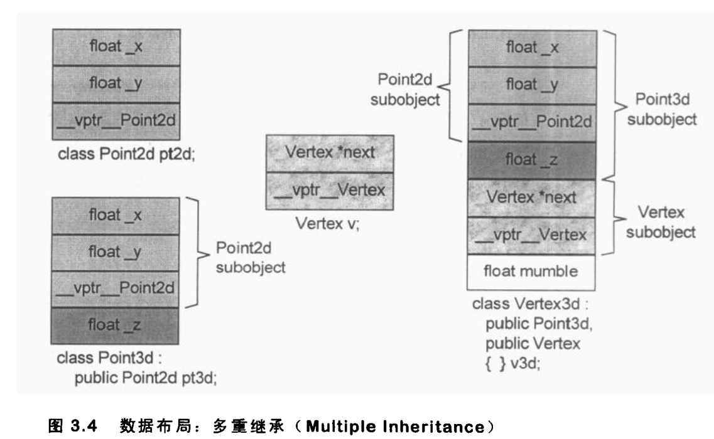
   + 虚拟继承：对于Vertex这样继承自虚基类的类，将其分割为两部分：一个不变局部和一个共享局部（虚基类部分），不变局部有固定的类偏移，共享局部则会因为继续派生Vertex导致其类偏移一直变化；一般的布局策略是先安排好不变局部，然后再建立起共享局部；
     + 对共享局部的访问有两种实现方法：
       + 其一是为派生类的每一个虚基类生成一个虚基类指针，指向虚基类起始地址。
       + 其二是在派生类的虚函数表起始地址之前存放所有虚基类的类偏移，这样vtbl[0,1,...]支持虚函数机制，vtbl[-1,-2,...]支持虚继承机制。
     + 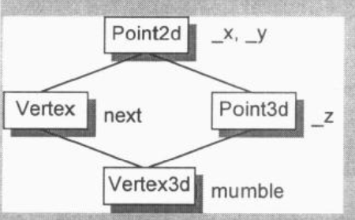
     + 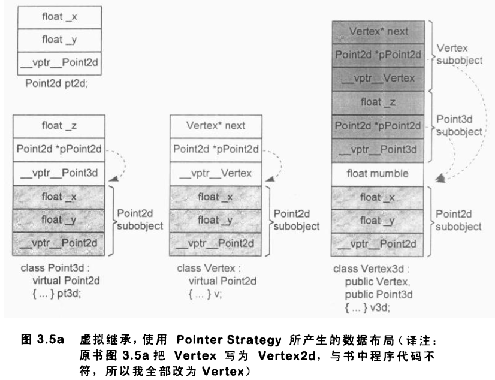
     + 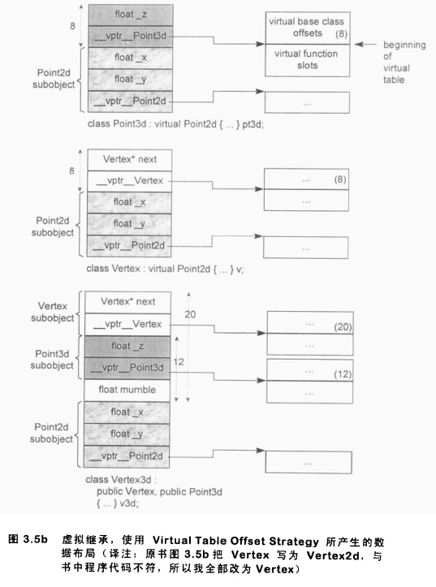
6. C++为了支持虚函数需要的额外开销
   + 为每个含有虚函数的类生成一个vtbl，用于存放它所声明的虚函数地址，以及type_info地址（用于RTTI）。
   + 为每个含有虚函数的类对象生成一个vptr指针，指向vtbl。
   + 在构造函数（包括拷贝构造）中插入相关代码，为类对象设置vptr值。这可能意味着在继承体系下的从基类到最底派生类的构造函数调用中，不断重置vptr值，其情况视编译器优化的积极性而定。
   + 在析构函数中插入相关代码，使它能够抹消vptr值。这可能意味着在继承体系下的从最底派生类到基类的析构函数调用中，不断抹消vptr值，其情况视编译器优化的积极性而定。

7. 指向数据成员的指针(原文讲的并不清晰，因此//TODO)

   + ```c++
     //取数据成员的地址将会得到类偏移
     &Point::z;
     //取绑定于具体对象的数据成员的地址将会得到成员的内存地址
     Point p;
     &p::z;
     ```

   + 可以通过指向数据成员的指针判断vptr在对象内存布局中的位置

     + ```c++
       //在我的平台上（gcc version 8.1.0 (x86_64-posix-sjlj-rev0, Built by MinGW-W64 project)）
       //三个数据成员的类偏移分别为8、12、16，因此vptr位于对象开头。
       class Point {
       public:
           int x, y, z;
           virtual void foo();
       };
       int main(){
           printf("%p\n", &Point::x);//使用cout输出三条语句都返回1？
           printf("%p\n", &Point::y);
           printf("%p\n", &Point::z);
       }
       ```

   + 为了区分指向第一个数据成员的指针和没有指向任何数据成员的指针，所有的真正的成员类偏移都被加上了1。

     + ```c++
       //如何区分
       int Point::* p1 = 0, Point::* p2 = &Point::x;
       ```

## 第4章 Function语义学（The Semantics of Function）

1. 成员函数分类
   + nonstatic成员函数、virtual函数、static成员函数。
2. nonstatic成员函数调用方式：C++的设计准则之一就是：nonstatic成员函数至少必须和非成员函数有相同的效率。因此对于nonstatic成员函数，编译器通过如下步骤将其转化为一个非成员函数形式调用：
   + 改写函数的signature（函数签名），插入形参this指针。
   + 将每一个对nonstatic数据成员的存取操作改为经由this指针来存取。
   + 此时函数已经成为一个非成员函数，编译器通过名称修饰机制解决访问控制与名称冲突问题。

```c++
//nonstatic成员函数							 //转化为非成员函数，使用了NRVO机制
Point3d Point3d::normalize() const{			void normalize_7Point3dFv(
    											register const Point3d* const this, 	
    											Point3d& _result){
    
    register float mag = magnitude();			register float mag = this->magnitude();			
    Point3d normal;								_result.Point3d::Point3d();
    
    normal._x = _x/mag;							_result._x = this->_x/mag;
    normal._y = _y/mag;							_result._y = this->_y/mag;	
    normal._z = _z/mag;							_result._z = this->_z/mag;
    return normal;								return;
}											}
```

3. virtual成员函数调用方式：virtual函数通过对象调用时，在编译期使用与nonstatic成员函数一样的方式被决议；通过对象指针或引用表现多态时，通过vptr->vtbl在运行期被决议。

   + vptr也会使用名称修饰机制，因为在一个复杂的继承体系中，可能存在多个vptrs。（多重继承、虚拟继承）

   + ```c++
     ptr->normalize();		(*ptr->vptr[1])(ptr);
     ```

4. static成员函数调用方式：static成员函数与非成员函数调用没有什么区别，它的主要特性就是没有this指针，这导致了以下次要特性：

   + 它不能直接存取nonstatic成员（数据、函数）；
   + 它不能被声明为const、volatile或virtual；
   + 它不需要经由对象才能被调用——虽然大部分时候它还是这样被调用的。

   + > //取static成员函数的地址将会得到它的内存地址，而且其类型是一个指向非成员函数的指针。
     > void (~~class::~~ *ptr)() = &class::static_func()

5. 多重继承体系下的虚函数支持

   + 在多重继承下，派生类中含有与上一层基类个数相同的vtbls和vptrs，通过名称修饰机制解决访问控制与名称冲突问题。如本例中的vtbl_Derived、vptr_Derived和vtbl_Base2_Derived、vptr_Base2_Derived。

   + 当将一个Derived对象地址指定给一个Base1指针或Derived指针时，被处理的vtbl是主虚表vtbl_Derived；而当指定给一个Base2指针时，被处理的vtbl是次虚表vtbl_Base2_Derived。

   + 将Derived对象地址指定给Base2指针来实现多态时必须在运行期调整this指针，这样一个调整是通过桩代码来实现的，实现机制与延迟绑定中的GOT+PLT相似。

   + 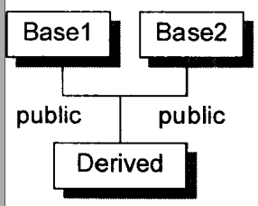

   + 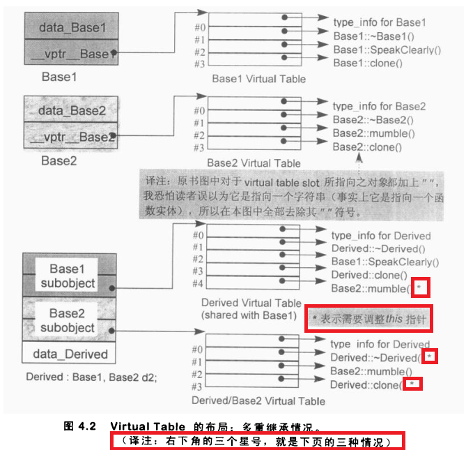

   + 上图中三个需要调整this指针的虚函数调用情况分别如下：

   + ```c++
     1.第一种情况：虚析构函数调用
     Base2* ptr = new Derived;//这个赋值操作会调整ptr指向Base2子对象起始地址，这个调整操作在编译期完成
     //调用Derived::~Derived(),ptr必须向后调整sizeof(Base1)个字节。
     //这个调整操作需要额外的偏移信息以及相关指令，这里不谈。
     delete ptr;
     
     2.第二种情况：使用Derived指针调用从Base2继承而来的虚函数
     Derived* ptr = new Derived;
     //调用Base2::mumble(),ptr必须向前调整sizeof(Base1)个字节
     ptr->mumble();
     
     3.第三种情况：支持虚函数返回值不同的这样一个语言的扩充性质：可以返回基类对象，也可返回派生类对象。
     Base2* pb1 = new Derived;
     //调用Derived* Derived::clone(),返回值必须被调整，以指向Base2子对象
     Base2* pb2 = pb1->clone();
     ```

6. 虚继承体系下的虚函数支持

   + 派生类与虚基类之间的指针转换也需要调整this指针。作者建议：不要在一个虚基类中声明nonstatic数据成员，不然，你在凝视深渊，同时深渊也在凝视你。

   + 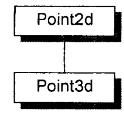

   + 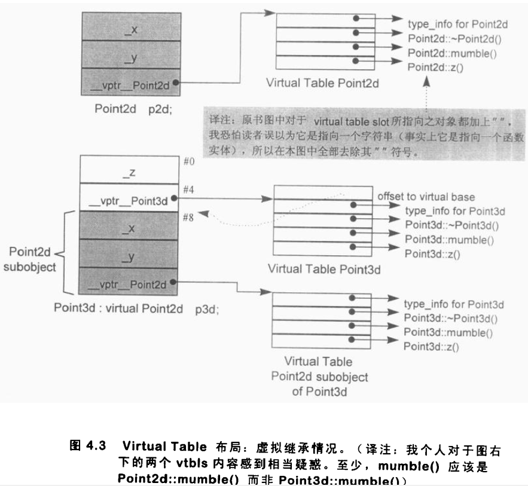

7. 指向成员函数的指针

   + 取一个nonstatic数据成员的地址，得到的是该成员的类偏移（再加1），它是一个不完整的值，需要被绑定于某个具体对象的地址上，才能够被存取；

   + 取一个nonstatic，non-virtual成员函数的地址，得到的是该函数的内存地址，但是该值也是不完全的，需要被绑定于某具体对象的地址上，才能够被调用。

   + 取一个virtual成员函数的地址，由于多态机制，真正的内存地址只能在运行时被决议，因此得到的是vtbl中的slot偏移（大概同一个虚函数在继承体系下的基类和派生类的一个或多个vtbl中处于相同slot）。为了让指向成员函数的指针同时支持virtual函数与non-virtual函数，需要一些复杂的操作，这里不谈。

   + ```c++
     //声明一个指向成员函数的指针
     double (Point::* pmf)();
     //赋值
     pmf = &Point::x;
     //调用
     Point p;
     (p.*pmf)();
     ```

8. inline函数

   + 关键词inline只是一个请求，如果这个请求被接收，编译器就必须认为它可以用一个表达式合理地将这个函数扩展开来。如果不能，那么这个请求会被驳回。
   + 编译器通过测试扩展前后函数调用的各种操作的开销对比来判断是否能合理扩展。
   + 如果inline函数被展开，编译器可能需要为形式参数或局部变量生成大量临时对象。
   + 此外，inine中再有inline，可能导致一个表面上看起来平凡的inline却因其连锁复杂度而没办法扩展开来。这种情况可能发生于复杂继承体系下的构造函数，或是其他一些表面上并不正确的inline调用组成的串联——它们每一个都会执行一小组运算，然后对另一个对象发出请求。
## 第5章 构造、析构、拷贝语义学（The Semantics of Constructor、Destructor and Copy）

1. 构造语义学：POD（plain old data：简单数据类型）类型构造语义示例

   + 对一个POD类型，观念上编译器会为它声明一个无用的默认构造函数、拷贝构造函数、拷贝赋值运算符、析构函数。但实际上，编译器会分析POD类型的声明，为它贴上POD标签，除此之外编译器什么也不做。

   + ```c++
     struct POD {int a, b, c;};
     //编译器并未为POD定义默认构造函数
     POD pod;
     //编译器并未为POD定义拷贝构造函数
     POD pod1 = new POD;
     //编译器并未为POD定义析构函数
     delete pod1;
     ```

   + C++并不支持弱符号（未初始化的全局符号）：因为对象的定义存在构造函数的隐式调用，即初始化；因此C和C++的一个差异就在于，.bss在C++中相对地不重要，C++的所有全局对象都被当做已初始化的数据对待。

2. 构造语义学：构造函数扩充操作：构造函数可能内含大量的隐藏码，因为编译器会扩充每一个构造函数，扩充程度视类的继承体系而定。一般而言编译器所做的扩充操作大约如下：
   1. 记录在member initialization list中的数据成员初始化操作会被放进构造函数体，并以成员的声明顺序为顺序。
   2. 如果有一个成员并没有出现在member initialization list中，但它有一个默认构造函数，那么该默认构造函数必须被调用。
   3. 在那之前，vptr(s)必须被设定初值。
   4. 在那之前，所有上一层的基类构造函数都必须被调用，以基类声明顺序为顺序。（与member initialization list中的顺序没关联）
      1. 如果基类被列于member initialization list中，那么任何明确指定的参数都应该传递过去；否则，而它有默认构造函数，那么就调用之。
      2. 如果基类是多重继承下的第二或后继的基类，那么this指针必须有所调整。
   5. 在那之前，所有虚基类构造函数必须被调用，从左到右，从最深到最浅。
      1. 如果虚基类被列于member initialization list中，那么任何明确指定的参数都应该传递过去；否则，而它有默认构造函数，那么就调用之。
      2. 此外，当前类对象中的每一个虚基类子对象的类偏移必须在运行期可被存取。
      3. 虚基类子对象的构造函数只能在当前类对象的构造函数中被调用，而不能在上一层基类子对象中被重复调用。这需要一个标志位判断当前构造的子对象是否处于继承体系的最底端。
         + 当构造PVertex对象时，Point子对象的构造函数只能在PVertex子对象的构造函数中被显式调用，而不能在Vertex3d子对象的构造函数中被重复调用。
         + 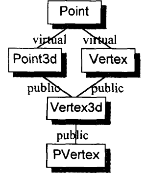

3. 构造语义学：vptr(s)初始化语义学

   + 在上述虚拟继承体系下，初始化一个PVertex对象时，构造函数的调用顺序为：

     + 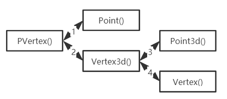

   + 构造函数的执行算法通常如下：

     1. 在派生类构造函数中，所有虚基类以及上一层基类的构造函数会被调用；
     2. 上述完成之后，对象的vptr(s)被初始化，指向相关的vtbl(s)。
     3. 如果有member initialization list的话，将在构造函数体内扩展开来，这必须在vptr被设定之后才进行，以免有虚函数被调用。
     4. 最后，执行用户程序代码

   + ```c++
     PVertex* PVertex::PVertex(PVertex* this, bool __most_derived, float x, float y, float z){
         //条件式地调用虚基类构造函数
         if(__most_derived != false)
             this->Point::Point(x, y);
         //无条件地调用上一层基类构造函数
         this->Vertex3d::Vertex3d(x, y, z);
         //将相关的vptrs初始化
         this->__vptr_PVertex = __vtbl_PVertex;
         this->__vptr_Point_PVertex = __vtbl_Point_PVertex;
         //执行用户程序代码，如虚函数
        	...
         //传回被构造的对象
         return this;
     }
     ```

   + 在类构造函数的member initialization list中调用该类的一个虚函数，安全吗？

     + vptr保证能够在member initialization list被扩展之前由编译器正确设定好，但是函数本身可能还得依赖未被设立初值的成员，所以在语义上这可能不安全。

4. 析构函数语义学

   + 编译器什么时候会为类声明、定义**析构函数**？
     + **声明（declare）**：如果用户程序没有声明**析构函数**，那么编译器会声明一个implicite**析构函数**，这样的声明是trivial（无用的）。
     + **定义（define）**：只有当编译器需要声明的implicite**析构函数**执行某些编译器所需的行动，这时编译器会在需要调用**析构函数**的地方开始**定义**析构函数。这样的定义是nontrivial（有用的）。
     + 注意：**定义**只发生在编译器需要它的时候，而不是用户程序需要的时候，而且被合成出来的析构函数只执行编译器所需的行动。
   + 什么情况下编译器需要对象的**析构函数**完成某些必需的操作？
     + 对象含有成员对象，且成员对象有定义**析构函数**；
     + 对象继承自基对象，基对象有定义**析构函数**；
     + 注意：对象自身持有某些动态内存分配的数据成员需要释放空间，这并不由编译器负责，这种情况下编译器不会定义nontrivial的析构函数，就算定义了，也不会执行这样的释放空间操作。

## 第6章 运行期语义学（The Semantics of Runtime）

1. 一般而言我们会把对象尽可能放置在使用它的那个程序区段附近，这样做可以节省不必要的对象构造和析构操作。为什么？

   + 局部对象的生命期从构造完成开始，到局部区段结束，对象被析构为止。

   + 如果局部区段有多个多个结束点，析构函数必须在每个结束点之前被调用。

     + ```  c++
       {
           Point point;
           //构造函数在这里被调用
           switch(int(point.x())){
           case -1;
               ...
               //析构函数在这里必须被调用
               return;
           case 0:
               ...
               //析构函数在这里必须被调用
               return;
           default:
               ...
               //析构函数在这里必须被调用
               return;
           }
       }
       ```

2. 不同对象的构造与析构
   + 全局对象的构造与析构：C++保证全局对象在main()之前被构造，在main()结束时被析构。
     + 为每个编译单元产生一个\_sti()函数（static initialization）：调用所有全局对象的构造函数；产生一个\_std()函数（static deallocation）：调用所有全局对象的析构函数。
     + 链接器链接时收集所有的\_sti()和\_std()函数放在一起，由C++运行时库负责执行。
   + 局部静态对象的构造与析构：C++保证局部静态对象的的构造、析构函数都只会执行一次，虽然对象所在代码区块可能会被执行多次（函数）。
     + 构造方式类似于单例模式，在第一次使用该对象时初始化。
     + 析构方式没看懂
   + 对象数组：
     + 对于既没有定义构造函数也没有定义析构函数的对象组成的数组，编译器并不需要做任何额外的工作；
     + 否则，编译器通过C++运行时库函数vec_new()、vec_delete()（对cfront编译器而言）将默认构造函数、析构函数执行于每一个元素之上。
   
3. new和delete运算符以及临时性对象//TODO

## 第7章 站在对象模型的顶端（On the Cusp of the Object Model）

1. 下面是有关模板的三个主要讨论方向
   1. 模板的声明。基本上来说就是当你声明一个template class、template class member function等等时，会发生什么事情。
      + 编译器什么也不做，直到某条语句使用了模板类相关的成员或调用了模板函数时，编译器才会实例化模板。
   2. 如何实例化（instantiates）出一个类以及inline nonmember，以及member template functions，这些是“每一个编译单元都会拥有一份实例”的东西。
   3. 如何实例化（instantiates）出nonmember以及member template functions，以及static template class members，这些都是”每一个可执行文件中只需要一份实例“的东西。这也就是一般而言template所带来的问题。

2. 模板中的名称决议方式

   + template中，对于一个nonmember name的符号决议结果是根据这个name的使用是否与“用以实例化出该template的参数类型”有关而决定的。如果其使用互不相关，那么就以“scope of the template declaration”来决定name；如果其使用互有关联，那么就以“scope of the template instantiation来决定name。

   + 但是我的实验结果与作者的说法并不相同：在**gcc version 8.1.0 (x86_64-posix-sjlj-rev0, Built by MinGW-W64 project)**与**gcc version 5.4.0 20160609 (Ubuntu 5.4.0-6ubuntu1~16.04.12)**平台上，调用*e.func()*与*e.type_dependent()*都会决议到*int foo(int)*函数上。

   + ```c++
     //test.h
     int foo(int);
     template<class type>
     class Example{
     public:
         void func(){
             _member = foo(_val);
         }
         type type_dependent(){
             return foo(_member);
         }
     private:
         int _val;
         type _member;
     };
     //test.cpp
     #include "test.h"
     #include <iostream>
     using namespace std;
     
     int foo(int val){
         cout<<"foo(int)"<<endl;
         return 1;
     }
     double foo(double val){
         cout<<"foo(double)"<<endl;
         return 1;
     }
     
     int main(){
         Example<double> e;
         e.func();
         e.type_dependent();
         cin.get();
     }
     ```

3. EH（Exception Handling）实现方式
   + 欲支持eh，编译器的主要工作就是找出catch子句，以处理被丢出来的exception。
     + 这多少需要追踪程序栈中的每一个函数的当前作用区域（包括追踪函数中的local class objects当时的情况（是否需要析构））。
     + 同时，编译器必须提供某种查询exception objects的方法，以知道其实际类型（这直接导致某种形式的运行期类型识别，也就是RTTI）。
     + 最后，还需要某种机制用以管理被丢出的object，包括它的产生、储存、可能的析构（如果有相关的析构函数）、清理（内存等资源释放）以及一般存取。也可能有一个以上的object同时起作用。
   + 一般而言，eh机制需要与编译器所产生的数据结构以及运行期的一个exception library紧密合作。在程序大小与执行速度之间，编译器必须有所抉择。
4. C++的eh实现方式
   + 三个语句组件
     + 一个throw子句：它在程序某处发出一个exception。被丢出去的exception可以是内建类型，也可以是自定义类型。
     + 一个或多个catch子句：每一个catch子句都是一个exception handler。
     + 一个try区段：将区段与catch子句关联。
   + 当一个exception被丢出去时，控制权会从函数调用中被释放出来，并寻找一个吻合的catch子句。如果都没有吻合者，那么默认的处理例程terminate()会被调用。当控制权被放弃后，进程栈中的每一个函数调用也就被弹出，这个过程称为unwinding the stack。在每一个函数被弹出之前，函数的local class objects会被析构。
   + 如何寻找一个吻合catch子句？
     + 编译器为抛出的exception对象和catch子句各自产生一个**类型描述符**，即type_info。因为真正的exception是在运行期被处理，因此需要RTTI。
     + 每一个函数会产生一个**exception表**：描述与函数相关的各区域、任何必要的清理代码（如调用local class object析构函数）、以及catch子句的位置（如果某个区域是在try区段之中）。
     + 当一个exception被抛出时，exception object会被产生出来并通常放置在相同形式的**exception数据堆栈**中。从throw端传递给catch子句的是exception object的地址、类型描述符。
5. RTTI
   + dynamic_cast：动态类型转换，主要针对的是downcast。
     + 对于指针：如果downcast是安全的，返回转换后的指针；如果不安全，返回0。
     + 对于引用：如果downcast是安全的，返回转换后的引用；如果不安全，不能返回0，因此抛出bad_cast exception。
   + 为什么对于引用，dynamic_cast只能抛出exception而不能返回0？
     + 因为引用必须指向某具体对象，不存在空引用。若将一个引用设为0，会引起一个临时对象通过转换函数被构造出来。
   + typeid运算符