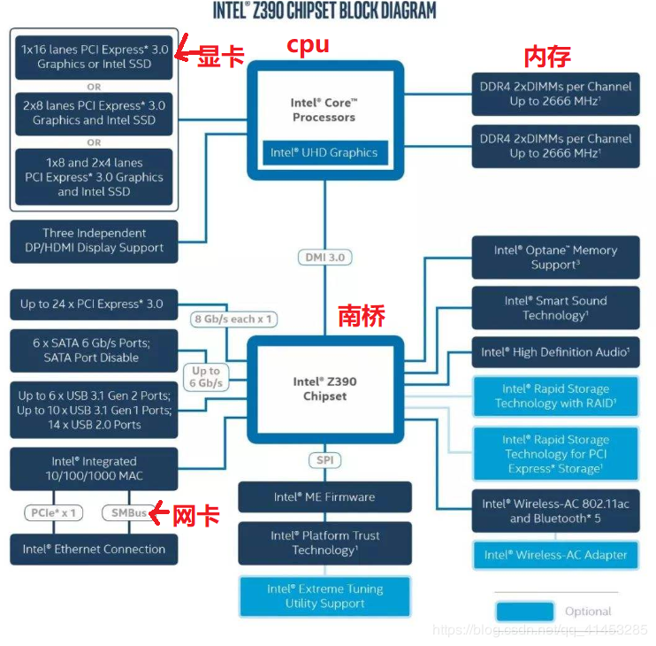
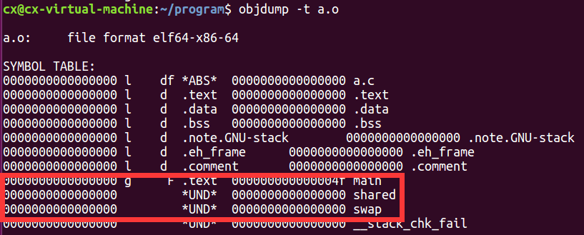
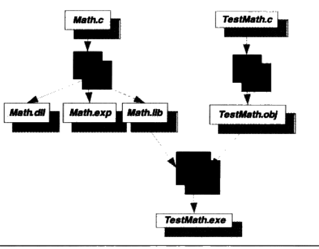
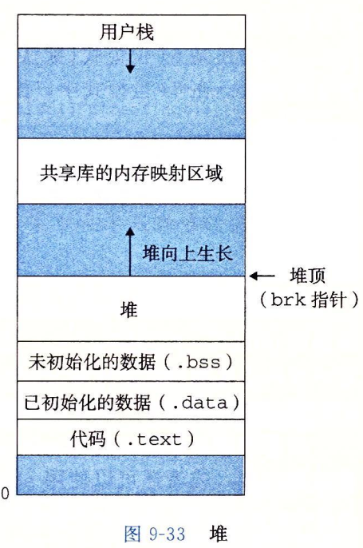

# 程序员的自我修养——链接、装载与库

[TOC]

​		作者访谈录这部分内容帮我组织了语言回答看这本书的目的，我希望能够理解操作系统的底层机制和运行原理，来帮助我走的更远，站的更高。当然，由于时间限制以及个人兴趣并没有作者那般强烈，我不会自己动手去实现内核等，因为我的目的是理解车是怎么动起来的，而不是希望成为一个造车专家。人的时间总是有限的，而想要做的事是无穷的，当然要把时间用在最要紧的事情上。

​		愿我们一直奋勇向前。


## 前言（作者访谈录）

1. ***你是如何对操作系统的底层机制和运行原理产生兴趣的？***
   + 很大程度上是因为性格决定的吧，因为我是一个喜欢对技术问题寻根究底的人，不满足于仅仅了解一个技术的表面，而是希望能通过层层深入地挖掘，找出它背后最关键最核心的机理。我相信很多计算机技术都是相通的，它们的核心思想相对是稳定不变的。经常听很多人谈起，IT技术日新月异，其实真正核心的东西数十年都没怎么变化，变化的仅仅是它们外在的表现，大题也是换汤不换药吧。
   + 为了了解操作系统内核及装载、链接这些关键的技术，我曾经自己从头写了一个很小的内核、装载器及一个简单的运行库。前后加起来花了两年多时间，大约有数万行代码。当然，如果继续写下去，可以让它的功能变得更加完整，但是我停止了对它的继续维护，因为我认为通过这个雏形系统，我已经了解了其背后的机理，如果再继续写下去更多的只是重复性的工作，因为现在已经有了很多很优秀的内核、装载和链接的相关软件和标准。
   + 虽然我在这个系统上花费了很多时间和精力，却没有获得什么直接的收益，也没有让我跟上最新的技术潮流，但是它带给我的间接收获却是无法言表的，它使我在后来学习其他技术的时候能够很快地触类旁通、自下而上地去理解整个系统，往往能够理解得更加深刻更加透彻。
2. ***介绍链接、装载与库原理的资料非常少，你在自己钻研的过程中，遇到的最大困难是什么？***
   + 当然相关资料很少会给我们带来很多的困难和挑战，而且相关的源代码在经过多年的发展和锤炼后，变得非常注重性能和效率，而很少考虑可读性，这使得通过挖掘源代码理解机制变得更为困难。这些代码很多都是相关领域的黑客高手写的，他们对系统机制的了解已经到了很深刻的地步，一小段代码会用尽系统的各种机制和方法，经常让人看得不知所云。比如系统库在不同的链接和装载方式下对C++全局对象的构造和析构，就异常复杂。整个流程来回曲折，加上有些代码已经遗弃，还会造成误解。Glibc这种支持数十种平台的系统还要考虑到各个系统的通性和个性，更使得整个过程雪上加霜。其实理解还不是最大的困难，最大的困难是理解了这个复杂而又晦涩的机制和过程，如何将它们尽量地简化，从中取舍，摒弃所有不必要的内容，再将它剥离出来后组织成尽量深入浅出层层引导的文字和图表，这才是最大的挑战。
3. ***在自学的过程中，一定有许多令你得意或开心的事，可不可以分享一二？***
   + 在这个过程中，最烦恼的事莫过于一个困扰了你很久的问题，通过各种方法，包括阅读源代码等还是无法理解或无法解释某个程序现象。忽然有一天某个灵感突现，回头再仔细阅读代码，紧接着马上试验一下，果真如此！大有拨云见日、豁然开朗的感觉，这应该是最开心的事吧。
4. 略

## 第一部分 简介

### 第1章 温故而知新

介绍基本的背景知识，包括硬件、操作系统、线程等。

1. 从Hello World引发的问题
   + 程序为什么要被编译器编译了之后才能运行？
   + 编译器在把C语言程序转换为可执行的机器码的过程中做了什么，怎么做的？
   + 最后编译出来的可执行文件里面是什么？除了机器码还有什么？它们是怎么存放的，怎么组织的？
   + #include<stdio.h>是什么意思？把stdio.h包含进来意味着什么？C语言库又是什么？它怎么实现的？
   + 不同的编译器（Microsoft VC、GCC）和不同的硬件平台（X86、ARM），以及不同的操作系统（Windows、Linux），最终编译出来的结果一样吗？为什么？
   + Hello World程序是如何运行起来的？操作系统如何装载它？它又从哪儿开始执行？到哪儿结束？main函数之前发生了什么？main函数结束以后又发生了什么？
   + 如果没有操作系统，Hello World可以运行吗？如果要在一台没有操作系统的机器上运行Hello World需要什么？应该怎么实现？
   + printf是怎么实现的？它为什么可以有不定数量的参数？为什么它能够在终端上输出字符串？
   + Hello World程序在运行时，它在内存中是什么样子的？

2. 硬件（主板架构）
   + 北桥负责与高速的CPU、内存、显卡连接。南桥负责与低速的I/O设备连接。
   + 早期北桥芯片是独立的
   + 
   + 现在的北桥芯片集成到了CPU中
   + 

3. 操作系统
   + “计算机科学领域的任何问题都可以通过增加一个间接的中间层来解决” 
   + 操作系统API的提供者是运行库，Linux下的Glibc库提供POSIX标准的API；Windows下的运行库提供Windows标准API，最常见的32位Windows提供的API又叫Win32.
   + 

4. 线程安全

   + 编译器优化与CPU乱序执行引发的问题：编译器可能将常用变量放到寄存器加速访问，也可能交换毫不相干的相邻指令的执行顺序；CPU也可能乱序执行指令流。

     + ```c
       //如果编译器为了提高x的访问速度，把x放到了寄存器里，不同线程的寄存器是相互独立的，因此可能引发竞争条件。
       x = 0;
       Thread1		Thread2
       lock();		lock();
       x++;		x++;
       unlock();	unlock();
       ```

     + ```c++
       //double-check实现的Singleton模式。
       volatile T* pInst = 0;
       T* GetInstance(){
           if(pInst == null){
               lock();
               if(pInst == null)
                   pInst = new T;
               unlock();
           }
       }
       //C++里的new包含两个步骤
       1. 分配内存
       2. 调用对象构造函数
       //所以pInst = new T包含了三个步骤
       1. 分配内存
       2. 调用对象构造函数
       3. 将内存的地址赋值给pInst
       //如果CPU的乱序执行交换了2和3，则会导致其他线程访问到尚未构造完全的对象。
       ```

   + 对于问题1编译器优化可采用volatile关键字解决

     + C/C++的volatile关键字
       + 阻止编译器为了提高速度将一个变量缓存到寄存器内而不写回。
       + 阻止编译器调整操作volatile变量的指令顺序（但是不能阻止CPU的乱序执行）

   + 对于问题2CPU乱序执行可通过barrier内存屏障解决。

参考文献

[https://blog.csdn.net/qq_41453285/article/details/85456920](https://blog.csdn.net/qq_41453285/article/details/85456920)

[https://en.wikipedia.org/wiki/Motherboard](https://en.wikipedia.org/wiki/Motherboard)

## 第二部分 静态链接

### 第2章 编译和链接

1. 编译器工作

   + 

2. GCC（GNU Compiler Collection）编译过程分解

   + 

   + 预编译(主要处理源代码文件中以“#”开始的预编译指令)

     + > gcc -E hello.c -o hello.i 或者 cpp hello.c > hello.i

   + 编译（完成词法分析、语法分析、语义分析及优化后产生汇编代码文件）

     + > gcc -S hello.i -o hello.s 或者 /usr/lib/gcc/i486-linux-gnu/4.1/cc1 hello.c

   + 汇编（将汇编代码转换为机器码，汇编器as）

     + > as hello.s -o hello.o 或者 gcc -c hello.s -o hello.o 或者 gcc -c hello.c -o hello.o

   + 链接（链接目标文件与库，链接器ld）

     + > ld -static /usr/lib/crt1.o /usr/lib/crti.o /usr/lib/gcc/i486-linux-gnu/crtbeginT.o -L/usr/lib/gcc/i486-linux-gnu/4.1.3 -L/usr/lib/ -L/lib hello.o --start-group -lgcc -lgcc_eh -lc --end-group /usr/lib/gcc/i486-linux-gnu/4.1.3/crtend.o /usr/lib/crtn.o

3. 链接

   + 链接过程主要包括了地址和空间分配（Address Allocation）、符号决议（Symbol Resolution）和重定位（Relocation）等这些步骤。

### 第3章 目标文件里有什么

1. 可执行文件格式：现在PC平台流行的可执行文件格式（Executable）主要是Windows下的PE（Portable Executable）和Linux下的ELF(Executable Linkable Format)，它们都是COFF（Common File Format）格式的变种。

   + | ELF文件类型                        | 说明                                                         | 实例                            |
     | ---------------------------------- | ------------------------------------------------------------ | ------------------------------- |
     | 可重定位文件（Relocatable File）   | 或者是作为静态链接库，或被用来链接成可执行文件或共享目标文件 | Linux的.o，.a；Windows的.obj    |
     | 可执行文件（Executable File）      |                                                              | Linux的/bin/bash；Windows的.exe |
     | 共享目标文件（Shared Object File） | 或者作为动态链接库，或者与其它的可重定位文件和共享目标文件链接产生新的目标文件 | Linux的.so；Windows的.dll       |
     | 核心转储文件（Core Dump File）     | 进程意外终止时地址空间的内容及一些其它信息                   | Linux下的core dump              |

2. ELF文件格式

   + 
   + ELF文件格式类似于物理磁盘的组织模式，ELF Header对应超级块，段表Section Table对应inode位图，段描述符（如.text）对应inode节点。
   + ELF Header：保存魔数，文件类型（可重定位、可执行、共享目标）、段表偏移。
   + .bss：有些编译器会将未初始化的全局变量存放在目标文件.bss段，有些则不存放，只是预留一个未定义的全局变量符号，等到最终链接成可执行文件的时候再在.bss段分配空间。（未初始化的静态变量一定位于.bss段）
   + 
   
3. 为什么要把程序的指令和数据的存放分开（.text和.data）

   + 不同段装载时分别映射到不同的虚拟内存区域，方便访问权限管理。
   + 指令区和数据区的分离有利于提高程序的局部性（CPU的指令缓存和数据缓存）
   + 指令区可能在多个进程间共享而数据区一般不能共享，因此需要分段管理。

4. 数据的存放
   + .data段保存的是那些已经初始化了的全局变量、静态变量；
   + .rodata段保存的是程序里面的常量（包括字符串常量"hello wolrd"）；
   + .bss段保存的是未初始化的全局变量和静态变量。
   + 普通局部变量在汇编代码里变成rbp/rsp+n，表现为一个栈地址，位于.text段。
     + 
     + 

5. 符号（Symbol）：链接过程就是将不同目标文件中的符号（函数和全局变量）的定义与引用正确匹配。

   + C符号修饰机制：为了兼容以前的库中的符号，GCC可能会在C语言的符号前加上下划线"_"。

   + C++符号修饰机制（Name Decoration或Name Mangling）：C++拥有类、继承、虚机制、重载、命名空间这些特性，导致符号管理更为困难。

     + ```c++
       //6个同名函数func，返回类型、参数、类、命名空间不同
       int func(int);
       float func(float);
       class C {
           int func(int);
           class C2 {
               int func(int);
           };
       };
       namespace N {
           int func(int);
           class C {
               int func(int);
           }
       };
       ```

     + 编译器在将C++源代码编译成目标文件时，会将函数和变量的名字进行修饰，形成符号。C++编译器和链接器都使用符号来识别和处理函数和变量。

       + 函数的修饰会包含函数签名（Function Signature）（包含了一个函数的函数名、参数类型、所在的类和命名空间及其他信息。），不包括返回类型，因此仅返回类型不同的同名函数会引发编译错误。

       + 变量的修饰则主要是类和命名空间的信息，不包括类型信息，因此不同类型的同名变量会引发编译错误。

       + ```c
         //GCC修饰规则
         int C::func(int)	_ZN1C4funcEi
         int foo::bar		_ZN3foo3barE
         ```

     + 由于不同的编译器采用不同的符号修饰方法，必然导致不同编译器编译产生的目标文件无法正常相互链接，这是导致不同编译器之间不能互操作的主要原因之一。

6. extern “C”：C++编译器会将在extern “C”的大括号内部的代码当做C语言代码处理，显然，C++的名称修饰机制将不会起作用。

   + 当在C++代码中使用了C头文件的函数，为了正确链接C库，必须在C头文件使用extern "C"来使C++编译器按照C语言的符号修饰机制修饰引用符号，与C库中的定义符号匹配。

7. 强符号与弱符号

   + 对C/C++语言来说，编译器默认函数和初始化了的全局变量为强符号，未初始化的全局变量为弱符号，static修饰的函数和变量不在讨论范围。也可以通过GCC的"\_\_attribute\_\_((weak))"来定义一个强符号为弱符号。
   + 链接时强弱符号处理规则
     + 规则1：不允许强符号被多次定义，否则链接器报符号重复定义错误。
     + 规则2：如果一个符号在所有目标文件中都是弱符号，那么选择其中占用空间最大的一个。

8. 强引用与弱引用

   + 链接器处理符号决议时，对于未找到定义的强引用，链接器报符号未定义错误；对于未找到定义的弱引用，链接器不报错。可以通过GCC的"\_\_attribute\_\_((weakref))"声明一个引用为弱引用。
9. 弱符号和弱引用的作用：
   + 库中定义的弱符号可以被用户定义的强符号所覆盖，从而使得程序可以使用自定义版本的库函数。
   + 程序可以对某些扩展功能模块的引用定义为弱引用，在链接时通过是否链接扩展模块来决定是否扩展程序功能，这样使得程序的功能更加容易裁剪和组合。

### 第4章 静态链接

1. 链接过程（两步链接）
   1. 空间与地址分配：扫描所有的输入目标文件，合并相同段，对于需要装载到进程虚拟地址空间的段，分配段虚拟地址；并且将输入目标文件中的符号表中的所有的符号定义和符号引用收集起来，统一放到一个全局符号表，并计算符号的虚拟地址。
   2. 符号解析与重定位：根据全局符号表与重定位段，进行符号解析与重定位、调整代码中的地址等。
2. 虚拟地址分配
   + 段虚拟地址分配：显然，可重定位目标文件中的段没有分配虚拟地址，只有可执行文件及共享目标文件为段分配了虚拟地址。默认设置下，对于32位Linux系统，ELF可执行文件的虚拟地址从0x8048000开始分配；对于64位Linux系统，ELF可执行文件的虚拟地址从0x400000开始分配。
     + 
     + 
   + 符号虚拟地址分配：因为各个符号在段内的相对位置是固定的，因此所在段虚拟地址+偏移量=符号虚拟地址。
     + 可重定位目标文件a.o的符号表中的符号虚拟地址为0x0，链接后可执行文件ab的符号表中的符号虚拟地址已分配。
     + 
     + 
3. 符号解析与重定位
   + 可重定位目标文件使用重定位段来描述如何修改相应的段，比如代码段“.text”如有要被重定位的符号，那么会有一个相对应叫".rel.text"的段保存了代码段的重定位信息。
   + 符号解析：链接器扫描完所有的输入目标文件后，所有未定义的符号应该都能够在全局符号表中找到，否则链接器就报符号未定义错误。
   + 重定位：对于重定位段中每一个对符号的引用，链接器查找全局符号表，找到相应的符号后根据虚拟地址进行重定位。
4. 编译器为什么不将未初始化的全局变量放置在.bss段，而是在符号表中将其标记为一个COMMON类型的变量？
   + 为了处理多个弱符号的链接问题：编译时本编译单元弱符号最终所占空间大小是未知的，因为可能在其他编译单元存在一个所占空间更大的弱符号，因此编译器无法为该弱符号在.bss段分配空间。
5. C++相关问题
   1. 重复代码消除：C++编译器在很多时候会产生重复的代码，比如模板、外部内联函数和虚函数表都有可能在不同的编译单元里生成相同的代码。
      + 例如：当一个模板在多个编译单元同时实例化成相同的类型的时候，必然会生成重复的代码；对于含有虚函数的类，编译器会在用到该类的多个编译单元生成虚函数表。
      + 解决方法：将每个模板的实例代码都单独的存放在一个段里，每个段只包含一个模板实例，链接时消除重复的模板实例段。
   2. 全局构造与析构：C++的全局对象的构造函数在main之前执行，析构函数在main之后执行。因此ELF文件定义了两种特殊的段。
      + .init：保存进程初始化代码。
      + .fini：保存进程终止代码。
6. ABI兼容性问题：ABI是目标文件格式、符号修饰标准、变量内存布局、函数调用方式等这些跟可执行代码二进制兼容性相关的内容。
   + 影响C语言的ABI兼容性的方面
     + 内置类型（如int）的大小和在内存中的放置方式（大小端、对齐方式等）。
     + 组合类型（如struct）的存储方式和内存分布。
     + 符号修饰标准。
     + 函数调用方式，比如参数入栈顺序、返回值如何保持等。
     + 堆栈的分布方式，比如参数和局部变量在堆栈里的位置，参数传递方法等。
     + 寄存器使用约定，函数调用时哪些寄存器可以修改，哪些需要保存，等等。
   + 影响C++的ABI兼容性的方面
     + 继承类体系的内存分布，如基类，虚基类在继承类中的位置。
     + 指向成员函数的指针的内存分布，如何通过指向成员函数的指针来调用成员函数，如何传递this指针。
     + 如何调用虚函数，vtable的内容和分布方式，vtable指针在对象中的位置等。
     + 模板如何实例化。
     + 符号修饰标准。
     + 全局对象的构造和析构。
     + 异常的产生和捕获机制。
     + 标准库的细节问题，RTTI如何实现等。
     + 内联函数访问细节。
   + 垃圾的C++二进制兼容性：不仅不同的编译器编译的二进制代码之间无法兼容，有时候连同一个编译器的不同版本之间兼容性也不好。
7. 静态库链接：静态库是一组目标文件经压缩打包后形成的一个文件，包含编号和索引，以便于查找和检索。（linux的.a，windows的.lib）
   + GCC链接库
     + crt1.o
     + crti.o
     + crtbeginT.o
     + libgcc.a
     + libgcc_eh.a
     + libc.a
     + crtend.o
     + crtn.o
8. 为什么静态库中一个目标文件只包含一个函数？比如libc.a里printf.o只有printf()函数。
   + 链接器在链接静态库时是以目标文件为单位的，每个函数独立的放在一个目标文件可以防止无关函数被链接进最终的输出文件中。

参考文献

[https://blog.csdn.net/a7980718/article/details/80852576](https://blog.csdn.net/a7980718/article/details/80852576)

## 第三部分 装载与动态链接

### 第6章 可执行文件的装载与进程

1. 进程虚拟地址空间
   + 
     + 32位CPU只能访问4GB物理内存，即进程虚拟地址空间大小限制4GB。
       + PAE（Physical Address Extension）：Intel通过扩展地址线到36位，同时修改了页映射机制，使CPU可以访问64GB物理内存。
       + AWE(Address Windowing Extensions)和mmap()：操作系统通过提供一个窗口映射的方法，把超过4GB的内存映射到进程地址空间中。在Windows中的实现机制叫AWE，Linux下的实现机制则为mmap()。
2. OS如何装载可执行文件
   1. 创建一个独立的虚拟地址空间（进程虚拟地址空间<->物理内存）：
      + 为内存描述符分配页目录，这时并不设置页映射关系，等到进程执行时发生页错误的时候再进行设置。
   2. 读取可执行文件头，并且建立（进程虚拟地址空间<->可执行文件）的映射关系
      + 由于可执行文件在装载时实际上是被映射的虚拟空间，所以可执行文件很多时候又被称为映像文件（Image）。
      + 为了当OS捕获页错误的时候能够知道进程当前需要的页在可执行文件的哪一个位置，OS为内存描述符创建VMA结构，映射可执行文件的段（Segment）。
        + 为了减少内存碎片，OS将可执行文件中相同权限的段（Section）当做一个段（Segment）进行映射，即映射到同一个VMA结构。Segment与Section是从不同的角度来划分同一个可执行文件，这在ELF中被称为不同的视图。从Section的角度来看ELF文件就是链接视图，从Segment的角度来看就是执行视图。
        + 
        + 堆栈也是以VMA的形式管理的，OS在初始化进程时将系统环境变量和命令行参数保存在进程栈底。
        + 进程还有一个特殊的VMA叫做vdso，它位于内核地址空间，事实上它是内核模块，进程通过访问这个VMA与内核通信。
   3. 将CPU的指令寄存器设置为可执行文件的入口地址，启动运行
      + 这一步在OS层面较为复杂，涉及内核堆栈和用户堆栈的切换、CPU运行权限的切换。
3. Linux装载ELF实现
   + 
   + load_elf_binary()装载程序功能：
     + 检查可执行文件格式有效性，比如魔数、程序头表中段的数量。
     + 寻找动态链接的.interp段，设置动态链接器路径。
     + 映射ELF段到进程地址空间VMA。
     + 初始化进程环境，比如进程启动时EDX寄存器的地址应该是DT_FINI的地址。
     + 将系统调用的返回地址修改为ELF可执行文件的入口点，对于静态链接，即ELF文件头中e_entry所指地址；对于动态链接，则为动态链接器。
4. Windows装载PE实现（PE可执行文件的段数量远远少于ELF，因此不用将Section合并为Segment）
   + 先读取文件的第一个页，在这个页中，包含了DOS头、PE文件头和段表。
   + 检查进程地址空间中，目标地址是否可用，如果不可用，则另外选一个装载地址。这个问题对于可执行文件来说基本不存在，因为它往往是进程第一个装入的模块，所以目标地址不太可能被占用。主要是针对DLL文件的装载而言的。
   + 使用段表中提供的信息，将PE文件中所有的段一一映射到地址空间对应的位置。
   + 如果装载地址不是目标地址，则进行Rebasing。
   + 装载所有PE文件需要的DLL文件。
   + 对PE文件中的所有导入符号进行解析。
   + 根据PE头中指定的参数，建立初始化栈和堆。
   + 建立主线程并且启动进程。

### 第7章 动态链接

1. 动态链接的意义
   + 减少多个相同模块副本带来的内存和磁盘空间浪费。
   + 方便程序模块的单独更新，而不是某个无关紧要的模块更新导致整个程序重新链接、发布。
   + 程序的可扩展性：程序在运行时可以动态的选择加载各种程序模块，这个特性被用来制作各种插件。（某公司发布产品，按照一定的规则制定好插件的接口，第三方开发者按照接口编写动态链接文件。该产品程序可以动态的载入各种由第三方开发的模块，在程序运行时动态的链接，实现程序功能的扩展。）
   + 程序的兼容性：一个程序在不同的平台运行时可以动态的链接到由操作系统提供的动态链接库，这些动态链接库相当于在程序和操作系统之间增加了一个中间层，从而消除了程序对不同平台之间依赖的差异性。
   
2. 动态链接简述
   + 基本思想：是把程序按照模块拆分为各个相对独立部分，在程序运行时才将它们链接在一起形成一个完整的程序，而不是像静态链接一样把所有的程序模块都链接成一个单独的可执行文件。
   + 动态链接过程：首先编译共享对象文件gcc -fPIC -shared -o Lib.so Lib.c，接着编译并链接可执行文件gcc -o Program1 Program1.c ./Lib.so。链接可执行文件时，静态链接器解析符号需要通过动态链接库提供的Stub信息处理动态符号引用。
   + 共享对象文件中的装载地址为0x00000000，实际装载地址在编译时是不确定的，而是在装载时，装载器根据当前地址空间的空闲情况，动态分配一块足够大小的虚拟地址空间给相应的共享对象。
   + 
   
3. 如何解决共享对象链接时进程虚拟地址不确定导致的符号引用定位问题

   + 方法一：装载时重定位：在链接时，对所有绝对地址的引用不做重定位，而把这一步骤推迟到装载时再完成。
     + 缺点：动态链接模块被装载映射至虚拟空间后，指令部分是在多个进程之间共享的，由于装载时重定位的方法需要修改指令，所以没有办法做到同一份指令被多个进程共享，因为指令被重定位后对于每个进程来讲是不同的。当然，动态链接库中的可修改数据部分可以采用装载时重定位的方法来解决。
   + 方法二：地址无关代码（PIC：position independent code）：把指令中那些需要被修改的符号引用分离出来，跟可修改数据部分放在一起，这样指令部分就可以保持不变，而可变数据部分在装载时进行重定位。
     + 全局变量：ELF的做法是在数据段里面建立一个指向模块外部的变量的指针数组，也被称为全局偏移表（GOT：global offset table），当代码需要引用该全局变量时，通过GOT中相对应的项间接引用。
     + 全局函数：
       + 延迟绑定（Lazy Binding）：为了降低程序启动时动态链接器对模块外部的函数引用的符号解析与重定位开销，将绑定工作（符号解析、重定位等）推迟到函数第一次被调用时进行。
       + ELF的做法是添加一个新的函数链接表PLT（procedure linkage table），在GOT间接跳转上又增加了一层间接跳转。
         + 

4. 符号引用寻址模式分类（函数，变量）：

   + 分类

     + 模块内部的函数调用、跳转等

     + 模块内部的数据访问，比如模块中定义的全局变量、静态变量。

     + 模块外部的函数调用、跳转等。

     + 模块外部的数据访问，比如其他模块定义的全局变量。

     + |          | 指令跳转、调用        | 数据访问          |
       | -------- | --------------------- | ----------------- |
       | 模块内部 | 1 相对地址寻址        | 2 相对地址寻址    |
       | 模块外部 | 3 GOT+PLT间接地址寻址 | 4 GOT间接地址寻址 |

   + 引用在共享对象内部的全局符号问题

     + 全局符号介入：动态链接里，当一个符号需要被加入全局符号表时，如果相同的符号名已经存在，则后加入的符号被忽略。
     + 引用内部全局变量的问题：如果可执行文件引用了定义在共享对象的全局变量，由于可执行文件在运行时并不进行代码重定位，所以链接器会为它在.bss段创建一个变量的副本，这样就产生了同一个全局变量的多个副本问题。因此ELF共享库在编译时，默认把定义在模块内部的全局变量当做定义在其他模块的全局变量，通过GOT间接地址寻址访问。
     + 引用内部全局函数的问题：对于引用在模块内部的全局函数，有可能由于全局符号介入导致模块内对它的引用被模块外的符号覆盖，导致重定位，因此也只能默认当做定义在其他模块的全局函数，通过GOT+PLT间接寻址访问。
     + 优化：因此，为了提高模块内部函数调用的效率，最好使用static关键字限制为编译单元内部链接。

   + 动态链接的可执行文件默认也使用PIC的方法来产生可执行文件的代码段部分，以便于不同的进程能够共享代码段，节省内存。

5. 实现动态链接的相关结构

   + 动态链接器（dl：Dynamic Linker）：对于动态链接的可执行文件，OS在装载完成后并不将控制权交给可执行文件的入口地址，而是装载dl并将控制权交给它。
     + 动态链接器自举：完成一系列自身的初始化操作。
     + 装载共享对象：将可执行文件和链接器自身的符号表都合并到一个全局符号表，根据符号依赖关系使用广度优先或深度优先遍历加载所有依赖的共享对象。
     + 重定位和初始化：遍历可执行文件和共享对象的重定位表，将它们的GOT/PLT中的每个需要重定位的位置进行修正。如果某个共享对象有.init段，则执行共享对象的初始化代码，可执行文件的.init代码执行由程序初始化部分代码负责，dl不管。
     + 最后将控制权转交给程序的入口并开始执行。
   + .interp段：保存动态链接器的路径。
   + .dynamic段：保存了动态链接器所需要的基本信息，比如依赖于哪些共享对象、动态链接符号表的位置、动态链接重定位的位置、共享对象初始化代码的地址等。
   + .dynsym段：动态符号表，或者叫导出符号表。
   + 动态链接重定位表：.rel.dyn和.rel.plt，分别表示对可修改数据段符号绝对地址引用和GOT项的重定位、plt项的重定位。
   + 动态链接时进程栈初始化信息

6. 显式运行时链接（运行时加载）：Linux内核模块动态加载

   + 动态链接在进程装载时装载共享对象，显式运行时链接在进程运行时装载共享对象。
   + 动态链接器dl提供一组API完成这一工作：dlopen()、dlsym()、dlerror()、dlclose()
   
7. 静态链接与动态链接的示意图

   + 
   + 

### 第8章 Linux共享库的组织

1. 共享库的兼容性
   + 共享库的兼容性是ABI兼容性，包括诸如函数调用的栈结构、符号命名、参数规则、数据结构的内存分布。前面提到过，因为C++标准没有对ABI做出规定，且语言存在虚函数表、模板实例化、多重继承等高级特性，导致C++的ABI兼容性异常差，因此C++的共享库导出接口一般为C接口。
2. 共享库组织
   + 共享库的命名规则：*libname.so.x.y.z*
     + x为主版本号：表示库的重大升级，不同主版本号的库之间是不兼容的。
     + y为次版本号：表示库的增量升级，即增加一些新的接口符号，且保持原来的符号不变。在主版本号相同的情况下，高次版本号的库向后兼容低次版本号的库。
     + z为发布版本号：表示库的一些错误的修正、性能的修改等，并不添加任何新的接口，也不对接口进行修改。
     + 共享库的主版本号和次版本号决定了一个共享库的接口。
   + SO-NAME：Linux会为每个共享库在它所在的目录创建一个名字为*libname.so.x*并指向它的软链接，表示此共享库的接口。
     + 通过使用SO-NAME，系统可以只保留主版本号中最高次版本号的共享库，简化共享库组织且节省空间。
     + Linux提供了一个工具叫做*ldconfig*，当系统中安装或更新一个共享库时，就需要运行这个工具遍历所有的默认共享库目录，比如/lib、/usr/lib等，然后更新所有的软链接，使它们指向最新版的共享库；如果安装了新的共享库，那么*ldconfig*会为其创建相应的软链接。
   + 符号版本机制：SO-NAME带来了新问题，如果程序依赖的共享库的次版本号高于SO-NAME指向的系统共享库，则链接不会报错，但程序运行过程中可能产生缺少某些符号的错误。
     + 版本机制：根据共享库版本定义符号的集合，如VERS_1.1、VERS_1.2等，以区分共享库不同版本导出的符号。
     + 范围机制：类似于命名空间与类的访问控制符，通过将共享库内部使用的全局符号定义为私有，可禁止共享库的使用者访问这些符号。
     + 符号版本机制的实现需要共享库与动态链接的可执行文件同时定义符号集合版本信息。在程序启动时，动态链接器会通过程序内记录的它所依赖的所有共享库的符号集合版本信息，然后判定当前系统共享库中的符号集合版本是否满足这些被依赖的符号集合。是则正常运行，否则终止运行，将可能存在的运行时错误提前。
   + 例外：Glibc的基本C语言库不遵守共享库命名规则，*libc-x.y.z.so*；动态链接器既不遵守共享库命名规则也不遵守SO-NAME规则*ld-x.y.z.so*、*ld-linux.so*。
3. 共享库系统路径
   + /lib：主要存放系统最关键和基础的共享库，比如动态链接器、C语言运行库。
   + /usr/lib：主要存放一些开发时用到的共享库，还包括开发时可能用到静态库、目标文件等。
   + /usr/local/lib：主要存放一些第三方的应用程序的库。例如python。
4. 共享库查找
   + 相关配置文件：/etc/ld.so.conf.d/、/etc/ld.so.cache
   + 环境变量：LD_LIBRARY_PATH、LD_PRELOAD、LD_DEBUG

### 第9章 Windows下的动态链接

1. Linux下的.so与Windows下的.dll区别

   + .so所有的全局函数和变量在默认情况下都可以被其他模块使用，即默认导出所有的全局符号；.dll需要显式的告诉编译器我们需要导出某个全局符号，即默认所有符号都不导出。
   + .so使用*.rel.dyn*和*.rel.plt*分别保存该模块所需要导入的变量和函数的符号以及所在的模块等重定位信息，使用*.got*和*.got.plt*分别保存这些符号的虚拟进程地址；.dll使用符号导入表替代上述结构完成符号导入。动态链接器根据重定位信息与符号导出表填充符号导入表。
   + .so使用*.dynsym*保存全局符号导出信息；.dll使用符号导出表完成符号导出。
   + ELF使用地址无关代码方式编译链接.so和使用动态链接的可执行文件，通过增加符号寻址间接层，以降低运行速度为代价，实现代码段的复用；PE使用装载时重定位的方式编译链接.dll，通过重定基址简化流程，以代码段不可复用为代价，提高运行速度。这是时间换空间与空间换时间的两个经典示例。

2. MSVC动态链接

   + *Math.lib*：并不是静态链接库，而是用来描述*Math.dll*的导出符号，它包含了*TestMath.o*链接*Math.dll*时所需要的导入符号以及一部分桩代码。
   + *Math.exp*：链接器在创建DLL时的临时文件，临时保存导出符号表。
   + 

3. C++导出接口的共享库ABI兼容性问题（BOOM）

   + ```c++
     //某程序员写了一个C++导出接口的字符串查找算法StringFind.dll，头文件如下
     class __declspec(dllexport) StringFind {
         char* p;
     public:
         StringFind(char* p);
         ~StringFind();
         int Find(char* p);
         int Length();
     };
     //一段时间后，他升级了StringFind.dll，接口变为如下
     class __declspec(dllexport) StringFind {
         char* p;
         int length; //新增成员变量
     public:
         StringFind(char* p);
         ~StringFind();
         int Find(char* p);
         int Length();
         char* Substring(int pos, int len); //新增成员函数
     };
     ```

   + 此.dll升级带来的ABI兼容性问题如下：

     + *Substring()*返回指向字符串子串的指针，这是一个动态内存，但该.dll并不负责该返回指针的内存释放工作，由用户手动完成。如果该.dll使用的CRT版本与用户程序或其他DLL所使用的CRT版本不一样，程序就会发生内存释放错误。这是由于每个CRT都会有自己独立的堆，在一个CRT中申请内存而在另外一个CRT中释放内存将会出错。
     + 一般DLL升级就是简单的使用新版的DLL覆盖旧版的DLL，而不会替换头文件，StringFind类在DLL中的实现增加了一个length成员变量，而在头文件中的接口没有这个成员变量，导致错误的数据访问。
     + 简单覆盖升级的方法还可能导致所有使用旧版DLL的程序都会发生运行时错误

## 第四部分 库与运行库

### 第10章 内存

1. 函数调用实现（汇编代码、以及调用栈示意图）

   + 调用栈保存了一个函数调用所需要的维护信息。包括

     + 函数的参数和返回地址
     + 临时变量：包括函数的非静态局部变量以及编译器自动生成的其他临时变量
     + 保存的上下文：包括在函数调用前后需要保持不变的寄存器

   + 调用栈结构

     + esp(extended stack pointer)：当前栈指针，指向进程栈顶。
     + ebp(extended base pointer)：当前调用栈的基本指针，固定不变，在函数调用期间，所有局部变量和函数参数都是通过ebp+offset寻址）；ebp指向地址保存上一个ebp的值，这样在函数返回时，ebp可以通过读取这个值恢复到上一个ebp。
     + 

   + 函数调用实现

     + 函数调用方

       + ```c
         //1. 把所有参数或入栈，或通过寄存器传递
         push	参数
         //2. 把当前指令的下一条指令的地址压入栈中
         //3. 跳转到函数体执行
         call	函数地址
         ```

     + 函数被调用方

       + ```c
         //1. 保存ebp，让ebp指向目前的栈顶
         push	ebp
         mov		ebp, esp
         //2. 在栈上开辟一块空间
         sub		esp, 开辟空间大小
         //3. 保存各种可能的寄存器上下文
         [push	reg1]
         ...
         [push	regn]
         函数实际内容
         //4. 从栈上恢复各种可能的寄存器上下文
         [pop	regn]
         ...
         [pop	reg1]
         //5. 恢复进入函数前的esp和ebp
         mov		esp, ebp
         pop		ebp
         //6. 使用ret指令返回
         ret
         ```

2. 函数调用惯例

   + 程序执行过程中函数的调用方与被调用方对调用方式的一个协商。

     + 函数参数的传递顺序和方式（寄存器、栈）
     + 谁负责清理调用栈，调用方还是被调用方：调用栈的初始化只能由调用方完成。
     + 符号修饰机制：为了链接的时候对调用惯例进行区分，不同调用惯例有不同的符号修饰机制。

   + | 调用惯例               | 参数传递                                                     | 出栈方     | 符号修饰                   |
     | ---------------------- | ------------------------------------------------------------ | ---------- | -------------------------- |
     | cdecl（C默认调用惯例） | 从右至左的顺序压参数入栈                                     | 函数调用方 | 下划线+函数名              |
     | stdcall                | 从右至左的顺序压参数入栈                                     | 函数本身   | 下划线+函数名+@+参数字节数 |
     | fastcall               | 前两个小于32位类型放入寄存器，其余参数按从右至左的顺序压入栈 | 函数本身   | @+函数名+@+参数字节数      |
     | pascal                 | 从左至右的顺序压参数入栈                                     | 函数本身   | 较为复杂                   |

   + 对于C++，以上几种调用惯例的符号修饰机制都有所改变。最后，C++自己还有一种特殊的调用惯例，称为thiscall，专用于类成员函数的调用，将this当做第一个参数。

   + cdecl调用惯例示例

     + ```c
       void f(int x, int y){
           ...
           return;
       }
       int main(){
           f(1, 3);
           return 0;
       }
       ```

     + 下图中虚线指向该指令执行后的栈状态，实线表示程序的跳转状况。

     + 

3. 函数返回值传递实现

   + 对于返回5-8字节对象的情况：采用eax，edx寄存器传递方式。

   + 对于大于8字节对象的情况：

     1. 函数调用方在自身栈上开辟空间容纳传递返回值的临时对象，然后将临时对象地址作为隐藏参数传递给被调用方，

     2. 被调用方将返回值拷贝给临时对象并将地址用eax寄存器传出，

     3. 最后调用方将eax指向的临时对象拷贝到真正容纳返回值的对象。

     + ```c
       class BigObject{
           ...
       };
       //源代码
       BigObject returnBigObject(){
           BigObject local;
           ...
           return local;
       }
       int main(){
           BigObject bo = returnBigObject();
       }
       //编译器修改后的源代码示意
       BigObject* returnBigObject(BigObject* tmp){
           BigObject local;
           ...
           return tmp(local);
       }
       int main(){
           BigObject tmp;
           BigObject realVal = *returnBigObject(tmp);
       }
       ```

   + 显然编译器对返回较大对象的传递方式会导致一次额外的临时对象构造与析构。因此C++提出了一项编译优化技术：命名对象返回值优化（NRVO：named return value optimization）：删除保持函数返回值的临时对象。

     + ```c
       //使用RVO技术的编译器生成代码示意
       void returnBigObject(BigObject* realVal){
           ...
       }
       int main(){
           BigObject realVal;
           returnBigObject(realVal);
       }
       ```

     + 

4. 运行库动态内存分配（C：malloc()、calloc()、realloc()、free()；C++：new delete）

   + 
   
   + ```c
     //设置进程数据段（Linux下数据段和BSS合并在一起统称数据段）的结束地址，如果我们将数据段的结束地址向高地址移动，那么扩大的空间就可以拿来作为堆。内核维护一个brk指针指向堆的顶部。
     int brk(void* end_data_segment);
     //Glibc对系统调用brk()的包装函数，参数为增量而不是虚拟地址。
     void* sbrk(intptr_t incr);
     ```
   
   + 

5. 堆分配算法
   + 空闲链表：将堆中各个空闲的块按照链表的方式组织。
   + 位图：将整个堆划分为大量的块（block），每个块大小相同，使用位图来记录块状态。
   + 对象池：如果被分配对象的大小固定，则可以将堆空间划分为对象大小的块，通过空闲链表或位图组织起来。（slab对象缓存）

### 第11章 运行库

1. 一个典型的程序运行步骤大致如下：
   1. 操作系统在创建进程后，把控制权交到了程序的入口，这个入口往往是运行库中的某个入口函数。
   2. 入口函数对运行库和程序运行环境进行初始化，包括堆、I/O、线程、全局变量构造，等等。
   3. 入口函数在完成初始化后，调用main函数，正式开始执行程序主体部分。
   4. main函数执行完毕之后，返回到入口函数，入口函数进行清理工作，包括全局变量析构、堆销毁、关闭I/O等，然后进行系统调用结束进程。

2. I/O初始化：建立打开文件表；从父进程获取继承的文件；初始化标准输入输出。在I/O初始化完成之后，所有的I/O函数就都可以使用了。
   + fd为内核空间中进程描述符关联的打开文件表中相应文件对象的存储下标，用户进程通过fd及相关系统调用操作位于内核空间的文件对象，内核通过这一层封装对用户进程屏蔽了相关细节，C运行库提供FILE结构与文件对象一一映射。
   + 
3. C变长参数与TLS（Thread local Storage）实现
   + C变长参数实现：C语言默认使用cdecl调用惯例。由C变长参数必须为函数最后一个形参，且参数从右至左入栈，因此变长匿名参数可由具名参数间接寻址；又由参数的出栈是由调用方完成，而调用方显然知道自己传递的各个参数的地址。
   + TLS实现：为每个线程在堆上分配私有空间用于存储TLS变量。

4. glibc（GNU C Library）MSVCRT（Microsoft Visual C Run-time）